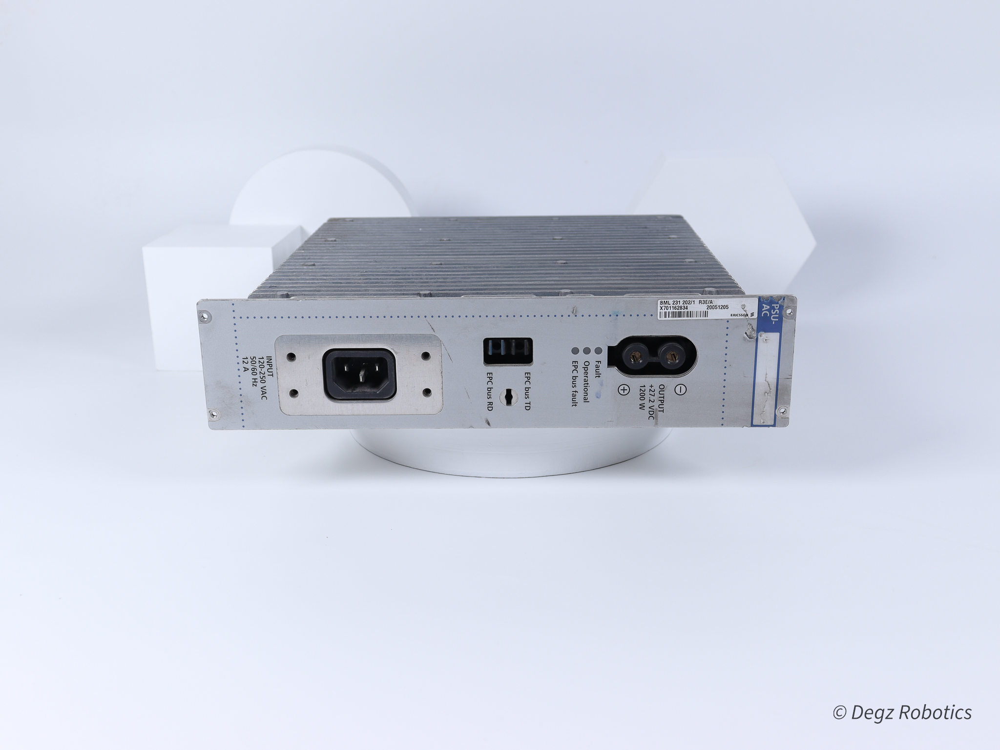
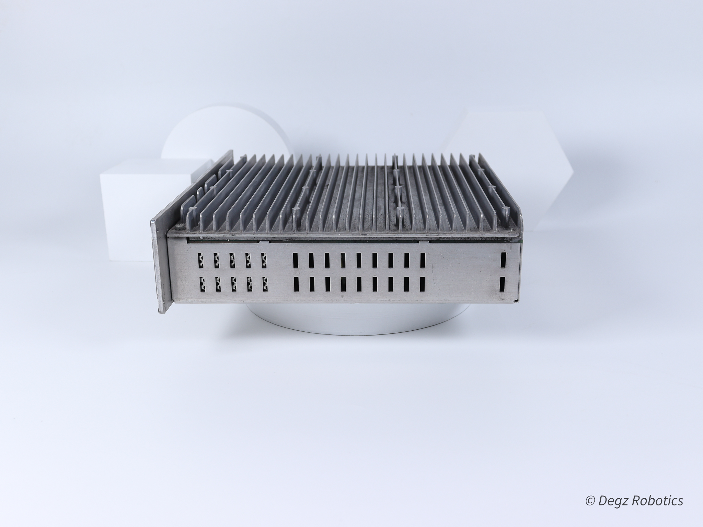
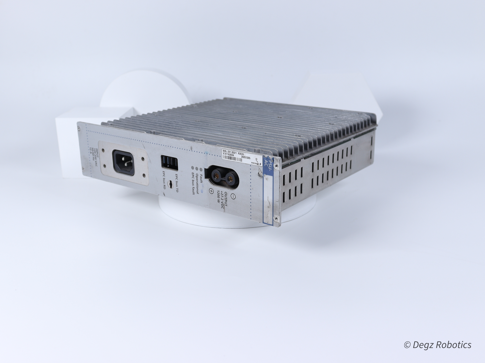
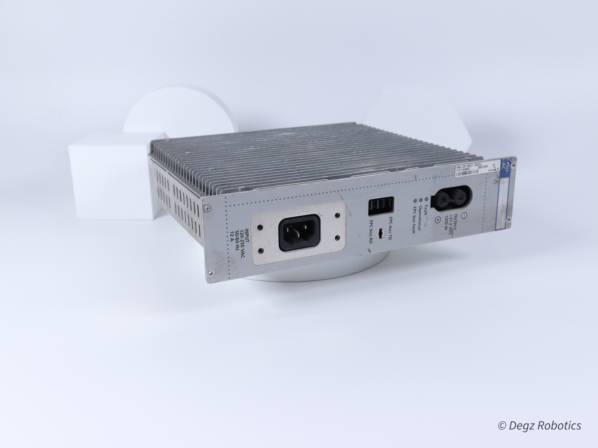

# Dönüşümün Gücü: 27V SMPS Güç Kaynakları
## Enerji Verimliliği ile Tanışın 
SMPS güç kaynakları, yüksek enerji verimliliği ve gelişmiş performans sunarak elektronik dünyasında bir devrim yaratıyor. Bu yenilikçi güç kaynakları, geleneksel transformatörlü güç kaynaklarına kıyasla daha az enerji harcar ve daha düşük ısı üretir, böylece enerji tasarrufu ve sistem güvenliği sağlar.

## 27V SMPS: Güçlü ve Güvenilir

27V SMPS güç kaynakları, özel endüstriyel uygulamalar ve hobi projeleri için ideal bir çözüm sunar. Bu voltaj seviyesi, yüksek performans ve özgül gereksinimler olan makineler, laboratuvar ekipmanları ve elektronik sistemler için özellikle tercih edilir. Ayrıca, güç ihtiyacı yüksek radyo kontrollü araçlar ve diğer hobi elektronik projeleri için de mükemmeldir. 27V SMPS, bu uygulamalara yüksek güvenilirlik ve istikrar sağlayarak, kullanıcıların ihtiyaç duyduğu performansı eksiksiz bir şekilde karşılar.

## Sektör Lideri Teknoloji
SMPS güç kaynakları, yenilikçi switch mod teknolojisi ile enerji dönüşümünün sınırlarını zorlar ve bu alanda yeni standartlar belirler. Bu gelişmiş teknoloji, enerjiyi daha verimli kullanarak, gereksiz tüketimi önler ve böylece enerji tasarrufunu maksimize eder. Bu sayede, operasyonel maliyetler önemli ölçüde düşerken, çevresel etki de azalır. Ayrıca, bu teknoloji sayesinde SMPS güç kaynakları, yüksek dalgalanma ve voltaj değişimlerine karşı da dayanıklıdır, bu da onları her türlü endüstriyel ve ticari uygulama için ideal hale getirir. Yüksek verimlilik, düşük maliyet ve çevre dostu özellikleriyle, SMPS güç kaynakları, enerji çözümleri arasında tercih edilen bir liderdir.

## Projelerinizi Yükseltin 

Yüksek verimliliği, kompakt tasarımı ve üstün performansıyla SMPS güç kaynakları, elektronik projelerin vazgeçilmez bir unsuru haline gelmiştir. Bu güç kaynakları, enerjiyi daha etkin kullanarak operasyonel maliyetleri azaltırken çevresel etkiye de dikkat eder. 27V SMPS modeli, özellikle güvenilirlik ve dayanıklılık gerektiren uygulamalarda tercih edilen bir çözümdür. Yenilikçi switch mod teknolojisi ile donatılmış bu model, enerji dönüşümü konusunda yeni standartlar belirler. Her türlü elektronik projeyi yeni başarılara taşımak için güçlü ve güvenilir bir enerji çözümü sunar.

