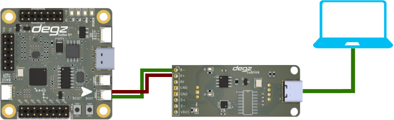

import DocCardList from '@theme/DocCardList';

# Derin Diver Kurulumu

Derin Diver'ı kullanmaya başlamadan önce Degz Suibo kontrol kartına Derin Diver'ı yüklememiz gerek. Degz Suibo kontrol kartı RP2040 mikroişlemcisini kullanmakta olup yazılım yükleme süreci UF2 dosyası ile yapılmaktadır.

- CH340 sürücülerini bu linkten kurun.
- Derin Diver'ın en son yayınlanmış sürümünü Github linki üzerinden UF2 dosyası olarak indirin
- Degz Suibo kartını bootloader moduna alın. BOOT tuşuna basılı tutarak USB ile bilgisayara bağlayabilirsiniz veya kart halihazırda bağlıysa, BOOT ve RESET tuşlarına aynı anda basıp ilk başta RESET tuşundan elinizi kaldırıp ardından BOOT tuşundan elinizi kaldırarak da bootloader moduna girebilirsiniz.
- İndirdiğiniz UF2 dosyasını bilgisayarınızın tanıyacağı RPI-RP2 adlı sürücüye kopyalayın. Kopyalama işlemi bittikten sonra sürücü kaybolacaktır ve Derin Diver yazılımını başarıyla yüklemiş olacaksınız.
- Kurulumun başarıyla tamamlandığından emin olmak için kartınızı USB ile bilgisayara bağladıktan sonra Arduino vb Serial Port okuyabilen bir programla kartın bağlı olduğu COM portunu açtığınızda yazılımın açılış mesajlarını görebilirsiniz. Hiçbir mesaj görmüyorsanız RESET tuşuna basıp kartı yeniden başlatabilirsiniz.

Derin Diver'la haberleşmek için Degz Suibo Kontrol Kartı ile temel bağlantımızı kurmamız gerekmekte. Aşağıda basit bir bağlantının nasıl yapılacağı gösterilmiştir.

Varsayılan olarak Derin Diver, Degz Suibo'nun RS485 portu üzerinden ana haberleşmesini yapmaktadır. Hata ayıklama ve log takibi için USB kullanılmaktadır. Degz Suibo'yu Sublink'e bağladıktan sonra Dive Control arayüzü üzerinden bağlantı kurabilirsiniz. Dive Control üzerinden bağlantının nasıl yapıldığını buradan öğrenebilirsiniz. 

<DocCardList />
