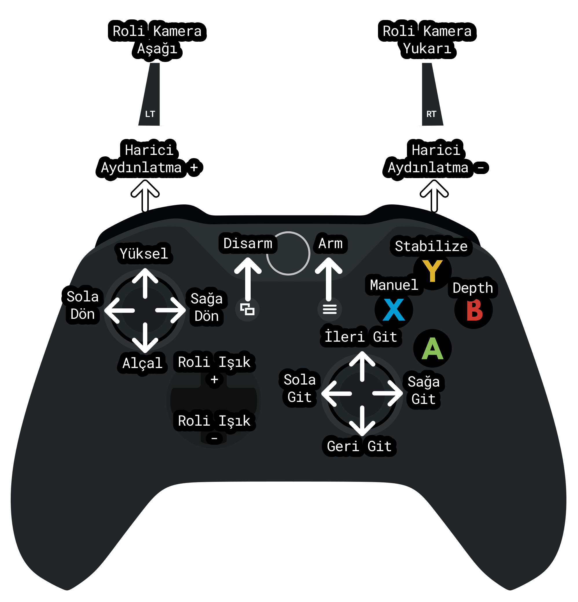

import DocCardList from '@theme/DocCardList';

# İlk Dalış ve Kontroller

Kurulum ve kalibrasyon adımlarını tamamladıktan sonra ilk dalış için hazırlıklara başlayabilirsiniz. İtici kalibrasyonlarını, sensör kalibrasyonlarını tamamladığınıza eminseniz ilk dalış için hazırsınız!

## Dalıştan Önce Kontrol Edilmesi Gerekenler

Su altı aracınızı suya indirmeden önce:

- Kontrol kartınızla sağlıklı bir haberleşme yapabildiğinizden emin olun
- Dive Control üzerinden su altı aracınıza bağlandıktan sonra iticilerinizi kontrol edebildiğinizden ve yönlerinin doğru olduğundan emin olun
- Kamera görüntünüzün sağlığını kontrol edin. İticilere güç verildiğinde parazit oluyorsa analog kamera izolasyonu konusunda sıkıntınız olabilir
- Pusula kullanıyorsanız kalibrasyonunu tam yaptığınızdan emin olun, su altı aracınıza güç verdikten ve aracınız kullanıma hazır olduktan sonra Dive Control arayüzündeki verilerin sapma miktarına bakın. Eğer eksenlerde kayma var ise kalibrasyon aşamalarında bir sıkıntı olmuş olabilir.
- İticilerinize güç vermeden önce tüm pervanelerin rahatça dönebildiğine emin olun, dönmesine engel olabilecek bir şey varsa ortadan kaldırın.
- Haznelerinizin su geçirmediğinden, valf kapaklarının kapalı olduğundan emin olun.
- Bilgisayarınıza Sublink'ten bağladığınız kablonun güvende olduğundan emin olun. Dalış sırasında su altı aracınız kabloyu çekip bağlantının kopmasına sebep olabilir.

## İticileri Test Edin

İticileri test ederken su altı aracınızı, pervanalerin size zarar veremeyeceği bir şekilde konumlandırdığınızdan emin olun.

- Dive Control üzerinden su altı aracınıza bağlanın, kumandanız veya klavye üzerinden su altı aracınızı Manuel Mod'a alın.
- Manuel Mod'a almak için kumandanızdan “B” tuşuna veya klavyenizden "I" tuşuna basın.
- Derin Diver'ı Arm'lamak için kumandadan “START” tuşuna veya klavyenizden “M” tuşuna basın.
- İleri komutu verin ve iticilerinizi gözlemleyin, seçtiğiniz itici konfigürasyonuna göre dönüp dönmediklerini kontrol edin.
- Yükseliş komutu verin ve yine iticilerinizi gözlemleyin.
- İticilerin hareketlerinden yana bir probleminiz yoksa Derin Diver'ı Disarm edin. Eğer bir sıkıntı varsa, itici konfigürasyonu sayfasını tekrar gözden geçirin.
- Derin Diver'ı Disarm'lamak için kumandadan “BACK” tuşuna veya klavyenizden “N” tuşuna basın.

## Kontroller

Dive Control üzerinden su altı aracınızı manual olarak kontrol edebilirsiniz. Klavye veya oyun kolları girdi yöntemi olarak kullanılabilir. Değiştirilebilir girdi sistemi ileriki versiyonlarda eklenecektir.

### Klavye Kontrolleri

- W - S : Yukarı aşağı kontrol, Heave
- A -D : Sağa sola dönme kontrolü, Heading
- Yön tuşları ile ileri - geri, sağa - sola gitme kontrolü, Surge & Strafe
- M : Arm komutu, aracınız armlamadan hareket etmeyecektir.
- N : Disarm komutu, tüm kontroller kesilir.
- I : Manual kontrol modu, iticilere hiçbir stabilizasyon uygulanmaz
- O : Stabilize kontrol modu, heading, roll ve pitch stabilizasyonu uygulanır (gövde türüne göre)
- P : Depth Hold kontrol modu, derinlik sabitleyerek stabilizasyon uygulanır (Test aşamasında)

### Oyun Kolu Kontrolleri

Tavsiye edilen oyun kolu Xbox destekli oyun kollarıdır. Başka oyun kolları ve custom oyun kollarına destek eklenecektir.

<DocCardList />
