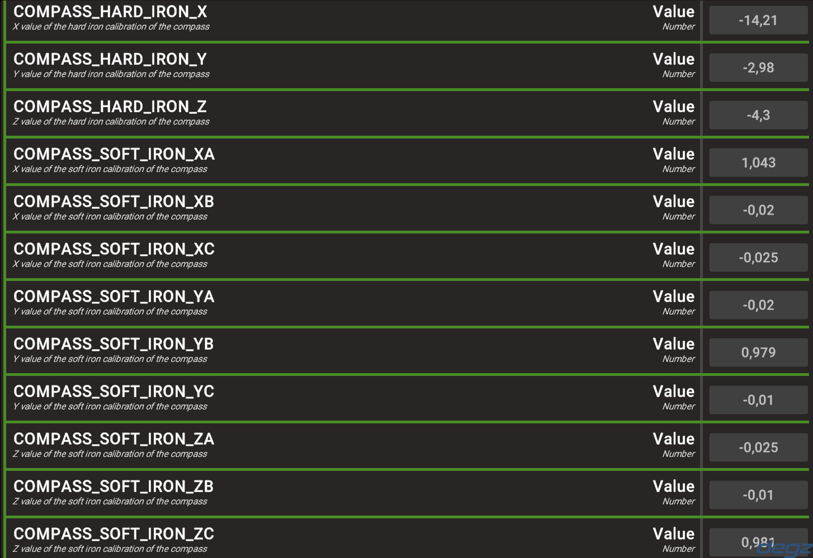

import DocCardList from '@theme/DocCardList';

# Sensör Kalibrasyonu

Derin Diver'ın tam performanslı çalışabilmesi için kontrol kartının üzerindeki sensörlerin kalibre olması gerekmektedir.

## Açı Ölçer (Gyroscope) ve İvme Ölçer (Accelerometer) Kalibrasyonu

Bu iki sensör Derin Diver ilk açıldığında kalibre edilir. Kalibrasyon halinde iken kontrol kartının veya su altı aracınızın mümkün olduğunca düz bir yüzeyde olduğundan ve kalibrasyon bitene kadar hiçbir şekilde oynamadığından emin olun. Kalibrasyon verisine eklenebilecek yanlış bir veri eksen kaymasına sebep olabilir.

- Su altı aracını veya kontrol kartını düz bir zemine koyunuz
- Sisteme güç veriniz
- İticilerden ikinci bir ses gelene kadar kontrol kartını veya aracınızı oynatmamaya dikkat edin.

## Pusula Kalibrasyonu (Compass, Magnetometer)

Pusulanın kalibrasyonu diğer sensörlerin aksine manuel olarak yapılmalıdır. Pusula kalibrasyonunun eksen sapmasına sebep olmaması için kontrol kartı araç içerisinde son pozisyonunu aldığı zaman yapılmalıdır. Pusula için kullanılan sensör manyetik alanlardan ve sensörün etrafında olabilecek ferro manyetik metallerden etkileneceği için kartın yerini değiştirmesi, kartın yanına başka bir kartın eklenmesi gibi durumlarda tekrar kalibre edilmesi gerekmektedir. Pusula kullanılan sistemlerde kontrol kartına herhangi bir mıknatısın yaklaştırılmaması gerekir. Çok yakında bir pusulanın sürekli bulunması sensörde kalıcı hasara yol açabilir. Derin Diver varsayılan olarak Degz Suibo için kalibreli olarak ayarlanmıştır.

### Manuel Kalibrasyon

Kontrol kartımızı su altı aracı içerisindeki son konumuna getirdikten sonra Derin-Diver Github Reposundan compassCal.uf2 dosyasını indirip kontrol kartınıza yükleyiniz.

Yüklemek için normal yazılım atma adımlarını takip etmeniz yeterli. Kartı BOOT tuşuna basarak usb ile bilgisayarına bağlayın ve çıkan sürücüye derlenmiş yazılım dosyasını sürükleyin. Sürücü kapandığı zaman yeni yazılımı atmış olacaksınız.
Yazılımı yükledikten sonra MotionCal'ı [şuradan indirin](https://www.pjrc.com/teensy/beta/imuread/MotionCal.exe). Programı açtıktan sonra karşını aşağıdaki gibi bir ekran gelecektir.

Buradan kontrol kartınızın bağlı olduğu COM portunu seçin ve kontrol kartınızı her eksende döndürmeye başlayın. Elinizde bir uçak varmış gibi düşünebilirsiniz.

İlk başta ekranda bir şey gözükmeyebilir ancak kontrol kartınızı biraz sağa sola çevirdikten sonra ekran aşağıdaki gibi gözükecektir.

Alt kısımdaki Gaps %2'nin altına düşene kadar kontrol kartınızı her eksende döndürmeye devam edin. Eğer değer %2'nin altına düşmüyorsa tüm eksenlerde çevirdiğinizden emin olun, aşağı yukarı sağa sola vs.

Gaps değeri %2'nin altına düştükten sonra kontrol kartınızı bilgisayardan çıkarın ve sağdaki verileri Dive Control üzerinden kartınıza yüklemek üzere bir yere not edin.

Kontrol kartınıza Derin Diver'ı tekrar yükledikten sonra Dive Control arayüzünü açın ve karta bağlanın. Bağlantı kurulduktan sonra araç içerisindeki parametreleri çekin ve pusula kalibrasyonu için olan parametreleri MotionCal'dan aldığınız verilere göre doldurun.

Hard Iron kısımlarını Magnetic Offset'teki veriler ile, Soft Iron kısımlarını da Magnetic Mapping kısmına bakarak doldurabilirsiniz. Magnetic Mapping'de satırlar XYZ, sütunlar ABC şeklindedir. Görseldeki gibi yaparsanız pusulanın kalibrasyonu için gereken verileri doğru girmiş olursunuz.

Parametreleri araca yolladıktan sonra kontrol kartınızı yeniden başlatın. Pusula kalibrasyonu için gereken veriler açılışta ayarlandığı için kartı yeniden başlatmanız gerekmektedir.

### Arayüz Üzerinden Kalibrasyon

Dive Control üzerinden pusula kalibrasyonu önümüzdeki versiyonlarda eklenecektir.

<DocCardList />
