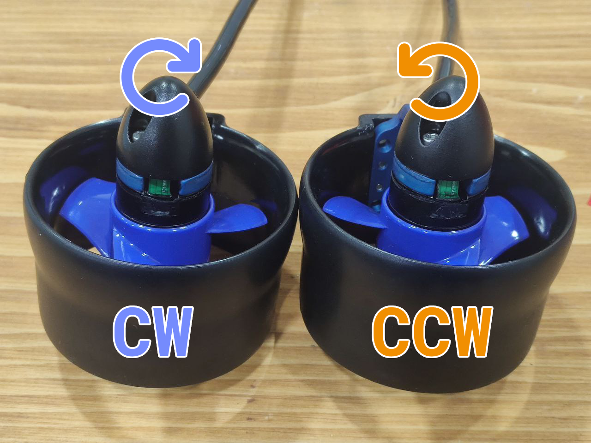

import DocCardList from '@theme/DocCardList';
import yengec6 from './image/yengec6.png';
import yengec8 from './image/yengec8.png';
import yengec6pitch from './image/yengec6pitch.png';

# İtici Bağlantıları ve Konfigürasyonları

Derin Diver birden fazla itici konfigürasyonunu desteklemektedir. Bu konfigürasyonlar arasında Yengeç 6, Yengeç 8 ve Yengeç 6 Pitch bulunmaktadır. Daha farklı itici konfigürasyonları için bizimle [Degz Robotics Forum](https://forum.degzrobotics.com) üzerinden iletişime geçebilirsiniz.

İticilere bağlı olan ESC'lerden çıkan PWM kabloları sırası farketmeksizin Degz Suibo'nun üzerindeki PWM headerlarına bağlanır. İticilerin dizilimleri ve yönlerinin ayarlanması Dive Control üzerinden yapılabilir. Aşağıdaki örnek bağlantı şemasını görebilirsiniz.

## Desteklenen İtici Konfigürasyonları (Derin Diver v0.9.0 ve üzeri)

İtici konfigürasyonlarında motorların yönleri maksimum itkilerini verdikleri yönler ve dönüş yönleri göz önünde bulundurulmalıdır. Mavi ile gösterilen iticiler saat yönünde, turuncu ile gösterilen iticiler saat yönünün tersine dönmesi gerekmektedir. Dive Control üzerinde, iticilerin pinlerini **`MOTOR_1_PIN`** şeklindeki parametreler ile, yönlerini de **`MOTOR_1_REVERSE`** şeklindeki parametreler ile ayarlayabilirsiniz. Aşağıdaki görsellerde hangi motorun hangi numaraya denk geldiği gösterilmiştir.

### Yengeç 6 İtici Konfigürasyonu

Yengeç 6 konfigürasyonunda su altı aracınız 6 itici ile hareket eder. 1 ve 2 numaralı iticiler su altı aracının aşağı yukarı gitmesini sağlarken aynı zamanda roll ekseninde stabilizasyon sağlar. Bu gövde tipinde pitch ekseninde kontrol ve stabilizasyon yoktur. 3, 4, 5 ve 6 numaralı iticilerin 45 derecelik açılarla yerleştirilmesi su altı aracını açısal olarak döndürmeden ileri geri ve sağa sola hareket etme kabiliyeti kazandırır. Bu itici konfigürasyonu Derin Diver'da varsayılandır. **`FRAME_TYPE`** parametresi 0 olarak ayarlandığında bu gövde tipi seçilmiş olur.

### Yengeç 8 İtici Konfigürasyonu

Yengeç 8 konfigürasyonunda su altı aracınız 8 iticiyi destekler. Bu sayede 6 eksende hareket kabiliyeti kazanmış olur. Bu gövde türünü kullanırken aracınızın ağırlık merkezini ve yoğunluk merkezinin tam ayarlanmış olması gerekmektedir. **`FRAME_TYPE`** parametresi 1 olarak ayarlandığında bu gövde tipi seçilmiş olur.

### Yengeç 6 Pitch İtici Konfigürasyonu

Yengeç 6 konfigürasyonu ile aynı olup yükseliş motorlarının roll ekseni yerine pitch eksenini kontrol etmesini sağlar. Bu konfigürasyonu kullanabilmek için **`FRAME_TYPE`** parametresi 2 olarak ayarlanmalıdır.

## İticinin Yönünü Nasıl Anlarım?

İticilerin yönlerini anlamak için pervanelerin açılarına bakabilirsiniz. Aşağıdaki görsellerde iki farklı yöne dönen pervane gösterilmiştir. Soldaki saat yönünde dönerken, sağdaki saatin tersi yönde döner.

<DocCardList />
