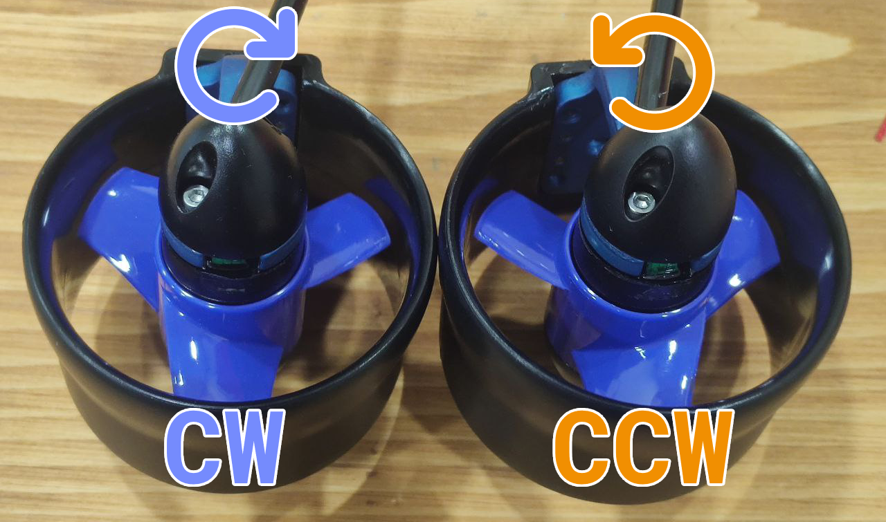

import DocCardList from '@theme/DocCardList';
import yengec6 from './image/yengec6.png';

# İtici Bağlantıları ve Konfigürasyonları

Derin Diver şuanda 6 iticili gövde tipini desteklemektedir. Daha fazla ve özelleştirilebilir gövde tiplerine destek yakın zamanda gelecektir.

İticilere bağlı olan ESC'lerden çıkan PWM kabloları sırası farketmeksizin Degz Suibo'nun üzerindeki PWM headerlarına bağlanır. İticilerin dizilimleri ve yönlerinin ayarlanması Dive Control üzerinden yapılabilir. Aşağıdaki örnek bağlantı şemasını görebilirsiniz.

## Desteklenen İtici Konfigürasyonları

İtici konfigürasyonlarında motorların yönleri maksimum itkilerini verdikleri yönler ve dönüş yönleri göz önünde bulundurulmalıdır. Mavi ile gösterilen iticiler saat yönünde, turuncu ile gösterilen iticiler saat yönünün tersine dönmesi gerekmektedir.

- Yengeç 6 İtici Konfigürasyonu

## İticinin Yönünü Nasıl Anlarım?

İticilerin yönlerini anlamak için pervanelerin açılarına bakabilirsiniz. Aşağıdaki görsellerde iki farklı yöne dönen pervane gösterilmiştir. Soldaki saat yönünde dönerken, sağdaki saatin tersi yönde döner.

<DocCardList />
