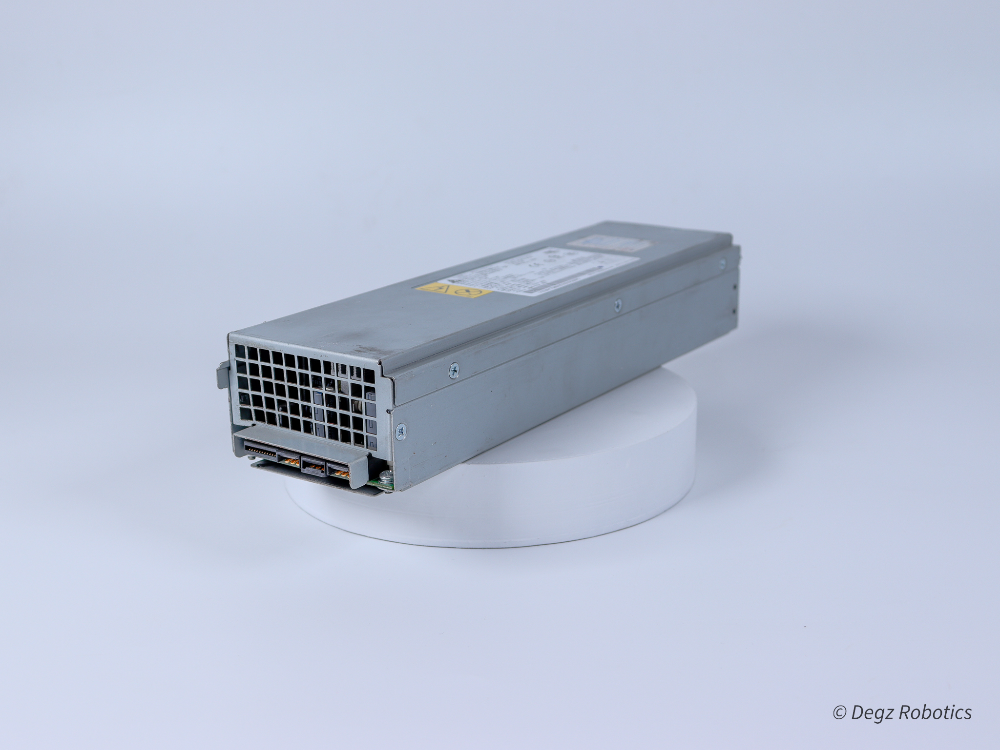
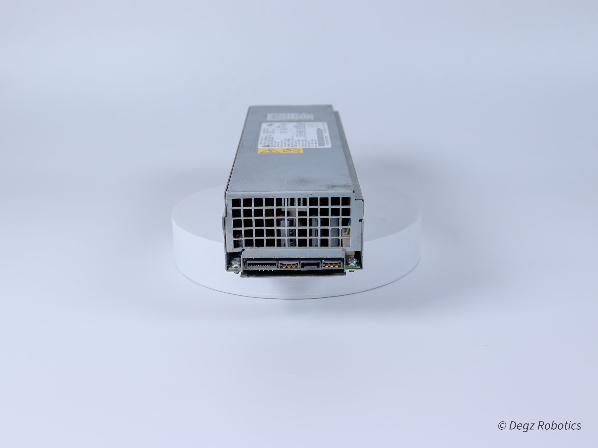
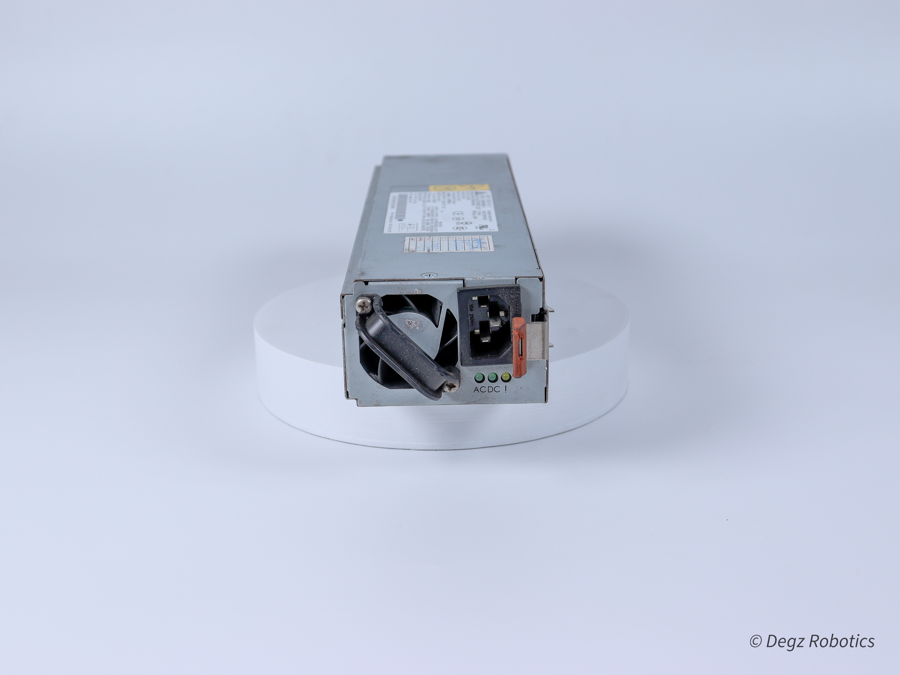

# Dönüşümün Gücü: 12V SMPS Güç Kaynakları

## Enerji Verimliliği ile Tanışın 

SMPS güç kaynakları, yüksek enerji verimliliği ve gelişmiş performans sunarak elektronik dünyasında bir devrim yaratıyor. Bu yenilikçi güç kaynakları, geleneksel transformatörlü güç kaynaklarına kıyasla daha az enerji harcar ve daha düşük ısı üretir, böylece enerji tasarrufu ve sistem güvenliği sağlar.

## 12V SMPS: Güçlü ve Güvenilir

12V SMPS güç kaynakları, teknoloji ve günlük yaşamın birçok alanında kritik bir rol oynar. Bilgisayar sistemlerinde, özellikle yüksek güç gerektiren CPU ve GPU gibi bileşenlere enerji sağlamak için yaygın olarak kullanılan 12V, sistem performansının ve güvenilirliğinin anahtarıdır. Otomotiv sektöründe, araç içi eğlence, navigasyon ve güvenlik sistemleri gibi elektronikler için idealdir, araçların daha akıllı ve bağlantılı hale gelmesini sağlar. LED aydınlatma çözümlerinde düşük enerji tüketimi ve yüksek verimlilik sunar. Telekomünikasyon alanında, ağ cihazları ve iletişim ekipmanları için tercih edilen 12V, dayanıklılık ve uzun ömür sunarak sektördeki inovasyonu destekler.

## Sektör Lideri Teknoloji

SMPS güç kaynakları, yenilikçi switch mod teknolojisi ile enerji dönüşümünün sınırlarını zorlar ve bu alanda yeni standartlar belirler. Bu gelişmiş teknoloji, enerjiyi daha verimli kullanarak, gereksiz tüketimi önler ve böylece enerji tasarrufunu maksimize eder. Bu sayede, operasyonel maliyetler önemli ölçüde düşerken, çevresel etki de azalır. Ayrıca, bu teknoloji sayesinde SMPS güç kaynakları, yüksek dalgalanma ve voltaj değişimlerine karşı da dayanıklıdır, bu da onları her türlü endüstriyel ve ticari uygulama için ideal hale getirir. Yüksek verimlilik, düşük maliyet ve çevre dostu özellikleriyle, SMPS güç kaynakları, enerji çözümleri arasında tercih edilen bir liderdir.

## Projelerinizi Yükseltin

Yüksek verimliliği, kompakt tasarımı ve üstün performansıyla SMPS güç kaynakları, elektronik projelerin vazgeçilmez bir unsuru haline gelmiştir. Bu güç kaynakları, enerjiyi daha etkin kullanarak operasyonel maliyetleri azaltırken çevresel etkiye de dikkat eder. 12V SMPS modeli, özellikle güvenilirlik ve dayanıklılık gerektiren uygulamalarda tercih edilen bir çözümdür. Yenilikçi switch mod teknolojisi ile donatılmış bu model, enerji dönüşümü konusunda yeni standartlar belirler. Her türlü elektronik projeyi yeni başarılara taşımak için güçlü ve güvenilir bir enerji çözümü sunar.

