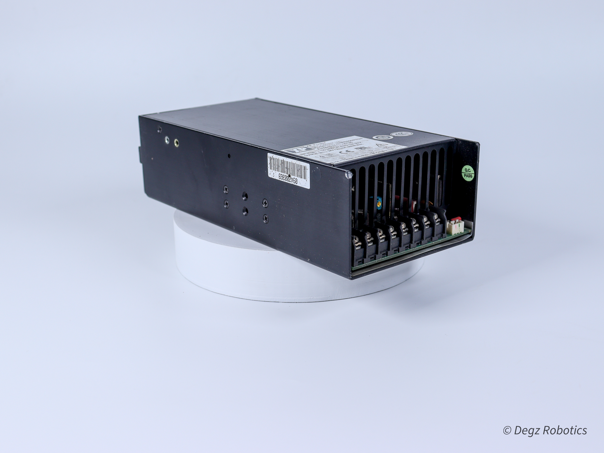
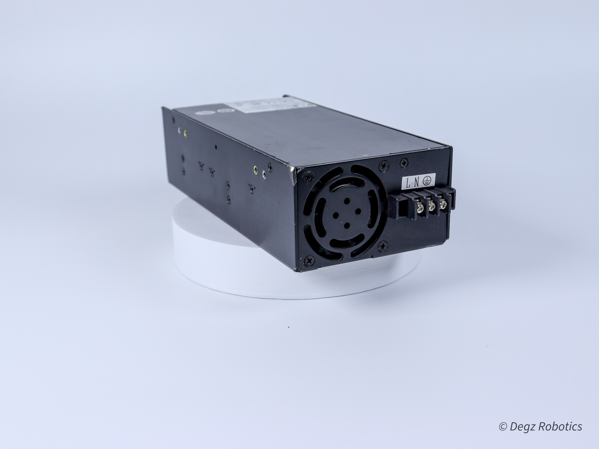
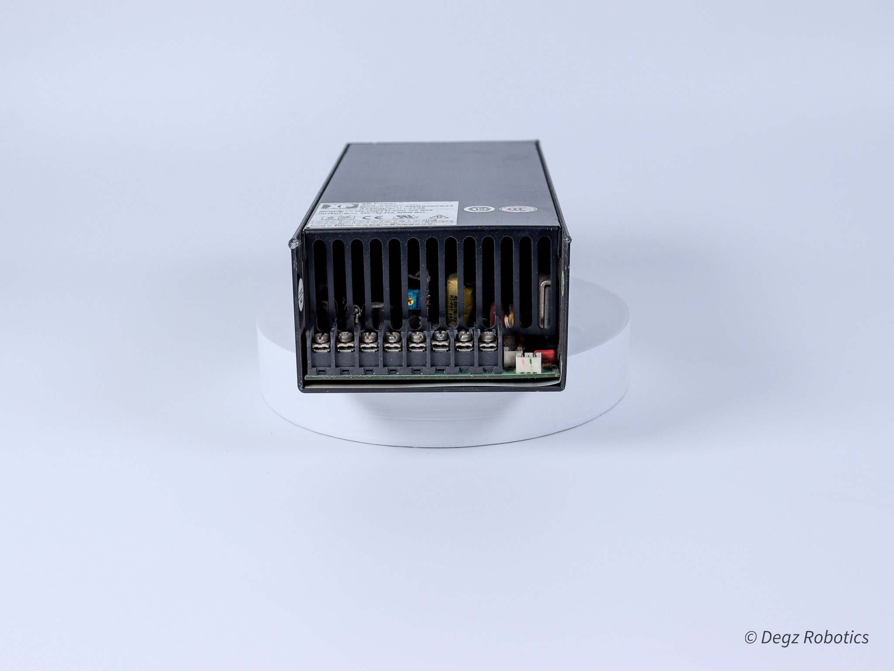
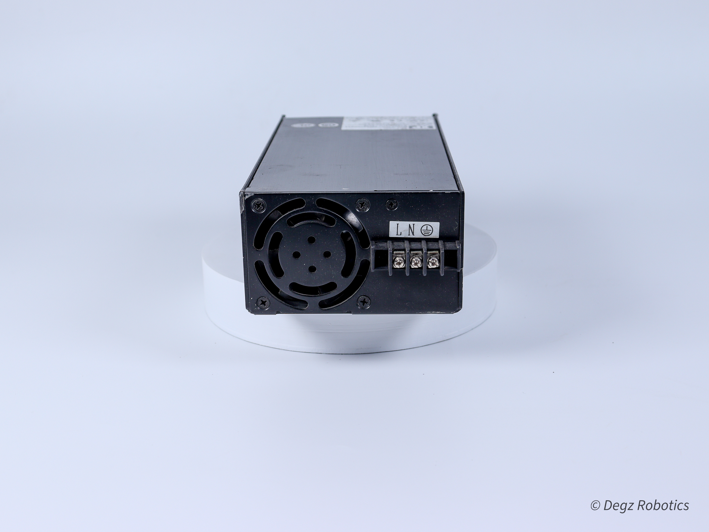

# Dönüşümün Gücü: 24V SMPS Güç Kaynakları
## Enerji Verimliliği ile Tanışın 

SMPS güç kaynakları, yüksek enerji verimliliği ve gelişmiş performans sunarak elektronik dünyasında bir devrim yaratıyor. Bu yenilikçi güç kaynakları, geleneksel transformatörlü güç kaynaklarına kıyasla daha az enerji harcar ve daha düşük ısı üretir, böylece enerji tasarrufu ve sistem güvenliği sağlar.

## 24V SMPS: Güçlü ve Güvenilir

24V SMPS güç kaynakları, endüstriyel otomasyon, güvenlik sistemleri ve telekomünikasyon gibi önemli uygulamalar için mükemmel bir seçenektir. Bu güçlü kaynaklar, yüksek güvenilirlik ve stabilite sunarak, otomasyon sistemleri ve PLC'ler gibi kritik ekipmanların sorunsuz çalışmasını sağlar. Elektriksel gürültüye karşı dirençli olmaları, CNC makineleri gibi ağır ekipmanların da tercihi haline gelmiştir. Aynı zamanda, güvenlik kameraları gibi ticari uygulamalar için ideal voltaj düzeyini sunarlar. Projelerinizde maksimum performans ve adaptasyon sağlayarak, verimliliğinizi artırırlar

## Sektör Lideri Teknoloji
SMPS güç kaynakları, yenilikçi switch mod teknolojisi ile enerji dönüşümünün sınırlarını zorlar ve bu alanda yeni standartlar belirler. Bu gelişmiş teknoloji, enerjiyi daha verimli kullanarak, gereksiz tüketimi önler ve böylece enerji tasarrufunu maksimize eder. Bu sayede, operasyonel maliyetler önemli ölçüde düşerken, çevresel etki de azalır. Ayrıca, bu teknoloji sayesinde SMPS güç kaynakları, yüksek dalgalanma ve voltaj değişimlerine karşı da dayanıklıdır, bu da onları her türlü endüstriyel ve ticari uygulama için ideal hale getirir. Yüksek verimlilik, düşük maliyet ve çevre dostu özellikleriyle, SMPS güç kaynakları, enerji çözümleri arasında tercih edilen bir liderdir.

## Projelerinizi Yükseltin 

Yüksek verimliliği, kompakt tasarımı ve üstün performansıyla SMPS güç kaynakları, elektronik projelerin vazgeçilmez bir unsuru haline gelmiştir. Bu güç kaynakları, enerjiyi daha etkin kullanarak operasyonel maliyetleri azaltırken çevresel etkiye de dikkat eder. 24V SMPS modeli, özellikle güvenilirlik ve dayanıklılık gerektiren uygulamalarda tercih edilen bir çözümdür. Yenilikçi switch mod teknolojisi ile donatılmış bu model, enerji dönüşümü konusunda yeni standartlar belirler. Her türlü elektronik projeyi yeni başarılara taşımak için güçlü ve güvenilir bir enerji çözümü sunar.

