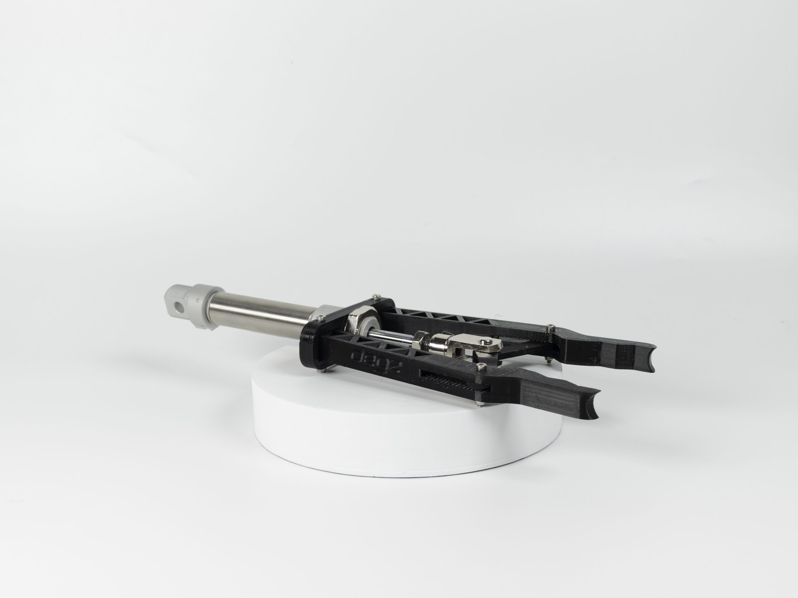

import DocCardList from '@theme/DocCardList';

# Ürün Hakkında

Sualtı görevlerini gerçekleştirmek için gereken tutucu kol, yaklaşık 0.8 sn içerisinde açılıp kapanabilir. 

Sualtındaki nesneleri hızlı bir şekilde toplayabilirsiniz. 10 cm boyuta kadar nesneleri kolaylıkla tutabilen kol basit bir açma kapama sinyali ile karadan veya sualtından kullanılabilir. Tutma şiddetini basınçla ayarlayarak hassas nesneleri hafif bir şekilde tutabilir veya ağır nesneleri güçlü bir şekilde kavratabilirsiniz.

# Ürünün Teknik Özellikleri

- Ağız açıklığı : 120mm
- Uzunluk: Açık 305mm, Kapalı 315mm
- Genişlik: 90mm  
- Tutma kuvveti : 2.8 Bar basınç altında Yaklaşık 180Newton

## Ürünün kullanımı

<iframe width="100%" height="574" src="https://www.youtube.com/embed/rv21GLY30Vw" title="180 NEWTON KAVRAMA GÜCÜ | Degz Su Altı Pinomatik Tutucu Kolu İnceledik !" frameborder="0" allow="accelerometer; autoplay; clipboard-write; encrypted-media; gyroscope; picture-in-picture; web-share" allowfullscreen></iframe>

**Soru ve önerileriniz için bize [forumdan](https://forum.degzrobotics.com/)    ulaşabilirsiniz .**

