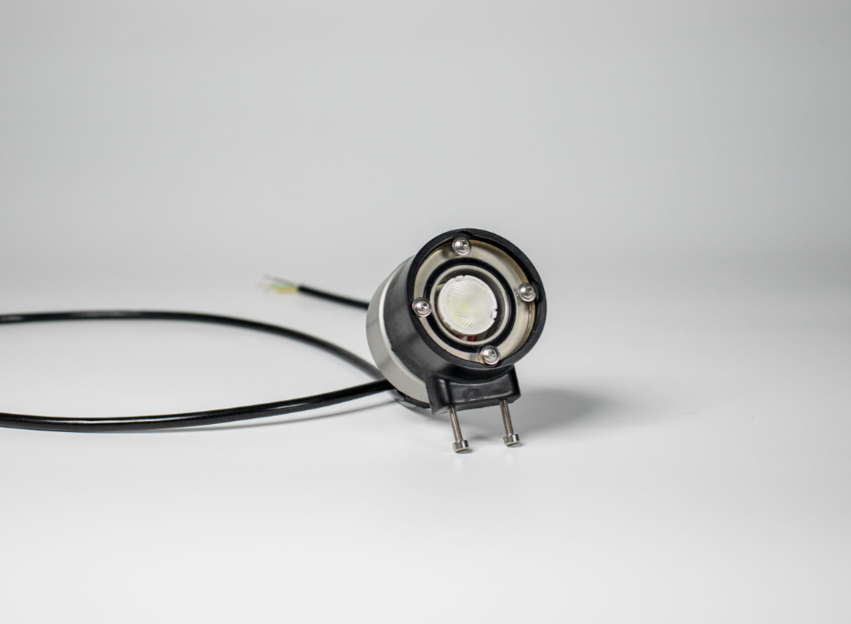
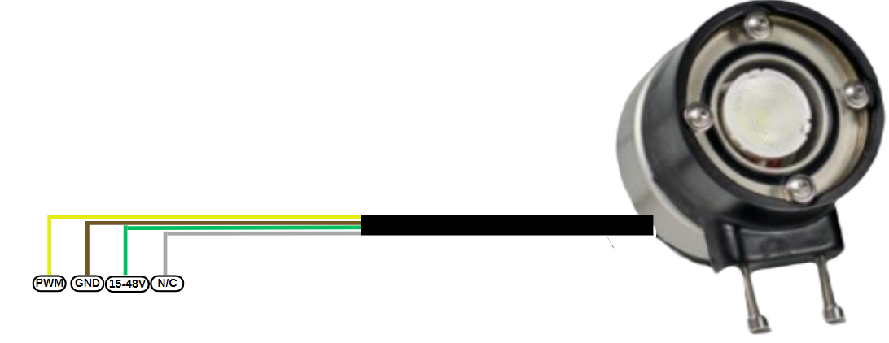

import DocCardList from '@theme/DocCardList';

# Ürün Hakkında

Bu su altı aydınlatması, 1500 lümenlik Cree LED'ler kullanarak güçlü bir ışık sağlar ve özellikle su altı çalışmaları için tasarlanmıştır. Anodize alüminyumdan yapılmış dayanıklı bir gövdeye sahip olan cihaz, etkili ısı dağıtımı sağlar ve 300 metre derinliğe kadar su altında güvenle kullanılabilir. Aydınlatma cihazı, Arduino, Raspberry Pi gibi çeşitli mikrodenetleyicilerle uyumlu olup, bu kartlar aracılığıyla veya doğrudan ana güç hattına bağlanarak kontrol edilebilir. 11.2 W güç tüketimiyle enerji verimliliği sunar ve aşırı ısıya karşı korumalıdır. PWM sinyali ile ayarlanabilir ışık şiddeti ve geniş bir gerilim aralığına sahip bu cihaz, su altı keşiflerinde kullanım için idealdir.

|       Özellik           |   Açıklama           |
|--------------------------|-----------------------|
|1500 lm ışık şiddeti	|Cihaz, 1500 lümen gücünde yüksek parlaklık sunar.|
|0-1500 µS Pwm Sinyali	|Işık şiddeti, 3.3V PWM sinyali ile 0-2000 µS aralığında ayarlanabilir.|
|15V-48V gerilim aralığı|	Cihaz, 15 ila 48 volt arasında değişen geniş bir gerilim aralığını destekler.|
|Aşırı ısı koruma|	Aşırı ısı oluşumuna karşı koruma özelliği ile güvenli kullanım sağlar.|
|Paralel bağlanabilir|	Birden fazla lamba, paralel olarak bağlanarak geniş alanlar aydınlatılabilir.|
|Alüminyum gövde	|Dayanıklı anodize alüminyum gövde, etkili ısı dağıtımı sağlar ve uzun ömürlüdür.|

## Pin Diyagramı

Soru ve önerileriniz için bize [forumdan](https://forum.degzrobotics.com/)    ulaşabilirsiniz .

<DocCardList />

