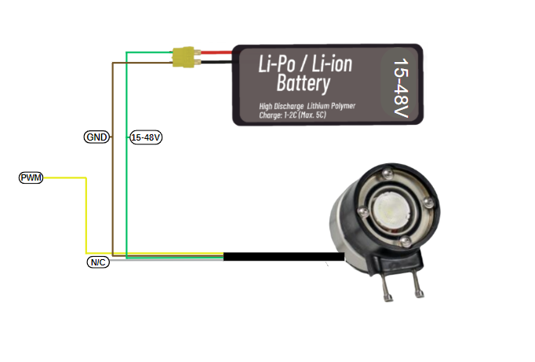
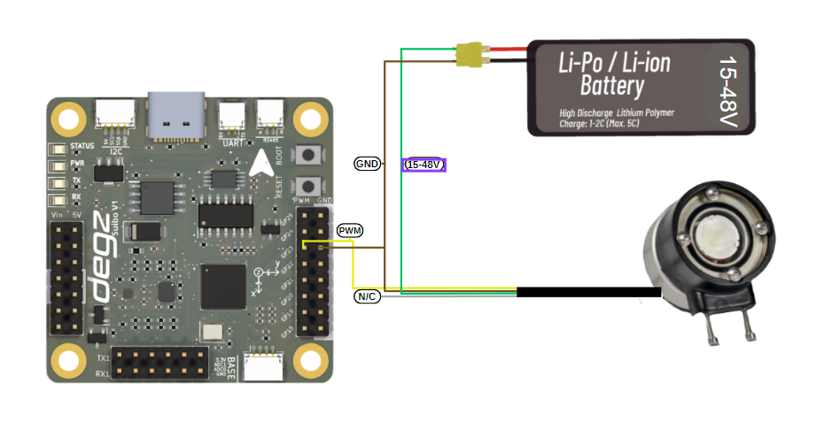

# Ürünün Kullanımı

## Su Altı Aydınlatmasının Pil ile Bağlantı Şeması 


Aydınlatıcınızın kullanımı için dört kabloyla basit bir bağlantı şeması vardır. Yeşil kablo, aydınlatıcınızı çalıştıracak olan 15 ile 48 volt arasındaki Li-Po veya Li-ion pilin pozitif bacağını temsil eder. Kahverengi kablo, negatif bağlantıyı oluşturur ve aydınlatıcınızın topraklamasını sağlar. Sarı kablo, parlaklık seviyesini ayarlamak için kullanılan darbe genişlik modülasyonunu (PWM) taşır. Beyaz kablonun herhangi bir  bağlantı gerektirmemektedir . Bu basit rehberle, aydınlatıcınızı güvenli bir şekilde pilinize bağlayıp kullanabilirsiniz.




## Su Altı Aydınlatmasının Parlaklığının Suibo  ile Kontrolü 

Aydınlatma sisteminiz, dört kablolu bir bağlantı düzeniyle 15 ila 48 volt arasındaki Li-Po veya Li-ion pil kullanarak enerji alır. Yeşil kablo, pilin pozitif ucuna, kahverengi kablo ise negatif ucuna bağlanarak sistem elektriklenir. Sarı kablo, aydınlatmanın parlaklığını PWM sinyaliyle ayarlar; beyaz kablo bu düzende işlevsizdir. Bu kurulum tamamlandığında, Suibo elektronik kontrol kartıyla programlama yapabilirsiniz. Örneğin, AYDINLATMA_PIN olarak tanımlı 23 numaralı pine aydınlatmanızı bağlayıp, farklı PWM değerleri göndererek parlaklık seviyesini kontrol edebilirsiniz. Bu yöntem, özellikle sualtı ve suüstü robotik projeleri gibi özel uygulamalar için idealdir. Robotunuzun çevresel koşullara göre aydınlatma gereksinimlerini dinamik olarak ayarlayabilir.Bu esnek ve kontrol edilebilir aydınlatma çözümü, robotik sistemlerinizi daha etkin bir şekilde kullanmanıza olanak tanır.




````

#define AYDINLATMA_PIN 23 // Aydınlatmanın bağlı olduğu pin

void setup() {
  // AYDINLATMA_PIN'i çıkış olarak ayarla
  pinMode(AYDINLATMA_PIN, OUTPUT);
}

void loop() {
  // Aydınlatmayı düşük parlaklıkta çalıştır (düşük PWM değeri)
  analogWrite(AYDINLATMA_PIN, 51); // Yaklaşık %20 parlaklık (255'in %20'si)
  delay(2000); // 2 saniye bekle
  
  // Aydınlatmayı yüksek parlaklıkta çalıştır (yüksek PWM değeri)
  analogWrite(AYDINLATMA_PIN, 255); // %100 parlaklık
  delay(2000); // 2 saniye bekle

  // Aydınlatmayı orta parlaklıkta çalıştır
  analogWrite(AYDINLATMA_PIN, 127); // Yaklaşık %50 parlaklık
  delay(2000); // 2 saniye bekle
}

````


## Su Altı Aydınlatmasının Parlaklığının Potansiyometre  ile Kontrolü 

Bu kod örneği, bir Arduino kullanarak potansiyometre ile kontrol edilen bir LED aydınlatma sistemini yapılandırır ve yönetir. Kod, bir potansiyometrenin analog girişini okuyarak 0 ile 1023 arasında bir değer alır ve bu değeri 0 ile 255 arasında bir parlaklık değerine çevirir. Bu çevrilen değer, ardından LED'in parlaklığını ayarlamak için kullanılır. Kod, belirlenen parlaklık değerini Arduino'nun seri monitörüne yazdırarak gerçek zamanlı izleme sağlar. Ayrıca, kodun işlevselliğini artırmak için 10 milisaniyelik bir gecikme ekler, böylece okumalar arasında stabil bir geçiş sağlanır. Bu basit sistem, analog sinyalleri dijital çıktılara dönüştürme ve mikrodenetleyicilerle donanım kontrolü uygulamalarına giriş yapmak için açıklayıcı bir örnektir.


````

#define AYDINLATMA_PIN 23    // Aydınlatmanın bağlı olduğu pin
#define POT_PIN A0           // Potansiyometrenin bağlı olduğu analog pin

void setup() {
  pinMode(AYDINLATMA_PIN, OUTPUT);
  Serial.begin(9600);   // Hata ayıklama ve izleme için seri portu başlat
}

void loop() {
  int potValue = analogRead(POT_PIN);    // Potansiyometreden değer oku (0 - 1023 arası)
  int parlaklik = map(potValue, 0, 1023, 0, 255); // Potansiyometre değerini parlaklık değerine çevir (0 - 255 arası)

  analogWrite(AYDINLATMA_PIN, parlaklik);    // Aydınlatmanın parlaklığını ayarla

  // Parlaklığı seri monitöre yazdır
  Serial.print("Parlaklık: ");
  Serial.println(parlaklik);

  delay(10); // Küçük bir gecikme ekle
}
````

Soru ve önerileriniz için bize [forumdan](https://forum.degzrobotics.com/)    ulaşabilirsiniz .