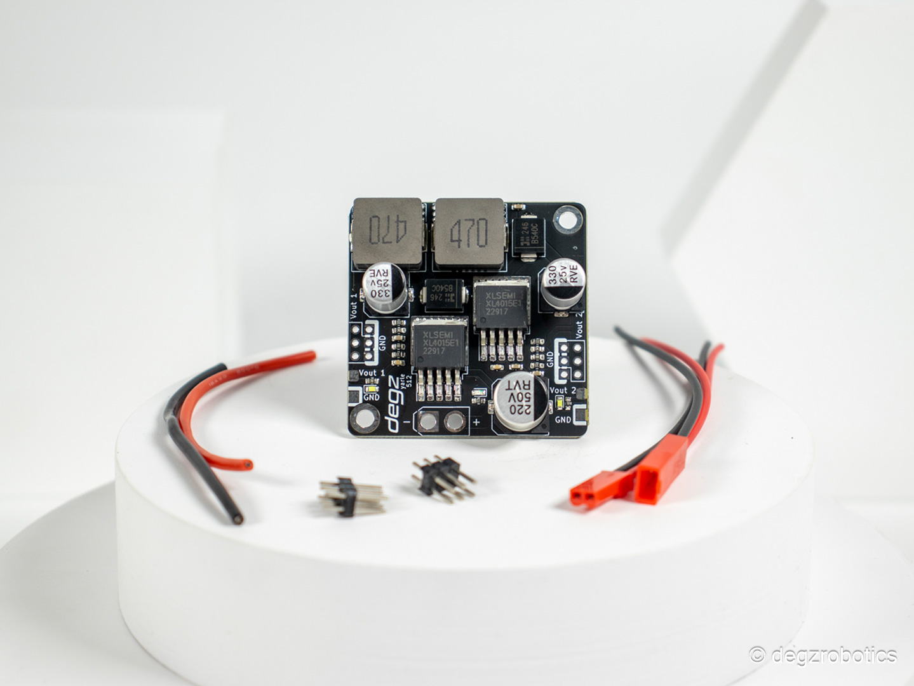
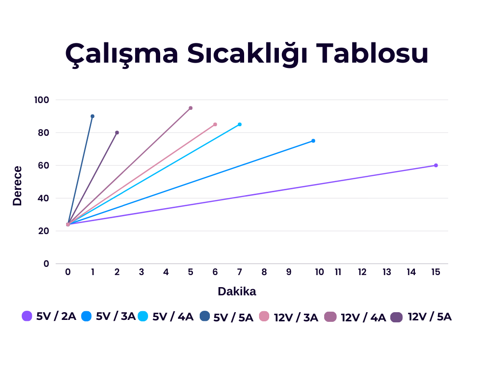

import DocCardList from '@theme/DocCardList';

# 5V 12V Gerilim Regülatörü

Bu regülatör, kullanıcılara oldukça esnek bir yapıda 5V ile 12V arasında değişen ayarlanabilir iki çıkış seçeneği sunar. Her çıkış bağımsız olarak ya da birlikte kullanılabilir, böylece iki adet 5V/5A, iki adet 12V/4A çıkışı ya da bir çıkış 5V diğeri 12V olarak ayarlanabilir. Ayarlamalar, kart üzerindeki belirgin işaretler sayesinde rahatlıkla yapılabilir.  Bu regülatör, 8-36V aralığında veya 3s-8s Li-Po pil ile çalışacak şekilde geniş bir giriş voltajı kapasitesine sahiptir. Ancak, giriş ters bağlantı korumasına sahip değildir; bu durumda yüksek akımlı bir diyotun seri şekilde bağlanması önerilir. Kompakt tasarımı ile çeşitli elektronik projelerde kullanıma uygundur ve kullanım kolaylığı ile projelerinize değer katar.

# Ürünün Teknik Özellikleri

Bu regülatör, yüksek güç çıkışı sağlar ve 5V ile 12V arasında ayarlanabilir iki çıkışa sahiptir. İki çıkıştan biri 5V 5A, diğeri 12V 4A olmak üzere farklı kombinasyonlarda kullanılabilir: ya iki 5V/5A, iki 12V/4A çıkışı ya da biri 5V diğeri 12V olacak şekilde.

Çıkış ayarları, kart üzerindeki Volt1 ve Volt2 olarak belirtilen yerlerden yapılır. Pedlerin birleştirilmesiyle elde edilen çıkışlar şöyledir:

Volt1 için 12V 4A,
Volt2 için 5V 5A.

:::note
Ayrıca, her iki çıkışı da aynı anda 5V veya 12V olarak ayarlayabilirsiniz. Ancak, kartın arkasındaki pedler birleştirilmeden voltaj çıkışı alınamaz.
:::
## Ürünün Özellikleri 

| Ana Özellikler              |                                                                                                                                                                                                                                    |
|----------------------------|--------------------------------------------------------------------------------------------------------------------------------------------------------------------------------------------------------------------------------------------|
|Giriş voltajı | 8-36V / 3s-8s li-po|
| 5V Azami Çıkış Akımı | 5000 mA|
|12V Azami Çıkış Akımı | 4000 mA|
|5V/12V Çıkış sayısı | 3+3 Pin|
|Giriş ters bağlantı koruması| Hayır ( Yüksek akımlı bir diyot seri bağlanabilir. )|
|**Fiziksel Özellikler**||
|Boyut| 45 x 45 mm|
|Header Konnektör| 2.54 mm Header|
|Güç Konnektör| XT30|

Bu ürünü almak için [tıklayınız](https://degzrobotics.com/product/5v-12v-gerilim-regulatoru/).  

Bu ürünü kullanırken karşılaştığınız  sorunları  bize sormak için  [tıklayınız](https://forum.degzrobotics.com/).  
<DocCardList />