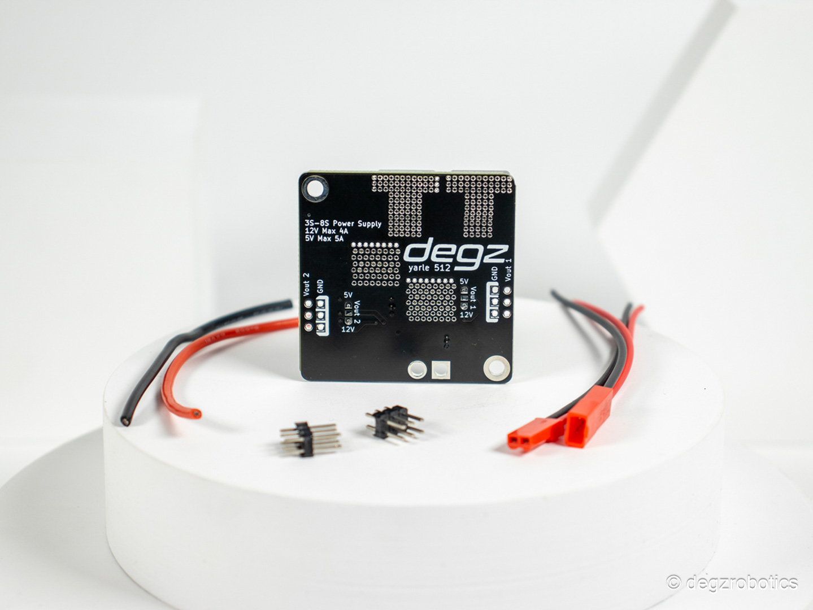

# Ürün Hakkında

İhtiyacınıza Göre Tek Regülatör!
Degz’in yeni regülatörü ile tanışın. Projeleriniz için güvenle kullanabileceğiniz bu kart sizlere ayarlanabilir çıkış gerilimi sunuyor. Nvidia veya Raspberry Pi gibi bilgisayarlarınızın akım ihtiyacını da rahatça karşılayan bu regülatör otonom sistemleriniz için özel olarak geliştirildi.

## 5V ve 12V Çıkış Gerilimi Aynı Kartta

Yüksek güç çıkışı sağlayabilen bu regülatör, 5 Volt ve 12 Volt arasında ayarlanabilen iki çıkış bulundurur. Bu sayede iki adet 5V/5A veya iki adet 12V/4A veya 1 adet 5V ve 1 adet 12V çıkış olarak kullanabilirsiniz.

Kart üzerinde belirtilen Volt1 ve Volt 2 çıkışlarından farklı voltaj ve akım çıkışları alabilirsiniz. Şematikte verildiği gibi pedler birleştirildiğinde alabileceğiniz çıkışlar şu şekilde olacaktır:

- Volt1: 12V 4000mA
- Volt2: 5V 5000mA

Aynı zamanda çıkışların ikisini de aynı anda 5V veya 12V olarak kullanabilirsiniz.

:::note
Kart arkasındaki pedler birleştirilmeden voltaj çıkışı alınmamaktadır.
:::

## Konnektörlü Bağlantı

Standart XT30 ile kullanılabilen kart, özellikle otonom projelerin güç ihtiyacını rahatlıkla karşılayabilir.

## Özellikler

### Genel Özellikler

- Giriş voltajı : 8-36V / 3s-8s li-po
- 5V Azami Çıkış Akımı : 5000 mA
- 12V Azami Çıkış Akımı : 4000 mA
- 5V/12V Çıkış sayısı : 3+3 Pin
- Giriş ters bağlantı koruması: Hayır ( Yüksek akımlı bir diyot seri bağlanabilir. )
  
### Fiziksel Özellikler**

- Boyut: 45 x 45 mm
- Header Konnektör: 2.54 mm Header
- Güç Konnektör: XT30

