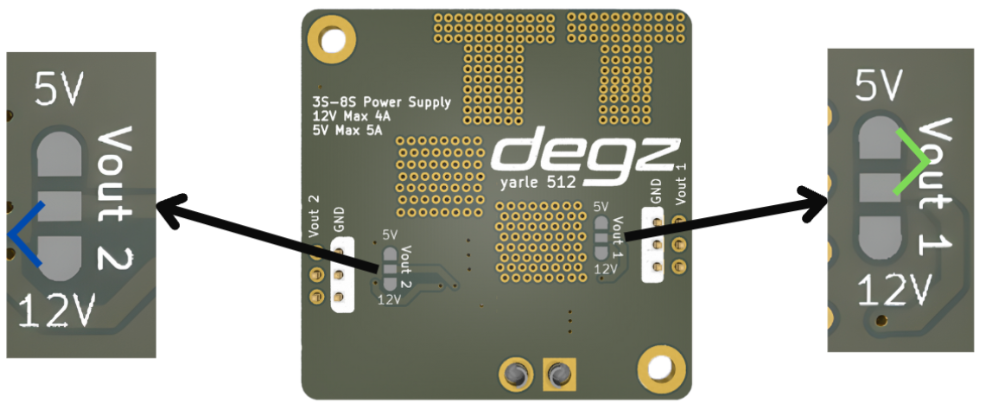

# Ürünün Kullanımı

## Pin Diyagramı

Degz’in yeni regülatörü ile tanışın. Projeleriniz için güvenle kullanabileceğiniz bu kart sizlere ayarlanabilir çıkış gerilimi sunuyor. 

## Pin Bağlantıları

Kart üzerinde okla gösterilen alanlarda lehim padleri bulunmaktadır. Bu padlerden renkli işaretlerle gösterilen ikisini lehimlendiğinde sol taraftan yani Vout 2 çıkışından 5v 5000mA bir çıkış elde edeceksiniz. Sağ taraftan yani Vout 1 çıkışından ise 12v 4000mA bit çıkış elde edeceksiniz.

:::info
İhtiyacınıza göre aynı anda iki çıkıştan 5 volt yada 12 volt alabilirsiniz.
:::

Bu ürünü kullanırken karşılaştığınız  sorunları  bize sormak için  [tıklayınız](https://forum.degzrobotics.com/).  