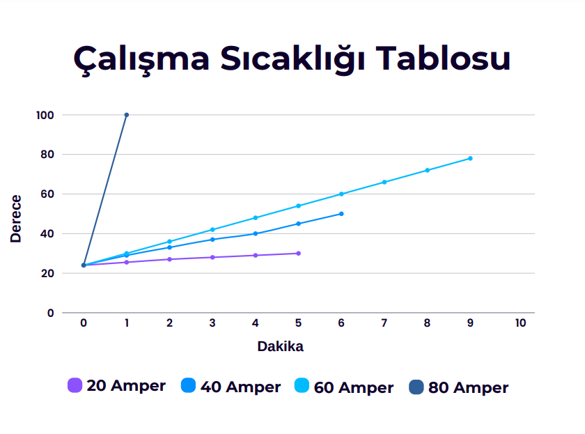
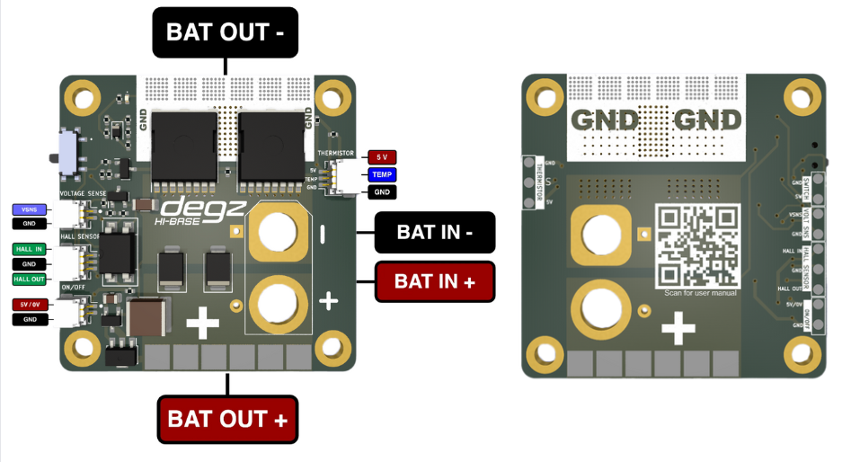

import DocCardList from '@theme/DocCardList';

# Ürün Hakkında

 

Hi Base kartı, kullanıcıların enerji tüketimlerini anlık olarak izlemelerini sağlayan bir elektronik devre kartıdır. Anlık akım, voltaj ve güç izleme özellikleri sayesinde, kullanıcılar enerji kullanımlarını detaylı bir şekilde görüntüleyebilirsiniz. Manyetik anahtarlama teknolojisi, kartın fiziksel bir temas olmaksızın açılıp kapanmasını mümkün kılar, ve aynı zamanda bir harici anahtar üzerinden uzaktan kontrol edilebilirliği sunar. Kart, INA219 akım sensörü ile donatılmıştır, bu da hassas akım ölçümleri yapılabilmesini sağlar.  45 x 45 mm boyutundaki kompakt tasarımı ve geniş uyumluluğu, çeşitli enerji yönetimi ihtiyaçlarına yönelik olarak tasarlanmıştır, böylece  enerji yönetimini etkin bir şekilde gerçekleştirmelerine olanak tanır.

## Ürünün Teknik Özellikleri

|      Ana Özellikler           |              |
|--------------------------|-----------------------|
|Anlık akım voltaj ve güç izleme|Kullanıcının enerji tüketimini detaylı bir şekilde izlemesini sağlar.|
|Manyetik anahtarlama|Fiziksel temas gerektirmeden, manyetik bir alan aracılığıyla cihazın açılıp kapanmasını sağlar.|
|Harici anahtar|Kullanıcıların cihazı dışarıdan bir anahtar aracılığıyla kontrol etmesine olanak tanır.|
|**Elektriksel Karakteristik**|
|Azami Akım| 120 Amper(120 ampere kadar test edilmiştir.)|
|Sürekli Akım| 60 Amper|
|Giriş Gerilimi| 6-48 Vdc|
|Pil Türleri| 2s – 12s|
|**Sensörler**|
|INA219 Akım sensörü|	Cihazın akımı hassas bir şekilde ölçmesini yardımcı olur .|
|**Fiziksel**|
|Boyut: 45 x 45 mm|

 

## Pin Diyagramı

 

**Bu ürünü kullanırken karşılaştığınız  sorunları  bize sormak için  [tıklayınız](https://forum.degzrobotics.com/).**  

<DocCardList />