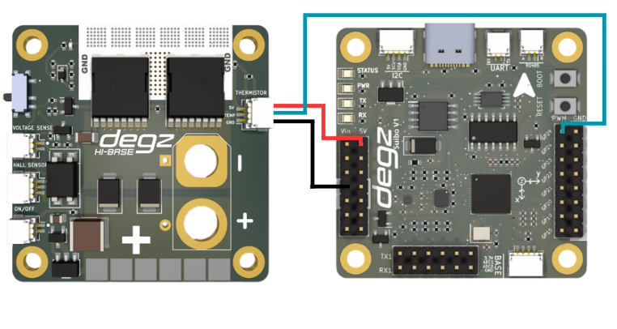

# Ürünün Kullanımı

## Hi Base ve  BLU 30 A ESC Fırçasız Motor Sürücü  ile Kullanımı

BLU 30A ESC fırçasız motor sürücüsünün Hi Base kartı ile birlikte kullanım  diyagramı aşağıdaki gibidir .


##  HiBase ve Suibo  ile Termistör Kullanarak Sıcaklık Ölçme

Bu örnekte, Suibo Elektronik Kartı ve HiBase kartı kullanılarak, bir termistör yardımıyla çevresel sıcaklık ölçülmektedir. Kod, Arduino ve çoğu MCU'da kullanılan analog giriş pinleri üzerinden termistörden analog veri okur. Devredeki seri direnç ve termistörün özellikleri kullanılarak termistör direnci hesaplanır ve bu direnç üzerinden sıcaklık değeri Kelvin cinsinden elde edilir, ardından Celsius cinsine çevrilir.

Kod, seri port üzerinden sıcaklık değerini sürekli olarak yazdırır. Bu setup, özellikle laboratuvar ortamları, ev otomasyonu sistemleri veya çevresel izleme projeleri için uygundur, çünkü basit bir yapıda olup kolaylıkla uygulanabilir ve gerçek zamanlı veri sağlar.



````
#include <Arduino.h>

// ADC okuması için kullanılacak pin
const int analogPin = 29; 
// Termistör ve devre parametreleri
const float betaParametre = 3950; // Tipik bir değer, termistör datasheetinden alınmalıdır
const float seriDirenç = 10000; // Seri bağlı direnç değeri (ohm cinsinden)
const float referansSıcaklık = 0 + 273.15; // Referans sıcaklık (Kelvin cinsinden)
const float referansDirenç = 10000; // Referans direnç değeri (ohm cinsinden), 25°C'de termistör direnci

void setup() {
  Serial.begin(9600); // Seri portu başlat
}

void loop() {
  int okunanDeger = analogRead(analogPin); // ADC'den değeri oku
  float voltaj = (okunanDeger / 1023.0) * 5.0; // Okunan değeri voltaja çevir
  float termistörDirenç = (5.0 * seriDirenç / voltaj) - seriDirenç; // Termistör direncini hesapla

  // Sıcaklığı hesapla
  float sıcaklık = betaParametre / (log(termistörDirenç / referansDirenç) + (betaParametre / referansSıcaklık));
  sıcaklık = sıcaklık - 273.15; // Kelvin'den Celcius'a çevir

  // Sıcaklığı seri porta yazdır
  Serial.print("Sıcaklık: ");
  Serial.print(sıcaklık);
  Serial.println(" C");

  delay(1000); // Bir sonraki okuma için 1 saniye bekle
}


 ````

 ##  HiBase  ve Hi Base  ile Gerilim Ölçümü Kodu


Bu kod, HiBase ve Suibo elektronik kartları kullanılarak NTC sensöründen gerilim okumalarını almak için yazılmıştır. Arduino'nun analog pinlerinden biri olan A0'a bağlı NTC sensörü, belirli aralıklarla okunarak elde edilen değerler seri porta yazdırılır. Bu işlem, sensörün ölçtüğü gerilim seviyesine dair hızlı ve sürekli güncellemeler sağlar.

Kurulumda, daha yüksek baud hızında seri iletişim başlatılır ki bu da veri aktarımını hızlandırır. Her okuma sonrası bir saniyelik bir bekleme süresi eklenir, böylece okumalar arasında stabil bir zaman dilimi sağlanır. Bu kod, gerilim izleme sistemleri, enerji yönetimi uygulamaları veya eğitim amaçlı projelerde kullanılabilir. Verilerin kolayca görüntülenmesi ve analizi için ideal bir çözümdür.


````

#include <Arduino.h>

// NTC sensörünün bağlı olduğu analog pin
const int analogPin = 29;

void setup() {
  // Seri haberleşmeyi başlat
  Serial.begin(115200);
}

void loop() {
  // Analog pin üzerinden okunan değeri oku
  int sensorValue = analogRead(analogPin);
  
  // Okunan değeri seri port üzerinden gönder
  Serial.print("Sensor Value: ");
  Serial.println(sensorValue);
  
  // 1 saniye bekle
  delay(1000);
}

 ````

 **Bu ürünü kullanırken karşılaştığınız  sorunları  bize sormak için  [tıklayınız](https://forum.degzrobotics.com/).**  