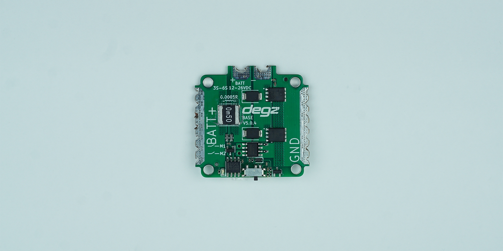

import DocCardList from '@theme/DocCardList';

# Ürün Hakkında

:::warning
Bu ürün yeni version ile satışa çıkmıştır .Yeni versiyonu satın almak isterseniz güncellenen [Degz Hi Base Güç Dağıtım Kart ](https://degzrobotics.com/product/guc-dagitim-karti-degz-hi-base-hall-effect-sensor/)'ına bakabilirsiniz.  

:::

Subdrive Lo-Base Güç Dağıtım Kartı, elektronik cihazların enerji yönetimini kontrol etmek için kullanılan bir araçtır. Statik manyetik anahtarlama özelliği sayesinde, cihazların güç akışını dokunmadan güvenli bir şekilde kesip bağlayabilir. Bu kart, 6-26 Vdc giriş geriliminde ve 2s'den 6s'e kadar olan pil konfigürasyonları için uygundur ve dahili regülatörü sayesinde hem 5v hem de 12v gerektiren cihazları destekler. Maksimum 150 amper yük kapasitesi ile yüksek akım gereksinimlerini karşılar ve soğutma sistemi sayesinde 80 amper sürekli, 40 amper ise regülatörsüz kullanımda sürekli akım sağlar. Ayrıca, bağımsız anahtarlama elemanları ile birden fazla cihazı kontrol etmeye imkan tanır ve üzerindeki akım ölçüm sensörü ile sistemdeki enerji tüketimini izleyebilir. Kart, anahtarlamayı uzaktan yapabilme imkanı da sunar, bu sayede güç yönetimi daha esnek bir hale gelir.

# Ürünün Teknik Özellikleri

| Özellik                  | Değer                 |
|--------------------------|-----------------------|
| Azami Akım               | 150 Amper             |
| Soğutma İle Sürekli Akım | 80 amper              |
| Sürekli Akım             | 40 Amper              |
| Dahili Regülatör         | Opsiyonel             |
| Giriş Gerilimi           | 6-26 Vdc              |
| Pil Türleri              | 2s – 6s               |
| Regülatör Voltajı        | 5 Vdc – 12Vdc         |
| Regülatör Akımı          | 3a @ 5Vdc – 1a @12Vdc |

**Soru ve önerileriniz için bize [forumdan](https://forum.degzrobotics.com/)    ulaşabilirsiniz .**