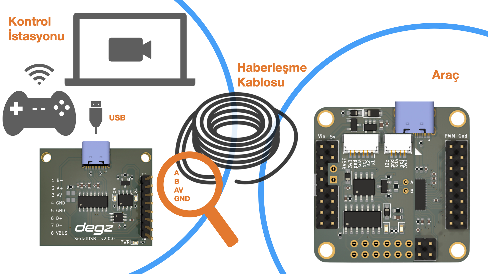

import DocCardList from '@theme/DocCardList';

# Ürün Hakkında

## Yüksek performans, düşük fiyat

:::warning
Bu ürün satıştan kalkmıştır. Bu yüzden güncellenen [Degz Sublink](https://degzrobotics.com/product/iletisim-karti-degz-sublink/)'e bakabilirsiniz.  

:::

Mizucom iletişim modülü, RS-485 iletişim standardını kullanarak özellikle su altı ve diğer kablolu robotik sistemler için tasarlanmış bir iletişim kartıdır. Bu modül, yüksek performanslı ve düşük gecikmeli veri iletimi sağlamak üzere geliştirilmiştir. Hot-plug özelliği ile donatılmış olan bu kart, çalışırken güvenli bir şekilde takılıp çıkarılabilir. Tek bir USB kablo üzerinden hem yüksek çözünürlüklü görüntü hem de kontrol sinyallerini bilgisayara aktarabilir. Python tabanlı bir bilgisayar arayüzüne sahiptir ve 400 metreye kadar iletişim menzili sunar. Analog çözücülerle uyumlu yapısı sayesinde, kullanıcılar çeşitli görüntüleme cihazlarını kolayca entegre edebilirler. Mizu geliştirme kartı ile tam uyumlu olan Mizucom, özellikle otonom sistemler için geliştirilen yazılım kontrolleri ile donatılmıştır, bu da onu robotik uygulamalar için güvenilir bir çözüm haline getirir.

# Ürünün Teknik Özellikleri

## Kart Hakkında

| Veriyolu Standardı                             | RS485             |
|------------------------------------------------|-------------------|
| Kamera İletişimi                               | Analog, Analog HD |
| Su altı istasyonu ile 4’lü kablo ile iletişim  | (A, B, AV ve GND) |
| Besleme Gerilimi                               | 5v                |
| Uyumlu Yazılımlar                              | Windows / MacOS   |

## Kullanım Diyagramı

:::warning
Bu ürün satıştan kalkmıştır. Bu yüzden güncellenen [Degz Sublink](https://degzrobotics.com/product/iletisim-karti-degz-sublink/)'e bakabilirsiniz.  

:::

