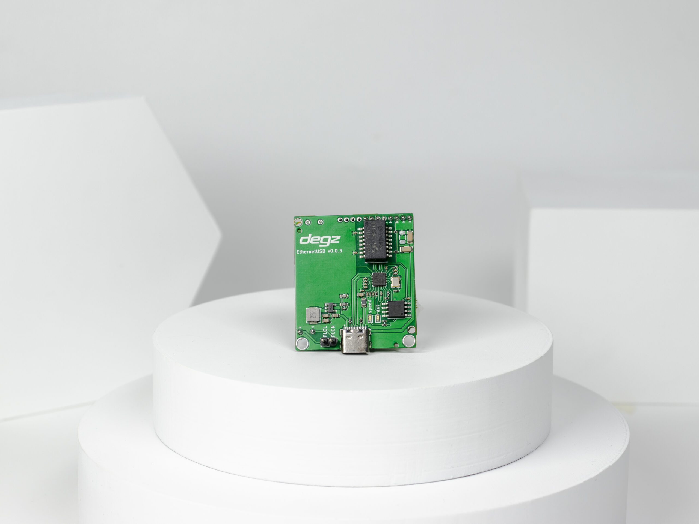

import DocCardList from '@theme/DocCardList';

# Ürün Hakkında

Sublink Hi-com, USB üzerinden beslenebilen ve küçük boyutlarda (43x38 mm) tasarlanmış bir iletişim modülüdür. İki tel kullanarak, 300 metre mesafeye kadar 200 Mbps bağlantı hızı ile ethernet iletişimi sağlayabilir. Düşük güç tüketimi özelliği, bataryalı sistemler için verimliliği artırırken, su altı araçları gibi zorlu ortamlarda güvenilir iletişim sunmak için test edilmiş ve optimize edilmiştir. TCP/IP, IGMP, CSMA/CA ve QoS gibi standart protokolleri destekleyen bu modül, güvenli veri transferi için AES 128 bit şifreleme kullanır ve OFDM modülasyon tipi ile çalışır. Windows, Linux ve MacOS işletim sistemleriyle uyumlu olan Sublink Hi-com, küçük boyutlu cihazların yanı sıra çeşitli uygulamalar için esnek ve yüksek hızlı bir çözüm sunar.

# Ürünün Teknik Özellikleri

| Özellik                            | Değer                      |
|------------------------------------|----------------------------|
| Menzil (En yüksek hız için)        | 300 metre                  |
| Bağlantı Hızı                      | 200 Mbps                   |
| Besleme Voltajı                    | 3.7V – 5V                  |
| USB Güç Besleme ve İetişim         | Mevcut                     |
| İşletim Sistemi                    | Windows / Linux / MacOS    |
| Güç Tüketimi                       | 3.3Watt/Saat               |
| Boyutlar MM (En x Boy x Yükseklik) | 43x38x27                   |
| Bağlantı Tipi                      | USB Arayüzü                |
| Çalışma Sıcaklığı                  | 0-70 C°                    |
| Ağırlık                            | 30 gram                    |
| İletişim Standardı                 | IEEE 802.3                 |
| Güvenlik                           | AES 128 Bit Şifreleme      |
| Protokol                           | TCP/IP, IGMP, CSMA/CA, QoS |
| Modülasyon Tipi                    | OFDM                       |
| Sublink Hi-com Uyumluluk           | Tam uyumlu                 |
| Sublink Lo-com ile Uyumluluk       | Uyumlu Değil               |

**Bu ürünü almak için [tıklayınız](https://degzrobotics.com/product/sublink-hi-com-usb/).** 

**Bu ürünü kullanırken karşılaştığınız  sorunları  bize sormak için  [tıklayınız](https://forum.degzrobotics.com/).**  
<DocCardList />
