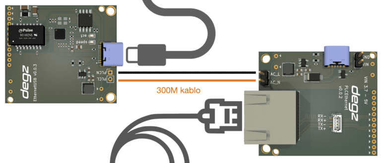

# Ürünün Kullanımı

Sublink Hi-com iki kabloyu (AC_L ve AC_N) karşılıklı bağlayıp güç verdiğiniz anda iletişime hazır hale gelir. Bu basit bağlantı standart bir ethernet bağlantısını simüle eder. Standart ethernet çıkışlarından uyumlu herhangi cihaza direkt bağlantı sağlayabilirsiniz.

## Yüksek hız için yalnız 2 kablo

Sublink Hi-com iletişim modülü 2 kablo üzerinden yüksek hızda ethernet iletişimi kurulması için geliştirilmiş iletişim modülüdür. Standart ethernet iletişim protokolünü, 2 kablo üzerinden 300 metre mesafeye kadar iletebilir.

**Soru ve önerileriniz için bize [forumdan](https://forum.degzrobotics.com/)    ulaşabilirsiniz .** 