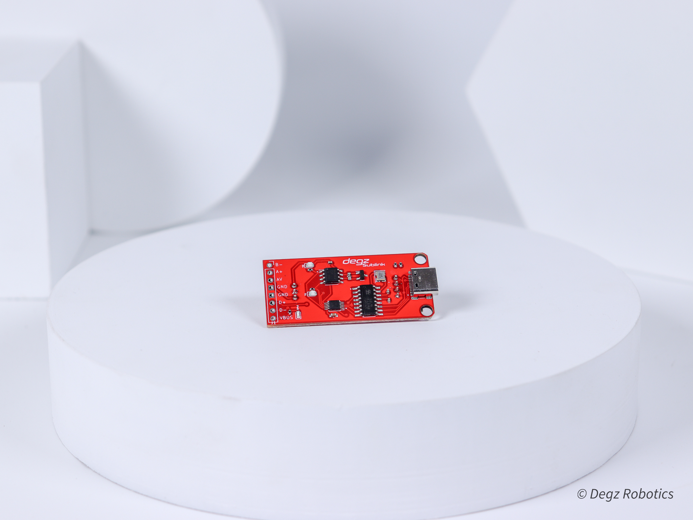

import DocCardList from '@theme/DocCardList';

# Ürün Hakkında

Sublink İletişim Kartı, RS-485 protokolü üzerinden düşük gecikme süresiyle yüksek performans sağlayan bir iletişim modülüdür. Bu modül, aktif kullanımda bile güvenle bağlanıp çıkarılabilen hot-plug işlevine sahiptir. USB üzerinden yüksek çözünürlüklü görüntü ve kontrol sinyallerini tek bir kablo ile iletebilir ve 400 metreye kadar uzaklıkta etkin bir iletişim kurabilir. Su altı araçları ve kablolu robotik sistemlerde kullanılmak üzere tasarlanmıştır ve Derin Diver ekosistemi ile tam uyumlu çalışabilir. Otonom sistemlerin iletişim ihtiyaçlarını karşılayacak biçimde geliştirilmiş, aynı zamanda analog çözücülerle entegrasyona olanak tanır ve birden fazla işletim sistemi ile uyumludur.

 

## Kart Hakkında

| Veriyolu Standardı                             | RS485             |
|------------------------------------------------|-------------------|
| Kamera İletişimi                               | Analog, Analog HD |
| Su altı istasyonu ile 4’lü kablo ile iletişim  | (A, B, AV ve GND) |
| Besleme Gerilimi                               | 5v                |
| Uyumlu Yazılımlar                              | Windows / Linux / MacOS / Android |

**Bu ürünü almak için [tıklayınız](https://degzrobotics.com/product/iletisim-karti-degz-sublink/).**  

**Bu ürünü kullanırken karşılaştığınız  sorunları  bize sormak için  [tıklayınız](https://forum.degzrobotics.com/).**  

<DocCardList />
=======

