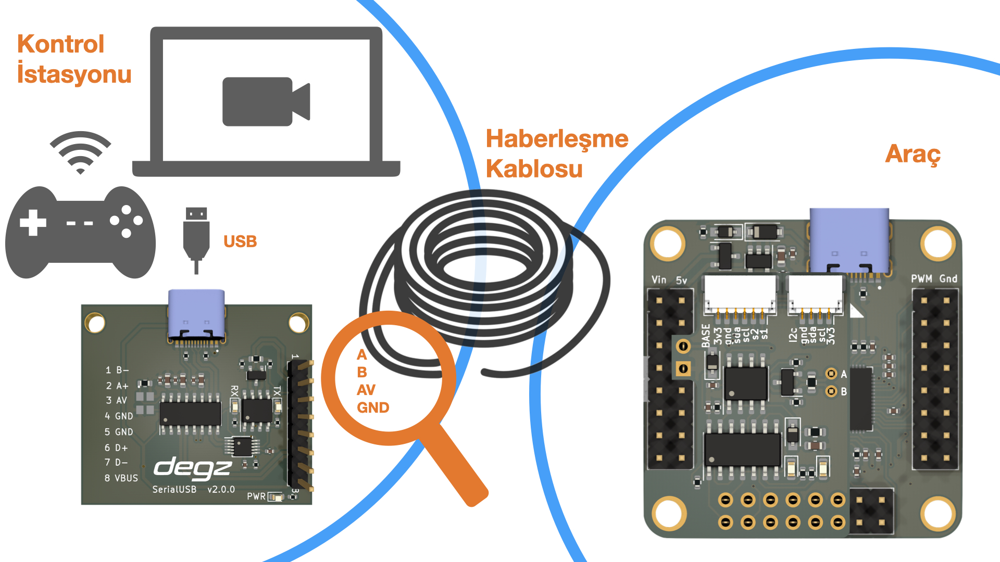

# Ürünün Kullanımı

## Bağlantı şeması

## Pin Portlarının  Açıklamaları

|Pinler                                         |Özellikleri       |
|------------------------------------------------|-------------------|
| TX                               | Verici (Transmitter) pinidir. Modül bu pin üzerinden seri veriyi USB'den çevre birimine gönderir.|
|RX  | Alıcı (Receiver) pinidir. Modül bu pin üzerinden çevre biriminden seri veriyi alır.|
|AVR| Bu, genellikle modülün besleme voltajını belirtir. AVR mikrokontrolörleri için kullanılan bir voltaj seviyesi olabilir.|
|GND                               | Toprak (Ground) bağlantısıdır ve elektriksel devreler için ortak bir referans noktası sağlar.|
| D+                              | USB veri artı hattıdır. USB veri iletişiminde pozitif veri hattı olarak kullanılır.|
|D-|USB veri eksi hattıdır. USB veri iletişiminde negatif veri hattı olarak kullanılır.|
|VBUS|USB güç hattıdır ve USB bağlantısı üzerinden 5V besleme voltajını taşır.|

## Kullanım Diyagramı

**Bu ürünü kullanırken karşılaştığınız  sorunları  bize sormak için  [tıklayınız](https://forum.degzrobotics.com/).**  