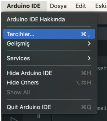
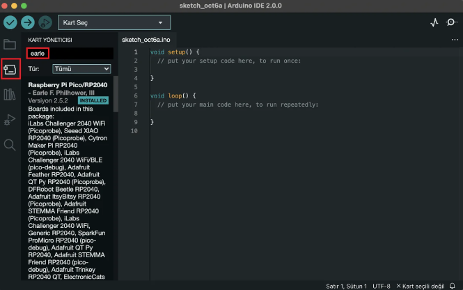
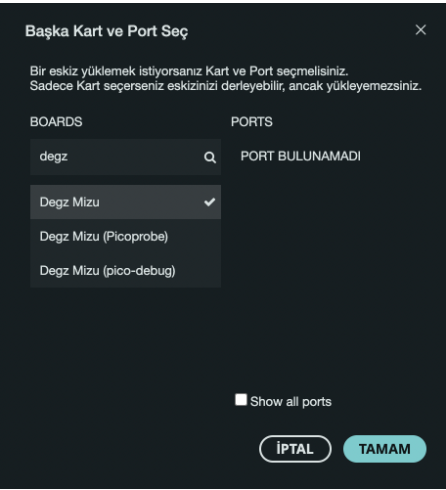
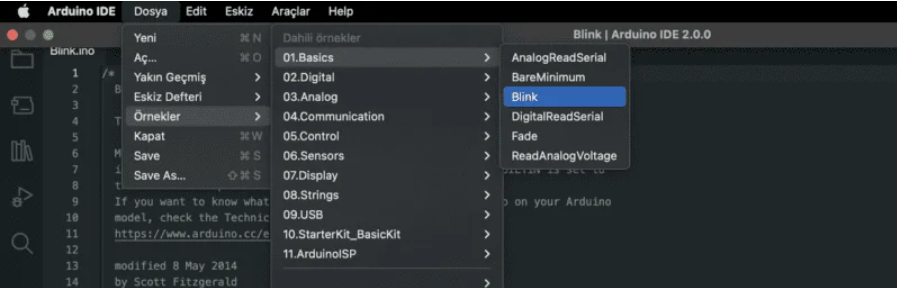
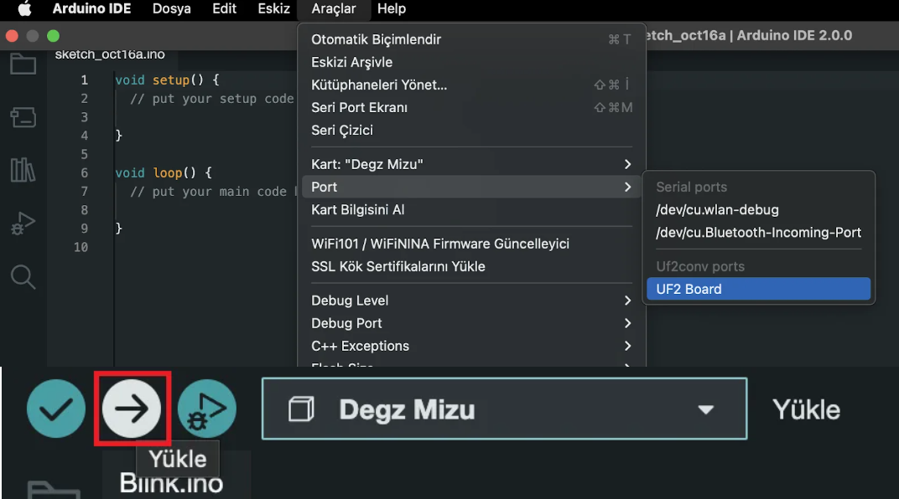
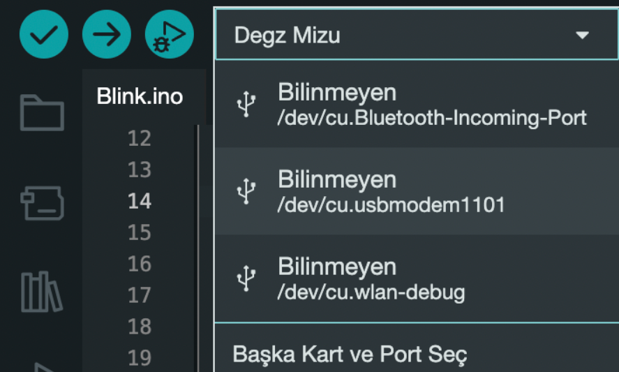

# Ürünün Kullanımı

## Mizu  İlk Kez Arduino IDE ile Programlama

Bu adımları Mizu’yu Arduino IDE üzerinden programlayabilmek için uygulamanız gerekmektedir.

İhtiyaç duyulanlar;

Mizu
Type C USB Kablosu
Dişi-dişi Jumper Kablo
Bilgisayar
Öncelikle [bu adresten](https://www.arduino.cc/en/software) Arduino IDE yazılımını indirin. Arduino IDE 2.0.0 kısmından işletim sisteminizi seçin ve indirin standart şekilde kurulumu tamamlayın.

Arduino IDE 2.0.0 uygulamasını açın ardından Dosya-> Tercihler kısmına tıklayın ve aşağıdaki linki kopyalayıp Ek kart yöneticisi URL’leri kısmına yapıştırın.

**https://github.com/earlephilhower/arduino-pico/releases/download/global/package_rp2040_index.json**

Ardından kart yöneticisi kısmına tıklayın (sol menüde) ve arama kısmına “earle” yazın, metni aşağı kaydırarak Kur yazısına tıklayın ve kart kurulumunu tamamlayın.

Ardından önce Mizu’nun **BOOT** ile **GND** pinlerini dişi-dişi jumper kablo ile birleştirerek, data hattı bulunduğuna emin olduğunuz Type C USB kablosu ile bilgisayarınıza bağlayın. Mizu üzerindeki LED yandıktan en az 3 saniye sonra jumper kabloyu çıkarın.

Bu işlem sonrası Mizu bilgisayarınızda RPI-RP2 (veya benzer) isimli bir USB flash bellek gibi gözükecektir.

Ardından Mizu sisteminize takılı iken kart seçim kısmına gelip Başka Kart ve Port Seç yazısına tıklayın.

Gelen ekranda arama kısmına **“Degz”** yazarak Degz Mizu (Viyalab Mizu olarak güncellenmiştir) yazısına tıklayıp **Tamam‘a** basın.

Ardından **Dosya->Örnekler-> Basics -> Blink** yazısına tıklayarak **Led Blink** örneği açın. Yükleme yapmadan önce bir sonraki adımı uygulayın.

**Araçlar->Port** kısmına gelin ve UF2 Board’u seçin, daha sonra kodu yükle yazısına tıklayın.

 

Yükleme işlemi bittikten sonra kart üzerindeki ledin yanıp söndüğünü göreceksiniz. Bu işlem sonrası Mizu, usbmodem(veya benzer) isimli port olarak kart seçim ekranında görülecektir ve program yüklemeye hazır hale gelecektir.

Bir sorun meydana gelmedikçe jumper kablo ile gerçekleştirilen aşamadan öncesini uygulamanıza gerek yoktur.

**Tebrikler, artık tüm projelerinizde Mizu’yu kolaylıkla kullanabilirsiniz!**

**Bu ürünü kullanırken karşılaştığınız  sorunları  bize sormak için  [tıklayınız](https://forum.degzrobotics.com/).**  