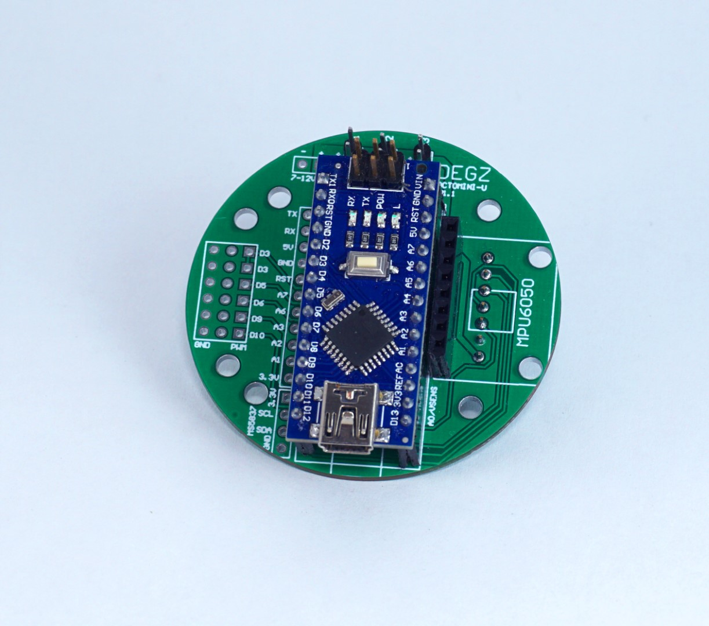

import DocCardList from '@theme/DocCardList';

# Octomini - Su Altı Kontrolcüsü
:::warning
Bu ürün satıştan kalkmıştır. Bu yüzden güncellenen [Degz Suibo](/elektronik-kartlar/Kontrol-Kartları/suibo-rp2040/)'ya bakabilirsiniz.  

:::

Octomini, Arduino Nano mikrodenetleyiciye dayalı bir geliştirici kartıdır ve özellikle insansız su altı araçları için tasarlanmıştır. Bu kart, boyut olarak 55mm çapın altında olacak şekilde küçük tutulmuş, taşınabilirliği ve kullanım kolaylığını artırmak amacıyla FPV (First Person View) stack tasarımından ilham alınarak geliştirilmiştir. Üzerindeki anahtarlama elemanları sayesinde su altı araçlarının aydınlatma gibi yardımcı sistemlerini, tutucu kollarını veya örnekleme cihazlarını yüzeyden kontrol etmeye olanak tanır. Teknik olarak beş artı bir PWM (Pulse Width Modulation) çıkışı sunar ve Mpu6050 jiroskopu ile dengeleme sağlar. Canbus iletişim modülü aracılığıyla teorik olarak 400 metreye kadar mesafedeki iletişim desteklenir. 7 ila 12 Volt arasında besleme voltajı alabilir ve en fazla 5 amperlik anahtarlama kapasitesine sahip üç farklı cihazı kontrol edebilir. Kart, basınç sensörü girişi, gerilim ölçümü ve ekstra analog pinler gibi özelliklerle donatılmıştır. Octomini'nin hem yazılımı hem de donanımı tamamen açık kaynaklıdır, bu da kullanıcıların yazılımı indirip özelleştirebilmelerine veya projeye katkıda bulunabilmelerine imkan tanır.

# Ürünün Teknik Özellikleri

## Kart Hakkında

| Özellik              | Değer                 |
|----------------------|-----------------------|
| Çıkış pwm pin sayısı | 5+1 Pin               |
| Mikro denetleyici    | Arduino Nano          |
| Dengeleme            | Gyro - Mpu6050        |
| İletişim modülü      | Canbus                |
| Mesafe               | 400 metre (teorik)    |
| Besleme voltajı      | 7-12 Volt             |
| Anahtarlama          | 3 cihaz, Azami 5amper |

## Ek Özellikler

- Basınç sensörü girişi
- Gerilim ölçümü
- Yardımcı analog pinler

:::info
Octomini tamamiyle açık kaynaklı yazılımı ve donanımdan oluşur.
Yazılımı indirmek veya katkıda bulunmak isterseniz [buraya](https://github.com/degzrobotics/octomini) tıklayabilirsiniz!
:::

:::warning
Bu ürün satıştan kalkmıştır. Bu yüzden güncellenen [Degz Suibo](/elektronik-kartlar/Kontrol-Kartları/suibo-rp2040/)'ya bakabilirsiniz.  

:::

**Bu ürünü kullanırken karşılaştığınız  sorunları  bize sormak için  [tıklayınız](https://forum.degzrobotics.com/).**  