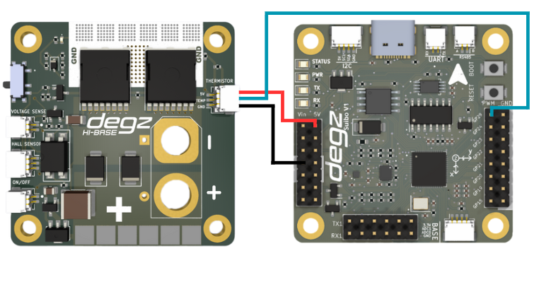
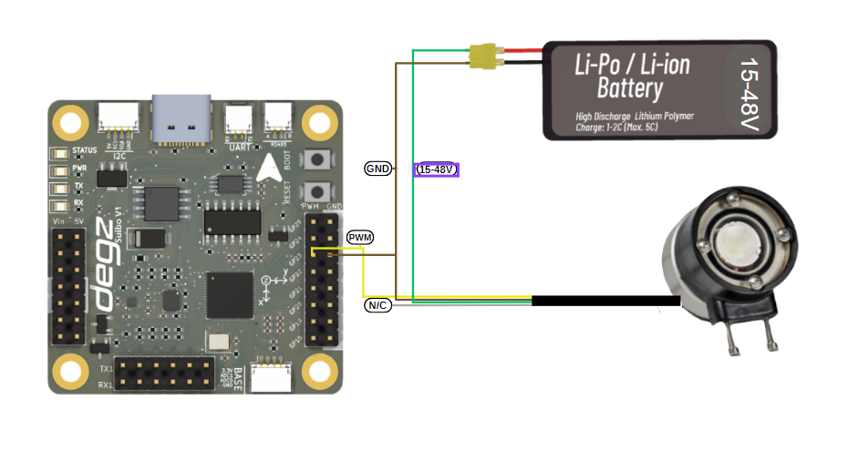
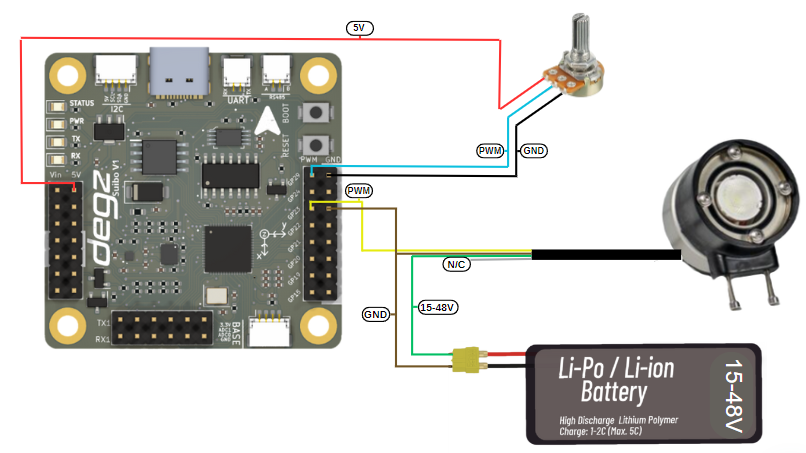

import DocCardList from '@theme/DocCardList';

# Suibo İle Yapılabilecek Örnekler 

## Suibo QMC6310 Manyetik Sensör Veri Okuma Kodu

Bu kod parçacığı, Arduino platformunu kullanarak QMC6310 manyetik sensöründen X, Y ve Z eksenlerine ait verileri okumak için yazılmıştır. QMC6310, I2C protokolü aracılığıyla iletişim kurabilen yüksek hassasiyetli bir manyetometredir. Aşağıdaki kod, sensörünüzün bağlı olduğu Suibo kartı üzerinden gerçek zamanlı olarak üç boyutlu pusula verilerini çekmek için hazırlanmıştır.

Kodu kullanmak için, Arduino IDE üzerinde yeni bir sketch oluşturun ve aşağıdaki kodu sketch'e yapıştırın. Kodu yükledikten sonra, Arduino'nun seri port çıktısından X, Y ve Z koordinatlarını temsil eden değerleri görebilirsiniz. Bu verileri, kendi projenizde navigasyon, konumlandırma veya hareket izleme gibi çeşitli uygulamalar için kullanabilirsiniz.

Kodu yüklerken herhangi bir sorunla karşılaşmanız durumunda, bağlantıları ve konfigürasyon ayarlarınızı kontrol etmeyi unutmayın. İyi çalışmalar!


````
#include <Wire.h>
// QMC6310varsayılan I2C adresi
#define QMC06310_ADDRESS 0x6C
// QMC6310 için okunacak register adresleri
#define X_LSB 0x00 // X ekseni LSB
#define X_MSB 0x01 // X ekseni MSB
#define Y_LSB 0x02 // Y ekseni LSB
#define Y_MSB 0x03 // Y ekseni MSB
#define Z_LSB 0x04 // Z ekseni LSB
#define Z_MSB 0x05 // Z ekseni MSB

void setup() {
  Serial.begin(9600);
  Wire.begin(); // I2C başlatılıyor
  // Sensörü başlatma komutları burada yer alabilir
}

void loop() {
  Wire.beginTransmission(QMC6310_ADDRESS);
  Wire.write(X_LSB); // İlk register adresinden itibaren okumaya başla
  Wire.endTransmission(false); // tekrar başlatma ile bitir
  
  Wire.requestFrom(QMC6310_ADDRESS, 6); // 6 byte veri iste, XYZ ekseni verileri
  
  if (Wire.available() == 6) {
    // XYZ değerlerini oku
    int x = Wire.read() | Wire.read() << 8;
    int y = Wire.read() | Wire.read() << 8;
    int z = Wire.read() | Wire.read() << 8;


    // Okunan değerleri seri porta yaz
    Serial.print("X: ");
    Serial.print(x);
    Serial.print(" Y: ");
    Serial.print(y);
    Serial.print(" Z: ");
    Serial.println(z);
  }
  delay(1000); // 1 saniye bekle
}
````

## Suibo QMC6310 Pusula Veri Filtreleme Örneği

Bu kod örneği, QMC6310 manyetik sensöründen alınan ham X, Y ve Z verilerini daha pürüzsüz ve stabil hale getirmek için düşük geçişli bir filtre uygular. ALPHA değeri, filtrelenmiş çıktıların ne kadar hızlı güncelleneceğini belirler—daha düşük bir ALPHA değeri, daha yavaş bir tepki süresi ve daha pürüzsüz bir çıktı sağlar.

Kod, sensörden gelen ham verileri okur ve bu veriler üzerinde sürekli bir filtreleme işlemi gerçekleştirir. Filtrelenmiş veriler, gerçek zamanlı olarak Arduino'nun seri monitöründe gösterilir. Bu örnek, özellikle hareketli platformlar ve navigasyon sistemleri gibi uygulamalar için idealdir, çünkü bu tür sistemler genellikle gürültülü veri akışlarından etkilenir.

Kodu kullanmaya başlamadan önce, sensörünüzü farklı yönlerde hareket ettirerek kalibrasyon değerlerini güncellemeniz önerilir. Bu, veri doğruluğunu maksimize etmenize yardımcı olacaktır.


````
#include <Wire.h>

#define QMC6310_ADDRESS 0x1C  // QMC6310 cihazının I2C adresi
#define ALPHA 0.1              // Düşük geçiren filtre için ALPHA değeri


float filteredX = 0, filteredY = 0, filteredZ = 0;


void setup() {
  Serial.begin(9600);
  Wire.begin();
}


void loop() {
  int rawX, rawY, rawZ;
  readQMC6310(rawX, rawY, rawZ);


  // Filtrelenmiş değerleri hesapla
  filteredX = ALPHA * rawX + (1 - ALPHA) * filteredX;
  filteredY = ALPHA * rawY + (1 - ALPHA) * filteredY;
  filteredZ = ALPHA * rawZ + (1 - ALPHA) * filteredZ;


  // Filtrelenmiş değerleri seri monitöre yazdır
  Serial.print("Filtrelenmiş X: ");
  Serial.print(filteredX);
  Serial.print(" Filtrelenmiş Y: ");
  Serial.print(filteredY);
  Serial.print(" Filtrelenmiş Z: ");
  Serial.println(filteredZ);


  delay(200); // Okumalar arasında daha uzun gecikme
}

void readQMC6310(int &x, int &y, int &z) {
  Wire.beginTransmission(QMC6310_ADDRESS);
  Wire.write(0x00);
  Wire.endTransmission(false);
  Wire.requestFrom(QMC6310_ADDRESS, 6);
  if (Wire.available() == 6) {
    x = Wire.read() | Wire.read() << 8;
    y = Wire.read() | Wire.read() << 8;
    z = Wire.read() | Wire.read() << 8;
  }
}


````
**Gelişmiş Pusula Veri Filtreleme Teknikleri**

Bu rehber, QMC6310 manyetik sensörden alınan verilerin stabilitesini ve güvenilirliğini artırmak için çeşitli gelişmiş filtreleme tekniklerini içermektedir. Veri okumalarınızı daha doğru hale getirmek için aşağıdaki adımları uygulayabilirsiniz:

1) Kalibrasyon: Sensörünüzü farklı yönlere çevirerek en düşük ve en yüksek değerleri belirleyin ve bu değerleri kodunuzda ilgili OFFSET değişkenleri olarak güncelleyin.
2) Filtreleme: Veri dalgalanmalarını azaltmak için ALPHA değerini düşürerek ağır bir filtre uygulayın.
Çevresel Kontrol: Manyetik gürültüyü azaltmak için testlerinizi manyetik olmayan ortamlarda yapın.
3) Zamanlama: Veri okuma sıklığını azaltarak gecikme sürelerini uzatın.
4) Ekstra Filtreleme Yöntemleri: Ortalama alma, medyan filtresi, Kalman filtresi gibi yöntemlerle verilerinizi daha da rafine edin.

Bu adımlar, projenizde kullanacağınız pusula verilerinin daha doğru ve kullanışlı olmasını sağlayacaktır.

## Suibo  LSM6DS3 İvmeölçer ve Jiroskop Verilerini Okuma Kodu

Bu kod örneği, LSM6DS3 sensöründen ivmeölçer ve jiroskop verilerini okumak için hazırlanmıştır. Kod, sensörü I2C iletişim protokolü üzerinden Arduino'ya bağlar ve sürekli olarak X, Y ve Z eksenlerindeki ivme ve dönüş hızlarını ölçer.

Kurulum aşamasında sensör başlatılır ve eğer başlatma başarısız olursa işlem durdurulur. Başarılı bir başlangıçtan sonra, sensörden gelen ivme ve jiroskop verileri seri monitöre detaylı olarak yazdırılır. Her veri noktası, üç ondalık basamağa kadar hassasiyetle gösterilir, bu da verilerin incelenmesini kolaylaştırır.

Bu kod, hareket izleme, pozisyon algılama veya robotik uygulamalar gibi çeşitli projelerde kullanılabilir. Her okuma arasındaki bir saniyelik gecikme, verilerin kolayca gözlemlenmesini sağlar.

```

#include "SparkFunLSM6DS3.h"
#include "Wire.h" // I2C protokolü için


// LSM6DS3 sensörü için bir nesne oluşturur. I2C iletişim modunu ve sensörün I2C adresini belirler.
LSM6DS3 myIMU(I2C_MODE, 0x6A);


void setup() {
  // Seri iletişimi başlatır. Bilgisayar ile mikrokontrolcü arasında veri alışverişi için kullanılır.
  Serial.begin(9600);
  delay(1000); // Başlangıçta 1 saniyelik bir bekleme ekler.
  Serial.println("İşlemci sıfırlamadan çıktı.\n"); // Seri monitöre bir mesaj yazdırır.
 
  // Sensörü başlatır. Başarısız olursa setup fonksiyonu durur.
  myIMU.begin();
}


void loop() {
  // İvmeölçer verilerini seri monitöre yazdırır.
  Serial.print("\nİvmeölçer:\n");
  Serial.print(" X = ");
  Serial.println(myIMU.readFloatAccelX(), 3); // X ekseni ivmeölçer verisini okur ve yazdırır.
  Serial.print(" Y = ");
  Serial.println(myIMU.readFloatAccelY(), 3); // Y ekseni ivmeölçer verisini okur ve yazdırır.
  Serial.print(" Z = ");
  Serial.println(myIMU.readFloatAccelZ(), 3); // Z ekseni ivmeölçer verisini okur ve yazdırır.


  // Jiroskop verilerini seri monitöre yazdırır.
  Serial.print("\nJiroskop:\n");
  Serial.print(" X = ");
  Serial.println(myIMU.readFloatGyroX(), 3); // X ekseni jiroskop verisini okur ve yazdırır.
  Serial.print(" Y = ");
  Serial.println(myIMU.readFloatGyroY(), 3); // Y ekseni jiroskop verisini okur ve yazdırır.
  Serial.print(" Z = ");
  Serial.println(myIMU.readFloatGyroZ(), 3); // Z ekseni jiroskop verisini okur ve yazdırır.


  delay(1000); // Her okuma arasında 1 saniye bekleme süresi ekler.
}
````

##  Suibo LSM6DS3 ile Sıcaklık Verisi Okuma Kodu

Bu kod örneği, LSM6DS3 sensör modülünün yerleşik termometre özelliğini kullanarak çevre sıcaklığını Santigrat ve Fahrenheit cinsinden okur ve gösterir. Kod, sensörünüzü I2C iletişim protokolü üzerinden Arduino ile iletişim kuracak şekilde yapılandırır ve başlangıçta sensörün doğru bir şekilde başlatılıp başlatılmadığını kontrol eder.

Başarılı bir başlatmadan sonra, sensörden sıcaklık okumaları alınır ve bu değerler seri monitöre dört ondalık basamağa kadar hassasiyetle yazdırılır. Bu, sıcaklık değişikliklerini detaylı bir şekilde gözlemlemenizi sağlar.

Kod, özellikle çevresel izleme, hava durumu istasyonları veya sıcaklıkla ilgili diğer otomasyon projeleri için uygundur. Her okuma arasında bir saniyelik bir gecikme, sürekli veri akışı sağlarken cihazın aşırı yüklenmesini önler.

````
#include "SparkFunLSM6DS3.h"
#include "Wire.h" // I2C protokolü için gereken kütüphane


// LSM6DS3 sensörü için bir nesne oluşturuyoruz. I2C modunu ve sensörün I2C adresini belirtiyoruz.
LSM6DS3 myIMU(I2C_MODE, 0x6A);


void setup() {
  // Seri bağlantıyı başlatıyoruz. Bu, bilgisayarla mikrokontrolcü arasında veri alışverişi yapmamızı sağlar.
  Serial.begin(9600);
  delay(1000); // Başlangıçta biraz bekletiyoruz, sistem kendine gelsin diye.
  Serial.println("İşlemci sıfırlamadan çıktı.\n"); // İşlemcinin resetten çıktığını belirten bir mesaj yazdırıyoruz.
 
  // Sensörü başlatıyoruz. Bu işlem, sensörün doğru şekilde çalışıp çalışmadığını kontrol eder.
  myIMU.begin();
}


void loop() {
  // Termometrenin okumalarını seri porta yazdırıyoruz.
  Serial.print("\nTermometre:\n");
  Serial.print(" Degrees C = "); // Santigrat cinsinden sıcaklık değerini yazdırıyoruz.
  Serial.println(myIMU.readTempC(), 4); // Sensörden okunan santigrat cinsinden sıcaklık değerini okuyoruz ve 4 basamak hassasiyetle yazdırıyoruz.
  Serial.print(" Degrees F = "); // Fahrenheit cinsinden sıcaklık değerini yazdırıyoruz.
  Serial.println(myIMU.readTempF(), 4); // Sensörden okunan fahrenheit cinsinden sıcaklık değerini okuyoruz ve 4 basamak hassasiyetle yazdırıyoruz.
 
  delay(1000); // Her sıcaklık okuması arasında 1 saniye bekletiyoruz.
}
````


## Suibo Elektronik Kartı ile Otomatik Isıtma Kontrol Sistemi

Bu projede, Suibo Elektronik Kartı kullanılarak, iç mekânların sıcaklığını izlemek ve soğuk hava koşullarında otomatik olarak ısıtıcıyı aktive etmek amaçlanmıştır. Kullanılan LSM6DS3 sensörü, ortamdaki sıcaklık değerlerini ölçer ve bu verileri Arduino üzerinden işler. Bu sistemde, QuickPID kütüphanesi ile entegre bir PID kontrol mekanizması, ısıtıcının sıcaklığını düzenleyerek istenilen konfor seviyesini korur.

Isıtıcı, belirlenen bir set değere (Setpoint) ulaşmak için PID algoritması tarafından kontrol edilir. Bu sayede, sıcaklık, kullanıcının ayarladığı ideal sıcaklığa otomatik olarak ayarlanır. Sistemin bu otomatik kontrolü, özellikle ev otomasyon sistemleri, seralar veya diğer çevresel izleme gerektiren projeler için idealdir. Ayrıca, Arduino seri port üzerinden gerçekleştirilen sürekli veri yazdırma ile sıcaklık değişiklikleri anında izlenebilir.

Kod, Suibo kartının sağladığı çeşitlilik ve uyumluluk avantajlarından yararlanarak, geliştiricilere geniş uygulama alanları sunar. Bu yapı, kolayca uygulanabilir ve proje ihtiyaçlarına göre özelleştirilebilir özellikleriyle dikkat çeker. Bu sistemle, kullanıcılar soğuk hava koşullarında otomatik ısı kontrolü sağlayarak enerji verimliliğini artırabilir ve yaşam alanlarını daha konforlu hale getirebilir.


````
#include <Arduino.h>  // Arduino temel kütüphanesini dahil et.
#include <Wire.h>     // I2C protokolü için kütüphaneyi dahil et.
#include "SparkFunLSM6DS3.h" // SparkFun LSM6DS3 kütüphanesini dahil et.
#include "QuickPID.h"  // QuickPID kütüphanesini dahil et.

LSM6DS3 imu = LSM6DS3(I2C_MODE, 0x6A); // I2C ile haberleşmek için LSM6DS3 sensörü tanımla.

float Setpoint, Input, Output; // PID kontrolü için gerekli değişkenleri tanımla.

float Kp = 70, Ki = 1.6, Kd = 1.7; // PID kontrol parametrelerini ayarla.

QuickPID heaterPid(&Input, &Output, &Setpoint); // PID kontrol nesnesini oluştur.

void setup() {
  Wire.begin(); // I2C haberleşmesini başlat.
  imu.begin(); // IMU sensörünü başlat.
  heaterPid.SetTunings(Kp, Ki, Kd); // PID parametrelerini ayarla.
  heaterPid.SetMode(QuickPID::Control::automatic); // PID kontrol modunu otomatik yap.
  pinMode(26, OUTPUT); // Pin 26'yı çıkış olarak ayarla.
  Setpoint = 45; // Hedef sıcaklığı ayarla.
}

void loop() {
  Input = imu.readTempC(); // Sensörden sıcaklık değerini oku ve Input'a ata.
  heaterPid.Compute(); // PID hesaplamasını yap.
  analogWrite(26, Output); // Output değerini analog olarak pin 26'ya yaz.
  Serial.println("|Pid Out: " + String(Output) + "|Temp: " + String(imu.readTempC()) + "|"); // Çıktıyı ve sıcaklık değerini seri porta yaz.
}
````


## Suibo ve HiBase ile Termistör Kullanarak Sıcaklık Ölçme

Bu örnekte, Suibo Elektronik Kartı ve HiBase kartı kullanılarak, bir termistör yardımıyla çevresel sıcaklık ölçülmektedir. Kod, Arduino ve çoğu MCU'da kullanılan analog giriş pinleri üzerinden termistörden analog veri okur. Devredeki seri direnç ve termistörün özellikleri kullanılarak termistör direnci hesaplanır ve bu direnç üzerinden sıcaklık değeri Kelvin cinsinden elde edilir, ardından Celsius cinsine çevrilir.

Kod, seri port üzerinden sıcaklık değerini sürekli olarak yazdırır. Bu setup, özellikle laboratuvar ortamları, ev otomasyonu sistemleri veya çevresel izleme projeleri için uygundur, çünkü basit bir yapıda olup kolaylıkla uygulanabilir ve gerçek zamanlı veri sağlar.



````
#include <Arduino.h>

// ADC okuması için kullanılacak pin
const int analogPin = 29; 
// Termistör ve devre parametreleri
const float betaParametre = 3950; // Tipik bir değer, termistör datasheetinden alınmalıdır
const float seriDirenç = 10000; // Seri bağlı direnç değeri (ohm cinsinden)
const float referansSıcaklık = 0 + 273.15; // Referans sıcaklık (Kelvin cinsinden)
const float referansDirenç = 10000; // Referans direnç değeri (ohm cinsinden), 25°C'de termistör direnci

void setup() {
  Serial.begin(9600); // Seri portu başlat
}

void loop() {
  int okunanDeger = analogRead(analogPin); // ADC'den değeri oku
  float voltaj = (okunanDeger / 1023.0) * 5.0; // Okunan değeri voltaja çevir
  float termistörDirenç = (5.0 * seriDirenç / voltaj) - seriDirenç; // Termistör direncini hesapla

  // Sıcaklığı hesapla
  float sıcaklık = betaParametre / (log(termistörDirenç / referansDirenç) + (betaParametre / referansSıcaklık));
  sıcaklık = sıcaklık - 273.15; // Kelvin'den Celcius'a çevir

  // Sıcaklığı seri porta yazdır
  Serial.print("Sıcaklık: ");
  Serial.print(sıcaklık);
  Serial.println(" C");

  delay(1000); // Bir sonraki okuma için 1 saniye bekle
}


 ````

 ##  Suibo ve HiBase  ile Gerilim Ölçümü Kodu


Bu kod, HiBase ve Suibo elektronik kartları kullanılarak NTC sensöründen gerilim okumalarını almak için yazılmıştır. Arduino'nun analog pinlerinden biri olan A0'a bağlı NTC sensörü, belirli aralıklarla okunarak elde edilen değerler seri porta yazdırılır. Bu işlem, sensörün ölçtüğü gerilim seviyesine dair hızlı ve sürekli güncellemeler sağlar.

Kurulumda, daha yüksek baud hızında seri iletişim başlatılır ki bu da veri aktarımını hızlandırır. Her okuma sonrası bir saniyelik bir bekleme süresi eklenir, böylece okumalar arasında stabil bir zaman dilimi sağlanır. Bu kod, gerilim izleme sistemleri, enerji yönetimi uygulamaları veya eğitim amaçlı projelerde kullanılabilir. Verilerin kolayca görüntülenmesi ve analizi için ideal bir çözümdür.


````

#include <Arduino.h>

// NTC sensörünün bağlı olduğu analog pin
const int analogPin = 29;

void setup() {
  // Seri haberleşmeyi başlat
  Serial.begin(115200);
}

void loop() {
  // Analog pin üzerinden okunan değeri oku
  int sensorValue = analogRead(analogPin);
  
  // Okunan değeri seri port üzerinden gönder
  Serial.print("Sensor Value: ");
  Serial.println(sensorValue);
  
  // 1 saniye bekle
  delay(1000);
}

 ````

## D300  Basınç, Sıcaklık, Derinlik ve Yükseklik Sensörü ile Veri Okuma Kodu

Bu kod, Arduino ve D300 Derinlik ve Su Sıcaklığı Sensörü (MS5837 modeli) kullanılarak su altı ortamlarında basınç, sıcaklık, derinlik ve yükseklik değerlerini ölçmek için yazılmıştır. MS5837 sensörü, suyun fiziksel özelliklerini yüksek doğrulukla ölçer ve elde edilen verileri Arduino'nun seri portu üzerinden gönderir.

Kurulum aşamasında, seri iletişim 9600 baud hızında başlatılır ve I2C bağlantısı kurulur. Sensörün başlatılması sırasında herhangi bir bağlantı hatası olup olmadığı kontrol edilir. Başarılı bir başlatma sonrasında, sensör modeli ve suyun yoğunluğu ayarlanarak ölçümlere hazır hale getirilir.

Ana döngüde, sensör sürekli olarak okunur ve elde edilen basınç, sıcaklık, derinlik ve yükseklik değerleri seri port üzerinden yazdırılır. Her okuma sonrasında bir saniyelik bir bekleme süresi eklenerek veri akışı düzenli bir şekilde sürdürülür. Bu kod, su altı araştırmaları, dalış teknolojileri, denizcilik uygulamaları veya çevresel izleme projeleri için idealdir. Verilerin sürekli ve güvenilir bir şekilde kaydedilmesi, analiz ve izleme faaliyetlerinde büyük önem taşır.


````
#include <Wire.h>
#include "MS5837.h"

MS5837 sensor;

void setup() {
  Serial.begin(9600); // Seri bağlantıyı 9600 baud hızında başlatır.
  
  Serial.println("Başlıyor"); // Başlangıç mesajını seri porttan gönderir.
  
  Wire.begin(); // I2C bağlantısını başlatır.

  // Sensör başlatılıyor. Başarısız olursa hata mesajı yazdırılıyor.
  while (!sensor.init()) {
    Serial.println("Başlatma başarısız!"); // Başlatma başarısız.
    Serial.println("SDA/SCL doğru bağlı mı?"); // SDA/SCL doğru bağlı mı kontrol et.
    Serial.println("Degz Robotik Bar30: Sarı=SDA, Yeşil=SCL"); // Doğru bilgi: Sarı=SDA, Yeşil=SCL
    Serial.println("\n\n\n"); // Ek boş satırlar.
    delay(5000); // 5 saniye bekletir.
  }
  
  sensor.setModel(MS5837::MS5837_30BA); // Sensör modelini ayarlar.
  sensor.setFluidDensity(997); // Akışkan yoğunluğunu ayarlar (tatlı su için 997 kg/m^3, deniz suyu için 1029 kg/m^3).
}

void loop() {
  // Basınç ve sıcaklık okumalarını günceller.
  sensor.read();

  // Basınç bilgisini seri porta yazdırır.
  Serial.print("Basınç: "); 
  Serial.print(sensor.pressure()); 
  Serial.println(" mbar");
  
  // Sıcaklık bilgisini seri porta yazdırır.
  Serial.print("Sıcaklık: "); 
  Serial.print(sensor.temperature()); 
  Serial.println(" derece C");
  
  // Derinlik bilgisini seri porta yazdırır.
  Serial.print("Derinlik: "); 
  Serial.print(sensor.depth()); 
  Serial.println(" m");
  
  // Yükseklik bilgisini seri porta yazdırır.
  Serial.print("Yükseklik: "); 
  Serial.print(sensor.altitude()); 
  Serial.println(" m deniz seviyesinin üzerinde");

  delay(1000); // 1 saniye bekletir.
}
````
##  Suibo ile Su Altı Aydınlatmasının Parlaklığını Ayarlama  Kodu

Aydınlatma sisteminiz, dört kablolu bir bağlantı düzeniyle 15 ila 48 volt arasındaki Li-Po veya Li-ion pil kullanarak enerji alır. Yeşil kablo, pilin pozitif ucuna, kahverengi kablo ise negatif ucuna bağlanarak sistem elektriklenir. Sarı kablo, aydınlatmanın parlaklığını PWM sinyaliyle ayarlar; beyaz kablo bu düzende işlevsizdir. Bu kurulum tamamlandığında, Suibo elektronik kontrol kartıyla programlama yapabilirsiniz. Örneğin, AYDINLATMA_PIN olarak tanımlı 23 numaralı pine aydınlatmanızı bağlayıp, farklı PWM değerleri göndererek parlaklık seviyesini kontrol edebilirsiniz. Bu yöntem, özellikle sualtı ve suüstü robotik projeleri gibi özel uygulamalar için idealdir. Robotunuzun çevresel koşullara göre aydınlatma gereksinimlerini dinamik olarak ayarlayabilir.Bu esnek ve kontrol edilebilir aydınlatma çözümü, robotik sistemlerinizi daha etkin bir şekilde kullanmanıza olanak tanır.




````

#define AYDINLATMA_PIN 23 // Aydınlatmanın bağlı olduğu pin

void setup() {
  // AYDINLATMA_PIN'i çıkış olarak ayarla
  pinMode(AYDINLATMA_PIN, OUTPUT);
}

void loop() {
  // Aydınlatmayı düşük parlaklıkta çalıştır (düşük PWM değeri)
  analogWrite(AYDINLATMA_PIN, 51); // Yaklaşık %20 parlaklık (255'in %20'si)
  delay(2000); // 2 saniye bekle
  
  // Aydınlatmayı yüksek parlaklıkta çalıştır (yüksek PWM değeri)
  analogWrite(AYDINLATMA_PIN, 255); // %100 parlaklık
  delay(2000); // 2 saniye bekle

  // Aydınlatmayı orta parlaklıkta çalıştır
  analogWrite(AYDINLATMA_PIN, 127); // Yaklaşık %50 parlaklık
  delay(2000); // 2 saniye bekle
}

````


## Suibo ve Potansiyometre ile  Su Altı Aydınlatmasının Parlaklığının  Kontrol  Kodu 

Bu kod örneği, bir Arduino kullanarak potansiyometre ile kontrol edilen bir LED aydınlatma sistemini yapılandırır ve yönetir. Kod, bir potansiyometrenin analog girişini okuyarak 0 ile 1023 arasında bir değer alır ve bu değeri 0 ile 255 arasında bir parlaklık değerine çevirir. Bu çevrilen değer, ardından LED'in parlaklığını ayarlamak için kullanılır. Kod, belirlenen parlaklık değerini Arduino'nun seri monitörüne yazdırarak gerçek zamanlı izleme sağlar. Ayrıca, kodun işlevselliğini artırmak için 10 milisaniyelik bir gecikme ekler, böylece okumalar arasında stabil bir geçiş sağlanır. Bu basit sistem, analog sinyalleri dijital çıktılara dönüştürme ve mikrodenetleyicilerle donanım kontrolü uygulamalarına giriş yapmak için açıklayıcı bir örnektir.




````

#define AYDINLATMA_PIN 23    // Aydınlatmanın bağlı olduğu pin
#define POT_PIN A0           // Potansiyometrenin bağlı olduğu analog pin

void setup() {
  pinMode(AYDINLATMA_PIN, OUTPUT);
  Serial.begin(9600);   // Hata ayıklama ve izleme için seri portu başlat
}

void loop() {
  int potValue = analogRead(POT_PIN);    // Potansiyometreden değer oku (0 - 1023 arası)
  int parlaklik = map(potValue, 0, 1023, 0, 255); // Potansiyometre değerini parlaklık değerine çevir (0 - 255 arası)

  analogWrite(AYDINLATMA_PIN, parlaklik);    // Aydınlatmanın parlaklığını ayarla

  // Parlaklığı seri monitöre yazdır
  Serial.print("Parlaklık: ");
  Serial.println(parlaklik);

  delay(10); // Küçük bir gecikme ekle
}
````


**Bu ürünü kullanırken karşılaştığınız  sorunları  bize sormak için  [tıklayınız](https://forum.degzrobotics.com/).**  