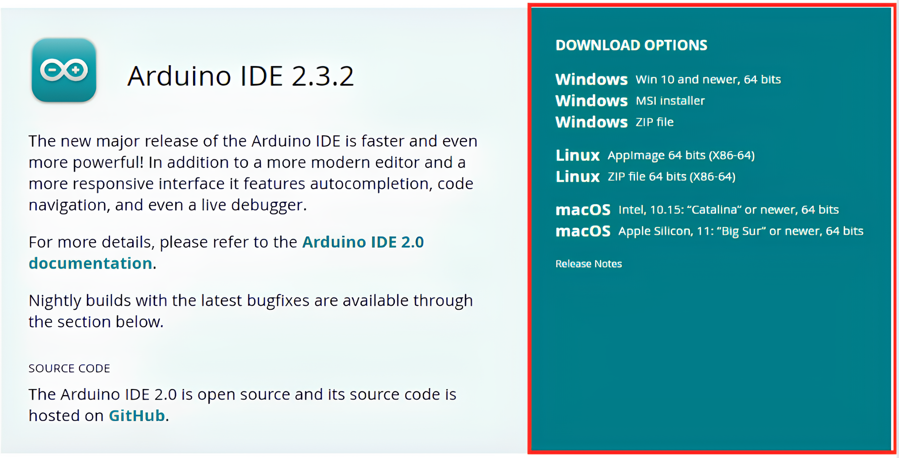
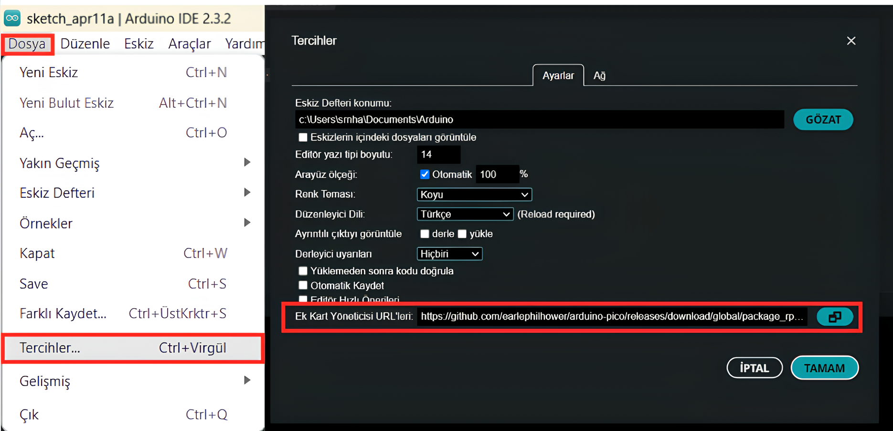
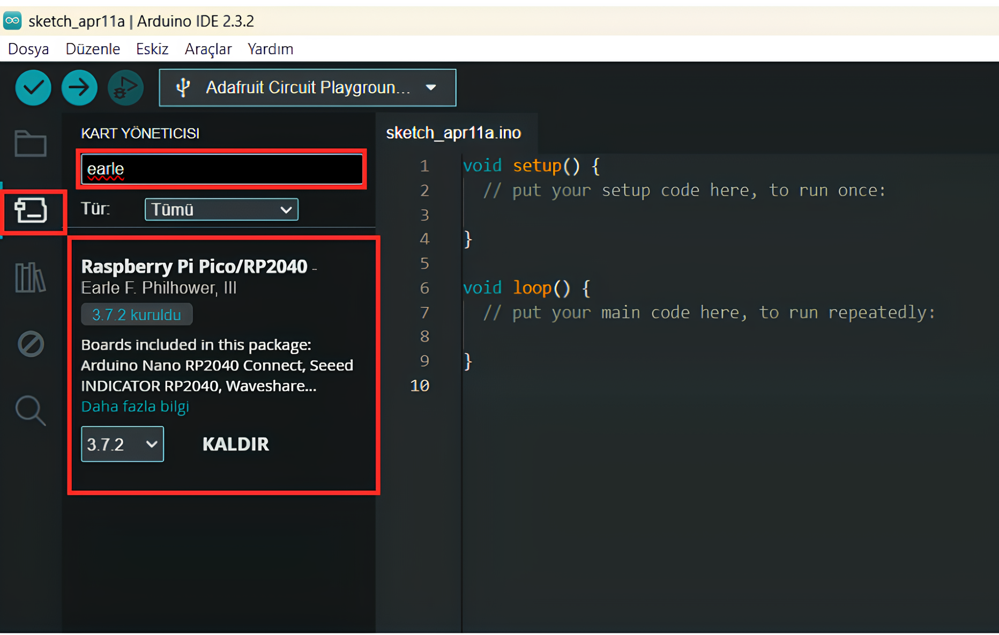
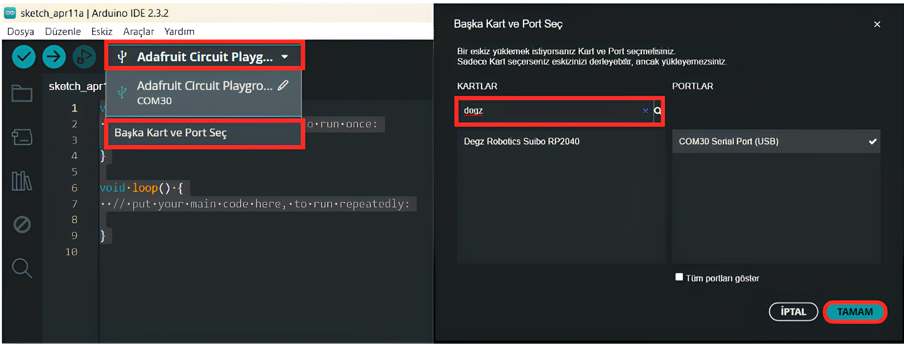
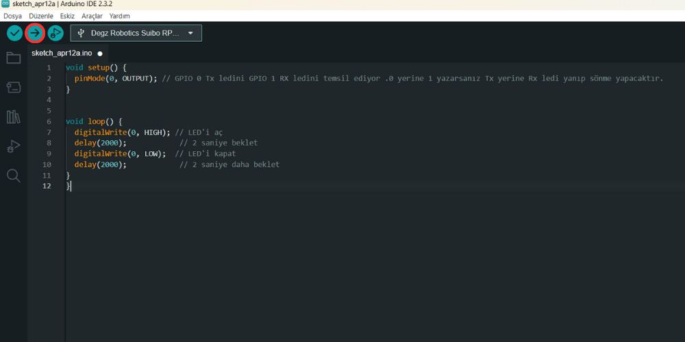

# Ürünün Kullanımı

## Suibo – İlk Kez Arduino IDE ile Programlama

### 1. Adım : Başlangıç Aşaması
Suibo'yu programlamaya başlamadan önce, birkaç temel malzemeye ihtiyacınız var: Suibo cihazı, bir Type C USB kablosu  ve bir bilgisayar. Bu malzemeler, programlama işleminin temelini oluşturur.

### 2. Adım : Arduino IDE Kurulumu


İlk olarak, [Bu linke tıklayarak](https://www.arduino.cc/en/software) Arduino IDE  2.3.2 yazılımını indirin. İşletim sisteminize uygun sürümü seçtikten sonra, yazılımı indirin ve bilgisayarınıza kurun. Kurulum, genel olarak basit birkaç adımdan oluşur ve özel bir ayarlama gerektirmez.

### 3. Adım : Yazılım Yapılandırması
 
Arduino IDE'yi kurduktan sonra, programı açın ve Dosya menüsünden Tercihler seçeneğine gidin. Burada, Ek kart yöneticisi URL'leri bölümüne https://github.com/earlephilhower/arduino-pico/releases/download/global/package_rp2040_index.json  adresini yapıştırarak gerekli kart yöneticisini ekleyin. Bu işlem, Arduino IDE'nin Suibo ile uyumlu olmasını sağlar.

### 4. Adım: Kartın Kurulumu

 

Ardından, Arduino IDE içerisinden Kart Yöneticisi'ne erişin ve arama çubuğuna "earle" yazarak ilgili kartı bulun. Karşınıza çıkan seçeneklerden gerekli kartı seçin ve kurulumunu gerçekleştirin. Bu adım, IDE'nin Suibo'yu tanımasını ve programlama işlemlerini gerçekleştirebilmesini sağlar.


### 5.Adım : Programlama

 

İlk olarak Type C USB kablosu kullanarak Suiboyu bilgisayarınıza bağlayın. Bağlıyken, Arduino IDE'de kart seçim ekranına giderek Degz yazdığınızda ilk çıkan Degz Robotics Suibo Rp2040 seçin. Daha sonra kartı kontrol etmek amaçlı aşağıdaki Kod parçasını ana ekrana koplayın. 

```
void setup() {
  pinMode(0, OUTPUT); // GPIO 0 Tx ledini GPIO 1 RX ledini temsil ediyor .0 yerine 1 yazarsanız Tx yerine Rx ledi yanıp sönme yapacaktır.
}


void loop() {
  digitalWrite(0, HIGH); // LED'i aç
  delay(2000);            // 2 saniye beklet
  digitalWrite(0, LOW);  // LED'i kapat
  delay(2000);            // 2 saniye daha beklet
}

```
:::note
"V1 Suibo kartlarında durum LED'i yanmıyor." 
:::


 ### 6 . Adım :Kodun Yüklenmesi ve Test Edilmesi
 
 

Ardından, Araçlar menüsünden port seçimi yaparak UF2 Board'ı seçin ve programı Suiboya yüklemek için yükle butonuna basın. Programın başarıyla yüklendiğini, Suibo üzerindeki  GP0 ise TX ledi GP1 yazıldı ise RX LED'in yanıp sönecektir.
Bu adımlar, Suibo'yu programlamak için izlemeniz gereken genel süreci özetlemektedir. Programlama işlemi tamamlandıktan sonra, Suibo artık  kullanıma hazır . 

 

**Soru ve önerileriniz için bize [forumdan](https://forum.degzrobotics.com/)    ulaşabilirsiniz .** 