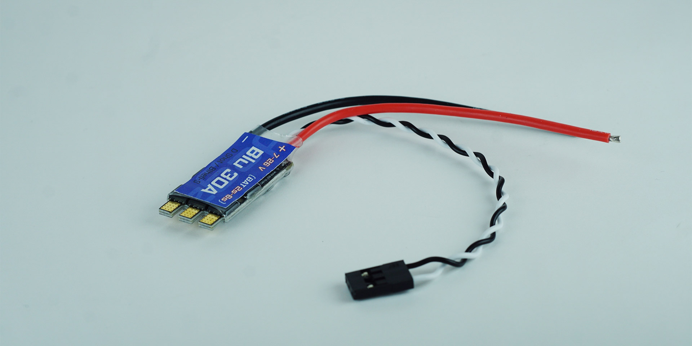

import DocCardList from '@theme/DocCardList';

# Blu 30A ESC - Fırçasız Motor Sürücü

Bu motor sürücü, su altı motorları için özel olarak konfigure edilmiş, çift yönlü çalışabilen ve Blheli ile Blheli_S konfigürasyon sistemlerine uyum sağlayan bir üründür. Dshot150, Dshot300 ve Dshot600 protokollerini destekleyerek 8v-24v arasındaki geniş bir gerilim aralığında (2s-6s pil ile) çalışabilir. Aşırı ısı durumunda koruma özelliğine sahip bu sürücü, 30 amper maksimum ve 35 amper anlık akım kapasitesine sahip olup, 36x20x5mm boyutlarında ve kablolarla birlikte 13 gram ağırlığındadır. PWM kontrolü ile 2000 mikrosaniyeye kadar tam ileri, 1500 mikrosaniyede durma ve 1000 mikrosaniyede tam geri hareketi destekler, durma hassasiyeti ise +-1 mikrosaniye aralığındadır. 

## Ürünün Özellikleri 

|Özellik                  | Açıklama                                                                                                                                                                                                                                   |
|----------------------------|--------------------------------------------------------------------------------------------------------------------------------------------------------------------------------------------------------------------------------------------|
|Konfigürasyon   |  Su altı motorlarına uygun konfigure edilmiş, çift yönlü.|
Konfigrasyon Sistemi | Blheli ve Blheli_S Konfigrasyon Sistemine uyumlu.|
|Protokoller| Dshot150, Dshot300 ve Dshot600 protokollerini destekler.|
|Gerilim Aralığı| 8v'den 24v'ye kadar (2s'den 6s'ye kadar olan pillerle uyumlu)|
|Aşırı Isı Koruma| Aşırı ısınmaya karşı koruma özelliği mevcut.|
|Azami Akım| 30 Amper maksimum sürekli akım kapasitesi.|
|Anlık Akım| 35 Amper anlık akım kapasitesi.
|  Boyutlar| 36mm uzunluk, 20mm genişlik ve 5mm yükseklik.|
|Ağırlık| Kablolarla birlikte toplam 13 gram.|
|PWM – Tam İleri| 2000 Mikrosaniye tam ileri için PWM sinyali.|
|PWM – Durma| 1500 Mikrosaniye durma için PWM sinyali.|
|PWM – Tam Geri| 1000 Mikrosaniye tam geri için PWM sinyali.|
|PWM Durma Hassasiyeti |Durma konumunda PWM hassasiyeti +-1 Mikrosaniye.|

**Bu ürünü almak için [tıklayınız](https://degzrobotics.com/product/a30-esc-fircasiz-motor-surucu/).** 

**Soru ve önerileriniz için bize [forumdan](https://forum.degzrobotics.com/)    ulaşabilirsiniz .**

<DocCardList />