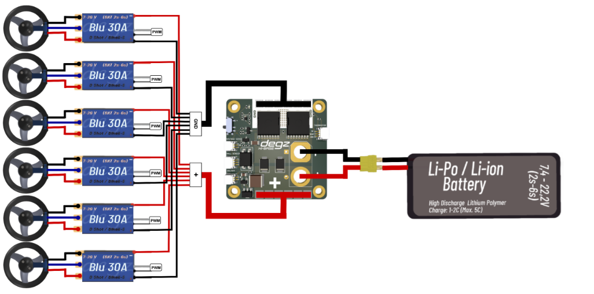

# Ürünün Kullanımı

## Blue 30A ESC'nin  Kullanımı

Üç  konnektörü Mitras Su Altı İticisinin motor fazlarına bağlanır. Bu bağlantılar , motorun fırçasız bobinlerine farklı sıralamalarda güç sağlayarak hassas hız kontrolü ve verimli çalışma sağlar.
ESC'nin kırmızı ve kalın siyah kablosu,pillerin  pozitif ve negatif girişlerine takılır.

İnce siyah-beyaz kablolara gelince, bunlar  sinyal göndermek için kullanılır ve motorun kontrolünü sağlanmasında rol oynar .

## Diğer Kartlar ile kullanımı

### Suibo ile Kullanımı

BLU 30A ESC fırçasız motor sürücü  Suibo  kartı ile birlikte PWM (Pulse Width Modulation) çıkışları kullanılarak çalıştırılabilir. Bu entegrasyon, ESC'nin motor hızını kontrol etmek için suibo kartından gelen PWM sinyallerini kullanmasını sağlar.

### Hi Base  ile Kullanımı

BLU 30A ESC fırçasız motor sürücüsünün Hi Base kartı ile birlikte kullanım  diyagramı aşağıdaki gibidir .

**Soru ve önerileriniz için bize [forumdan](https://forum.degzrobotics.com/)    ulaşabilirsiniz .**