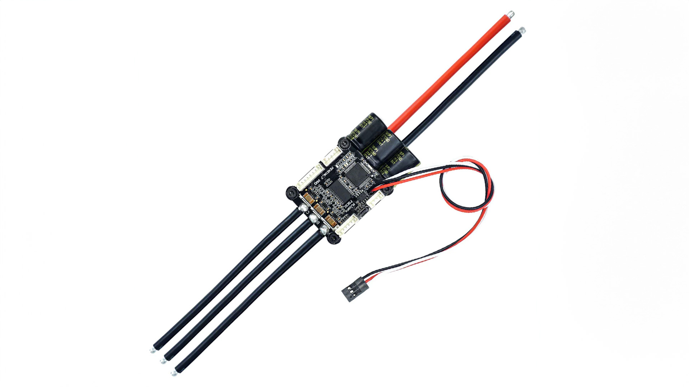

import DocCardList from '@theme/DocCardList';

# VESC 6.7 70A Yüksek Güçlü Motor Sürücü - Flipsky

VESC motor sürücü, 14V'dan 60V'a kadar geniş bir gerilim aralığında çalışabilen ve maksimum 70A sürekli, 200A anlık akım sağlayabilen bir açık kaynaklı motor kontrol ünitesidir. Bu motor sürücü, DC, BLDC ve FOC (sinüzoidal) gibi çeşitli kontrol modlarını destekler ve rejeneratif frenleme özelliği ile enerji geri kazanımı sağlayabilir. USB, CAN ve UART gibi birçok bağlantı noktası ve ABI, HALL, AS5047 gibi sensörlerle uyumludur. Programlanabilir yapısı ve VESC Tool yazılımı ile kullanıcılar motor sürücülerini ihtiyaçlarına göre özelleştirebilir. Ayrıca, düşük ve yüksek gerilim, aşırı akım ve yüksek sıcaklık gibi durumlar için koruma fonksiyonlarına sahiptir. 67x39x18.7mm boyutlarındaki bu motor sürücü, çeşitli uygulamalar için esnek ve güvenli bir çözüm sunar.

# Ürünün Teknik Özellikleri

:::warning
VESC 60V’a kadar yüksek gerilim ile çalıştığı için dikkatli kullanılması gerekmektedir!
:::

## Kart Hakkında

| Özellik                    | Değer                                                                                                                                                                                                                                      |
|----------------------------|--------------------------------------------------------------------------------------------------------------------------------------------------------------------------------------------------------------------------------------------|
| Sürekli akım               | 100A                                                                                                                                                                                                                                       |
| Anlık akım                 | 200A                                                                                                                                                                                                                                       |
| Gerilim                    | 14V-60V (Hücreler: 4-13S; 4S ila 12S için güvenlidir, gerilim - spike’ları 60V’yi aşmamalıdır!)                                                                                                                                            |
| BEC                        | 5V @ 1A ERPM: 150000 Kontrol                                                                                                                                                                                                               |
| Arayüzü Bağlantı Noktaları | USB, CAN, UART                                                                                                                                                                                                                             |
| Desteklenen Sensörler      | ABI, HALL, AS5047, AS5048A                                                                                                                                                                                                                 |
| Giriş Seti Desteği         | PPM, ADC, NRF, UART, SPI, IIC Modlar: DC, BLDC, FOC - (sinüzoidal)                                                                                                                                                                         |
| Regeneratif kapasite       | Evet                                                                                                                                                                                                                                       |
| Programlanabilir           | Evet                                                                                                                                                                                                                                       |
| Motor kablosu              | 10AWG                                                                                                                                                                                                                                      |
| Güç kablosu                | 8AWG                                                                                                                                                                                                                                       |
| Boyut                      | 75.4×63.7×31.1mm (Isı emici dahil)                                                                                                                                                                                                         |
| Özellikler                 | Dört Kontrol Modu: Akım / Görev Döngüsü / Hız / Konum - kontrol modu.                                                                                                                                                                      |
| Koruma fonksiyonları       | düşük gerilim koruması, yüksek gerilim koruması, aşırı - akım koruması, yüksek sıcaklık koruması, MOSFET’lerin aşırı sıcaklık - koruması. MPU9250, MPU9150, MPU6050, LSM6DS3, BMI160 gibi ivmeölçer ölçüm - ünitesi modüllerini destekler. |

:::info
Fabrika çıkışlı firmware sürümü olan 5.2 sürümünü kullanmanız önerilir, yeni firmware güncellemesi ESC’ye zarar verebilir.
:::

## Kapsamlı Sürücü Ayarlama Yazılımı VESC Tool

Motor sürücünüzü VESC arayüzü ile kolaylıkla programlayabilirsiniz.
Programlayıcıyı indirmek için [bu linki](https://vesc-project.com/vesc_tool) kullanabilirsiniz.

**Bu ürünü almak için [tıklayınız](https://degzrobotics.com/product/vesc-6-6-70a-yuksek-guclu-motor-surucu-flipsky/).** 

**Soru ve önerileriniz için bize [forumdan](https://forum.degzrobotics.com/)    ulaşabilirsiniz .**

<DocCardList />
