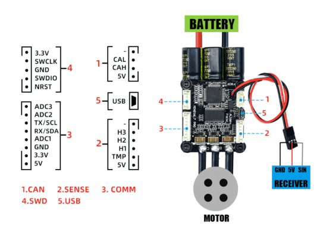

# Ürünün Kullanımı

## Bağlantı şeması

## Port Açıklamaları:

| Port                  | Özellik                                                                                                                                                                                                                                     |
|----------------------------|--------------------------------------------------------------------------------------------------------------------------------------------------------------------------------------------------------------------------------------------|
|1)  CAN             | Controller Area Network (CAN) bus sistemi için bir bağlantı noktasıdır. CAN, özellikle araçlarda kullanılan ve birçok farklı elektronik kontrol ünitesinin (ECU) birbiriyle iletişim kurmasını sağlayan bir ağ protokolüdür.                                                                                                                                  |
2 )SENSE     | Bu giriş, genellikle motorun veya bataryanın durumunu algılayan sensörlerden gelen sinyalleri okumak için kullanılır. Örneğin, bir sıcaklık sensörü buraya bağlanarak motorun veya bataryanın aşırı ısınıp ısınmadığını kontrol edebilir.|
| 3)COMM|  Bu, iletişim için kullanılan porttur. RX/SDA ve TX/SCL etiketleri, bu portun I²C seri veri (SDA) ve seri saat (SCL) hatlarına sahip olduğunu gösterir. I²C, mikrodenetleyici ve diğer I²C uyumlu cihazlar arasında veri alışverişini sağlayan bir protokoldür. |
|4 ) SWD                      |  Serial Wire Debug (SWD) portu, mikrodenetleyicinin programlanması ve hata ayıklaması için kullanılır. SWCLK (Serial Wire Clock) ve SWDIO (Serial Wire Data I/O) pinleri, programlama ve hata ayıklama sırasında veri aktarımı ve senkronizasyonu için gereklidir.|
|5 ) USB  | Bu, Universal Serial Bus (USB) bağlantı noktasıdır ve kartın bilgisayar üzerinden programlanması veya bilgisayar ile veri alışverişi yapması için kullanılır.|

## Pin   Açıklamaları
 
| CAN Portu                   | Özellik                                                                                                                                                                                                                                     |
|----------------------------|--------------------------------------------------------------------------------------------------------------------------------------------------------------------------------------------------------------------------------------------|
|CAL           | Bu pin, genellikle kalibrasyon için kullanılır.|
CAH           |Genellikle kalibrasyon veya ayar hatları için kullanılabilir.|
|5V|  USB üzerinden sağlanan 5 volt güç çıkışı.
|  **SENSE  Portu**                   | **Özellik**                                        |                                                          
|H3, H2, H1      |  Bu pinler genellikle harici cihazlarla iletişim için kullanılır. Özel işlevleri kartın tasarımına ve kullanılan protokole göre değişebilir.
TMP |bir sıcaklık sensörü için giriş pinidir.|
|5V|Porta güç sağlayan 5 volt çıkış.|
|**COMM  Portu**                  | **Özellik**   |                                               
|ADC3, ADC2, ADC1         | Analog-Digital Converter, yani analog-dijital dönüştürücü girişleri.Harici sensörlerden analog sinyalleri alır ve mikrodenetleyicinin işleyebileceği dijital sinyallere dönüştürür.
RX/SDA | Bu pin hem UART alıcı (RX) hem de I²C veri hattı (SDA) olarak işlev görür.|
TX/SCL |: Bu pin hem UART verici (TX) hem de I²C saat hattı (SCL) olarak işlev görür.|
|GND| GND|
|3.3V|Porta güç sağlayan 3.3 volt çıkış.|
|5V|Porta güç sağlayan 5 volt çıkış.
| **SWD Portu**                   | **Özellik**                                                  |
|3.3V            | Porta güç sağlayan 3.3 volt çıkış.|
SWCLK             |Serial Wire Clock, yani seri saat hattı. SWD (Serial Wire Debug) için saat sinyalini sağlar.|
|GND| GND|
|SWDIO| Serial Wire Debug Data I/O, yani seri veri giriş/çıkış hattı. SWD için veri aktarımı sağlar.|
|NRST|Reset pinidir. Bu pin aracılığıyla mikrodenetleyiciye reset sinyali gönderilebilir.|

:::info
VESC 6.7 70A Yüksek Güçlü Motor Sürücü'nün  bizim iticiler bizim üzerinde  degz yazan bir pil ve suibo ile bir şematik yapılabilir buraya . Başlıkta suibo ile kulalnımı deriz .
:::

## Gyro ile Dengelemeye Hazır

VESC IMU ile dengeleme sağlayan tek tekerlekli araçlarla çalışmaya uygun halde gelir.

<iframe width="100%" height="574" src="https://www.youtube.com/embed/iGgNuo6o_Ug" title="VESC IMU Accelerometer Calibration - How To" frameborder="0" allow="accelerometer; autoplay; clipboard-write; encrypted-media; gyroscope; picture-in-picture; web-share" allowfullscreen></iframe>

## VESC board için ayarlama

Vesc’nin elektrikli kaykaylar ile nasıl ayarlanması gerektiğini aşağıdan izleyebilirsiniz.

<iframe width="100%" height="574" src="https://www.youtube.com/embed/lDuV8cnPRmI" title="VESC® Tool 2020 Tutorial - How to Program Vesc for DIY Electric Skateboards" frameborder="0" allow="accelerometer; autoplay; clipboard-write; encrypted-media; gyroscope; picture-in-picture; web-share" allowfullscreen></iframe>

**Bu ürünü kullanırken karşılaştığınız  sorunları  bize sormak için  [tıklayınız](https://forum.degzrobotics.com/).**  
