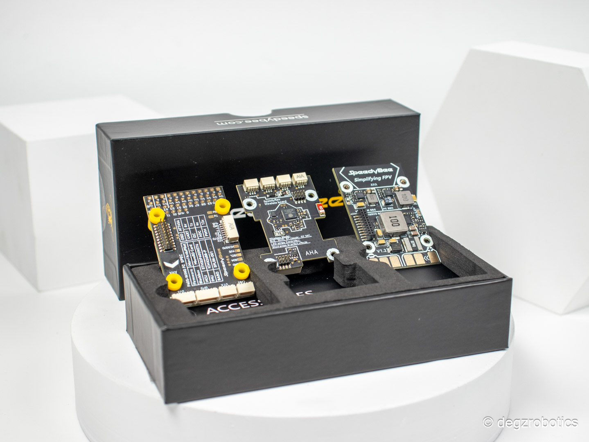
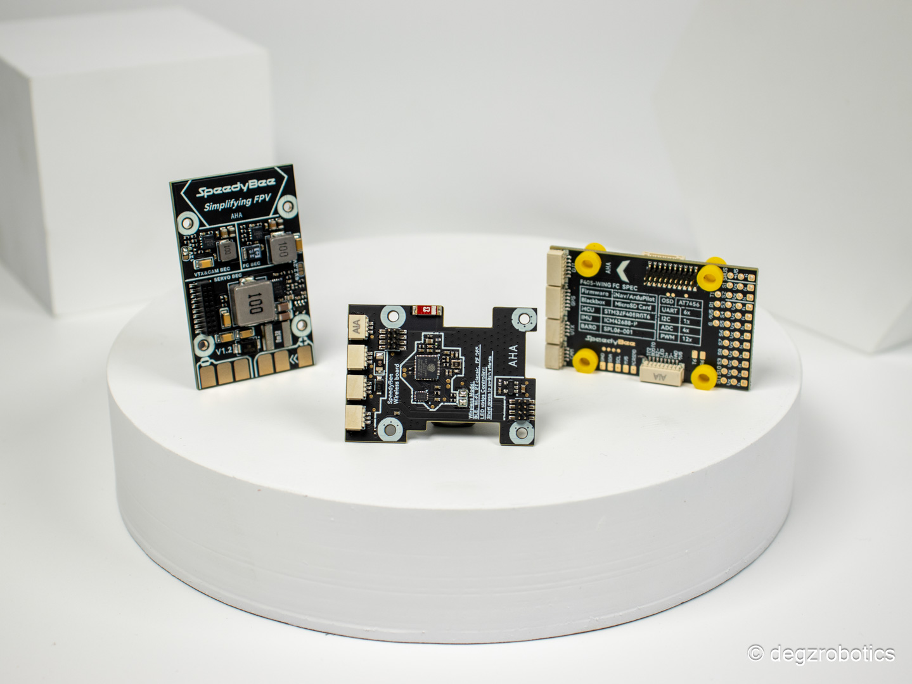

# Ürün Hakkında

## SpeedyBee F405 Wing Uçuş Kartı

SpeedyBee uçuş kartı seti, Ardupilot ve Inav destekli bir otopilot kartı olarak tasarlanmıştır. Bu sayede otonom uçuş projelerinizde mükemmel bir performans sunar. Ardupilot desteği sayesinde, kartı ArduSub olarak kurarak Pixhawk’a alternatif olarak kullanabilirsiniz. Su altı sistemlerinde kullanmak istiyorsanız, I2C portuna bir pusula sensörü bağlamanız gerekmektedir. Örneğin HMC5883L gibi pusula sensörleri I2C üzerinden bağlanabilir. I2C bağlantısı yapıldıktan sonra MissionPlanner üzerinden External Compass seçeneğini etkinleştirmeniz gerekmektedir.

## Üç Kart Birlikte

Bu SpeedyBee uçuş kartı seti, **üç ana karttan oluşmaktadır:** Kontrol Kartı, Güç Dağıtım Kartı ve Kablosuz Bağlantı Kartı. Güç Dağıtım Kartı, 5V’lik kontrol kartı için, ayarlanabilir 9V veya 12V’lik video verici sistemleri için ve ayarlanabilir 5V, 6V veya 7.2V’lik servolar için üç ayrı voltaj çıkışı sağlar. Güç girişi 7-36V arasında olup maksimum 6S batarya ile kullanılması önerilmektedir.

**Uygulamalar ile destekli!**

Kablosuz Bağlantı Kartı sayesinde, Bluetooth ve Wi-Fi üzerinden SpeedyBee App, MissionPlanner, QGroundControl gibi uygulamalara kolayca bağlantı kurabilirsiniz. Bu özellik, kartın uzaktan yönetimini ve kontrolünü sağlar. Kullanıcıların projelerini daha etkili bir şekilde izlemelerini ve yönetmelerini mümkün kılar. SpeedyBee F405 Wing, güçlü performansı ve geniş bağlantı seçenekleri ile otonom uçuş projeleriniz için ideal bir tercihtir.

## Teknik özellikler

### SpeedyBee F405 WING FC Kartı  

| Özellik                   | Değer                                                                                                  |
|-------------------------- |--------------------------------------------------------------------------------------------------------|
| MCU                       | STM32F405,168MHz,1MB Flash                                                                             |
| IMU(Gyro&Accelerometer)   | ICM-42688-P                                                                                            |
| Barometer                 | SPL006-001                                                                                             |
| OSD Chip                  | AT7456E                                                                                                |
| Blackbox                  | MicroSD Card Slot                                                                                      |
| UART                      | 6 sets(USART1, USART2, USART3, UART4, UART5, UART6(Dedicated for Wireless board Telemetry connection)) |
| I2C                       | 1x Used for magnetometer, digital airspeed sensor                                                      |
| ADC                       | 4x (VBAT, Current, RSSI, Analog AirSpeed)                                                              |
| PWM                       | 12x (11+1“LED”pad)                                                                                     |
| ELRS/CRSF receiver        | Supported,connected to UART1                                                                           |
| SBUS                      | Built in inverter for SBUS input (UART2-RX)                                                            |
| LED                       | 3x LEDs for FC STATUS (Blue, Green) and 3.3V indicator(Red) 1x RGB                                     |
| RSSI                      | Supported,Named as RS .                                                                                |
| Supported FC Firmware     | INAV:SpeedyBeeF405WING(default) ArduPilot: SpeedyBeeF405WING                                           |

### SpeedyBee F405 WING PDB Kartı

| Özellik                	| Değer                                                                                                                                                                                      	|
|------------------------	|--------------------------------------------------------------------------------------------------------------------------------------------------------------------------------------------	|
| Input voltage range    	| 7~36V (2~6S LiPo)                                                                                                                                                                          	|
| Battery Voltage Sensor 	| Connect to FC board VBAT, 1K:10K (Scale 1100 in iNav, BATT_VOLT_MULT 11.0 in ArduPilot)                                                                                                    	|
| Battery Current Sensor 	| 90A continuous, 215A peak Connect to FC board Current (Scale 195 in iNav, 50 A/V in ArduPilot)                                                                                             	|
| TVS Protective diode   	| Yes                                                                                                                                                                                        	|
| FC BEC output          	| Output 5.2V +/- 0.1V DC Continuous current 2.4 Amps, 3A Peak Designed for FC, Receiver, GPS module, AirSpeed module, Telemetry module, WS2812 LED_Strip                                    	|
| VTX BEC output         	| Output 9V +/- 0.1V DC Continuous current 1.8 Amps, 2.3A Peak Voltage adjustable, 9V Default, 12V or 5V via jumper Designed for Analog Video Transmitter,Digital Video Transmitter, Camera. 	|
| Servo BEC output       	| Output 4.9V +/- 0.1V DC Continuous current 4.5 Amps, 5.5A Peak Voltage adjustable, 4.9V Default, 6V or 7.2V via jumper Designed for Servos.                                                	|
| Weight                 	| 11.4g                                                                                                                                                                                      	|

### SpeedyBee F405 WING Wireless Kart

| Özellik                                                                                                	| Değer                                                                                                                                                                                             	|
|--------------------------------------------------------------------------------------------------------	|---------------------------------------------------------------------------------------------------------------------------------------------------------------------------------------------------	|
| Wireless Configuration (long press BOOT button for 6 seconds to switch modes)                          	| BLE mode, connect to Speedybee APP. / Wi-Fi mode, connect to QGroundControl APP, Speedybee APP, MissionPlanner, etc. / Classic Bluetooth SPP mode, connect to QGroundControl APP, MissionPlanner 	|
| LED strip controller (short press BOOT button to switch effects, long press 2 seconds to switch modes) 	|  4x WS2812 LED strip connectors, adjustable colors and flashing modes / Max 5.2V 1.3A, supports around 70pcs 5050 WS2812 LED beads                                                               	|
| On-board battery level indicator                                                                       	| 4x RGB indicator LED for battery level display by number of lights                                                                                                                                	|
| Weight                                                                                                 	| 4.2g                                                                                                                                                                                              	|