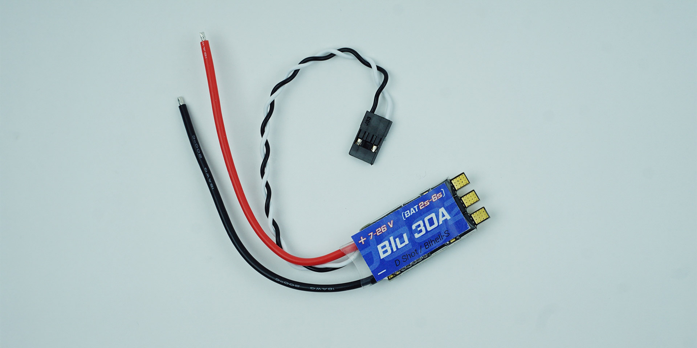

# Ürün Hakkında

## Teknik Özellikler

|Özellik                  | Açıklama                                                                                                                                                                                                                                   |
|----------------------------|--------------------------------------------------------------------------------------------------------------------------------------------------------------------------------------------------------------------------------------------|
|Konfigürasyon   |  Su altı motorlarına uygun konfigure edilmiş, çift yönlü.|
Konfigrasyon Sistemi | Blheli ve Blheli_S Konfigrasyon Sistemine uyumlu.|
|Protokoller| Dshot150, Dshot300 ve Dshot600 protokollerini destekler.|
|Gerilim Aralığı| 8v'den 24v'ye kadar (2s'den 6s'ye kadar olan pillerle uyumlu)|
|Aşırı Isı Koruma| Aşırı ısınmaya karşı koruma özelliği mevcut.|
|Azami Akım| 30 Amper maksimum sürekli akım kapasitesi.|
|Anlık Akım| 35 Amper anlık akım kapasitesi.
|  Boyutlar| 36mm uzunluk, 20mm genişlik ve 5mm yükseklik.|
|Ağırlık| Kablolarla birlikte toplam 13 gram.|
|PWM – Tam İleri| 2000 Mikrosaniye tam ileri için PWM sinyali.|
|PWM – Durma| 1500 Mikrosaniye durma için PWM sinyali.|
|PWM – Tam Geri| 1000 Mikrosaniye tam geri için PWM sinyali.|
|PWM Durma Hassasiyeti |Durma konumunda PWM hassasiyeti +-1 Mikrosaniye.|

