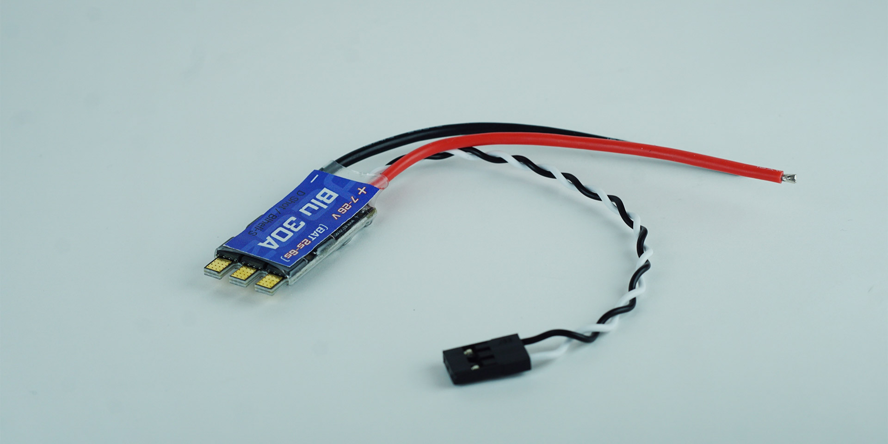
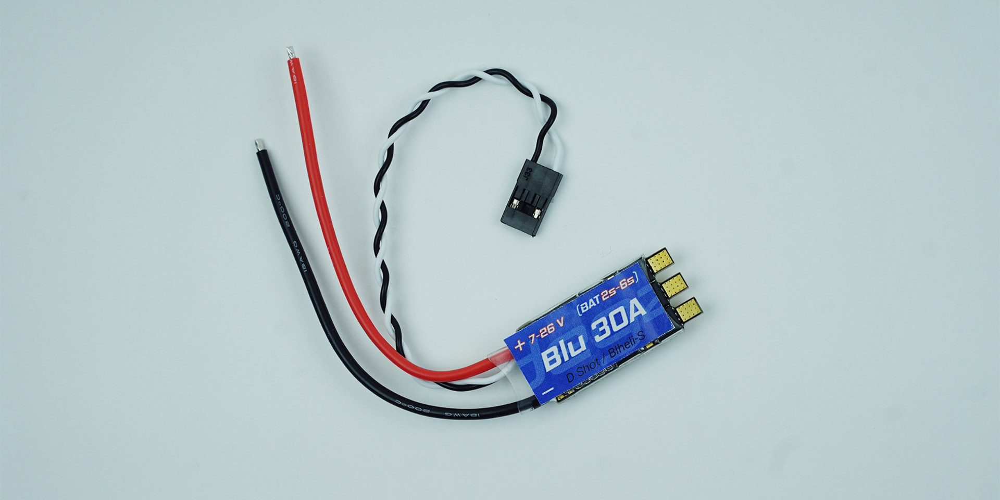

# Ürün Hakkında

30A ESC – Fırçasız Motor Sürücü Mitras ve M1 motor kullanılarak üretilen motor türevleri için özelleştirilmiş en uygun fiyatlı motor sürücü olarak karşınızda!

Daha iyi performans, daha uygun fiyata!
## Teknik Özellikler

- Su altı motorlarına uygun konfigure edilmiş, çift yönlü
- Blheli, Blheli_S Konfigrasyon Sistemine Uyumlu
- Dshot150/300/600 protokollerini destekler
- 8v-24v gerilim aralığı (2s-6s)
- Aşırı ısı koruma
- Azami Akım 30 Amper
- Anlık Akım 35 Amper
- Boyutlar 36x20x5mm
- Ağırlık (Kablolarla Birlikte) 13gr
- PWM – 2000 Mikrosaniye Tam İleri, 1500 Mikrosaniye Durma, 1000 Mikrosaniye - Tam Geri çalışma
- PWM Durma Hassasiyeti +-1 Mikrosaniye
- Kutu içeriği

:::tip
Blu30A Motor Sürücü kutudan çıkar çıkmaz kullanıma hazır.
:::
