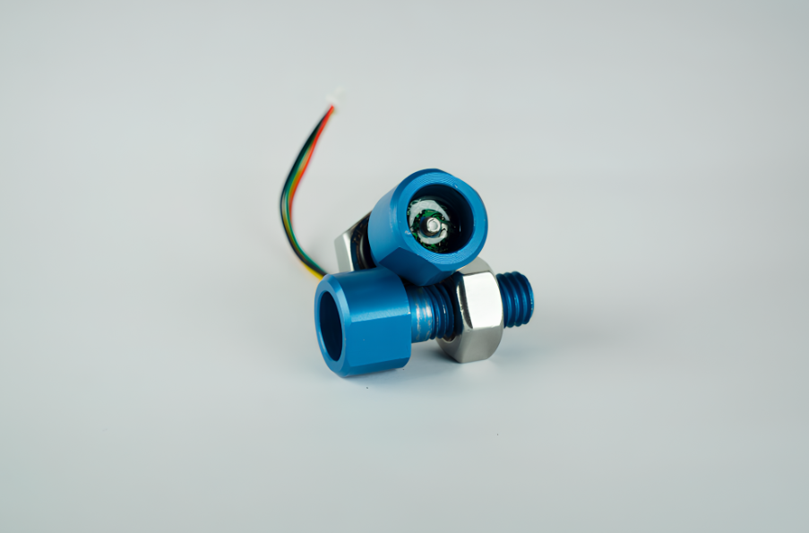
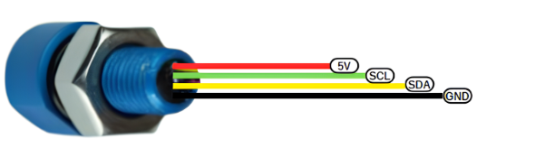

import DocCardList from '@theme/DocCardList';

# D300 Derinlik ve Su Sıcaklığı Sensörü
 

Bu derinlik ve sıcaklık sensörü, MS5837-30BA modülü kullanılarak geliştirilmiş olup, 300 metre derinliğe kadar 1cm hassasiyetinde basınç ölçümü ve ±1°C hassasiyette sıcaklık ölçümü yapabilir. I2C protokolü üzerinden veri iletişimi sağlar ve 4.5-5.5V arası bir besleme gerilimi ile çalışırken, 3.3V I2C gerilimini kullanır. Sensör, 5V I2C gerilimi ile çalışan cihazlara bağlandığında zarar görme riskine karşı uyarı içerir. PixHawk ve benzeri uçuş kontrol kartlarıyla uyumlu bu cihaz, ayrıca ArduPilot ve ArduSub destekli araçlarda da kullanılabilir.

## Kart Hakkında

Özellik                  |                                                                                                                                                                                                                                     |
|----------------------------|--------------------------------------------------------------------------------------------------------------------------------------------------------------------------------------------------------------------------------------------|
|Entegrasyon        |Sensör, voltaj dönüştürücü kartıyla entegre edilmiş, kolay müdahale edilebilir yapıdadır.                                                                                                                        |
Performans | 300 metre derinliğe kadar 2mm hassasiyetle basınç ölçümü yapabilir; ±1°C hassasiyetle sıcaklık ölçümü sunar. Derinlik Hassasiyeti 1cmdir|
|Veri Erişimi| I2C aracılığıyla verilere erişim sağlar, bu kullanımı kolaylaştırır. I2C Gerilimi 3.3V dur.|
|Uyumluluk                   |PixHawk ve diğer uçuş kontrol kartlarıyla uyumlu; ArduPilot ve ArduSub tarafından desteklenir.|
|Maksimum Derinlik | 300 metre derinliğe kadar ölçüm yapabilir.|
|Sensör Modeli| MS5837-30BA kullanılarak geliştirilmiştir.|
|Konnektör Tipi|Çoğu uçuş kontrol kartıyla uyumlu JST konektörü kullanılmıştır.|
|Sızdırmazlık| ROV veya UAV’lerde sızdırmazlık konusunda üst düzey performans sağlar.|
|Besleme Gerilimi|  4.5-5.5V |

:::warning
Bu cihaz 3.3V i2C Gerilimi ile çalıştığı için 5V i2C gerilimi ile çalışan cihazlara bağlandığında zarar görecektir.
:::

## Sensor çıkışları

**Bu ürünü almak için [tıklayınız](https://degzrobotics.com/product/derinlik-ve-sicaklik-sensoru/).** 

**Soru ve önerileriniz için bize [forumdan](https://forum.degzrobotics.com/)    ulaşabilirsiniz .**

<DocCardList />