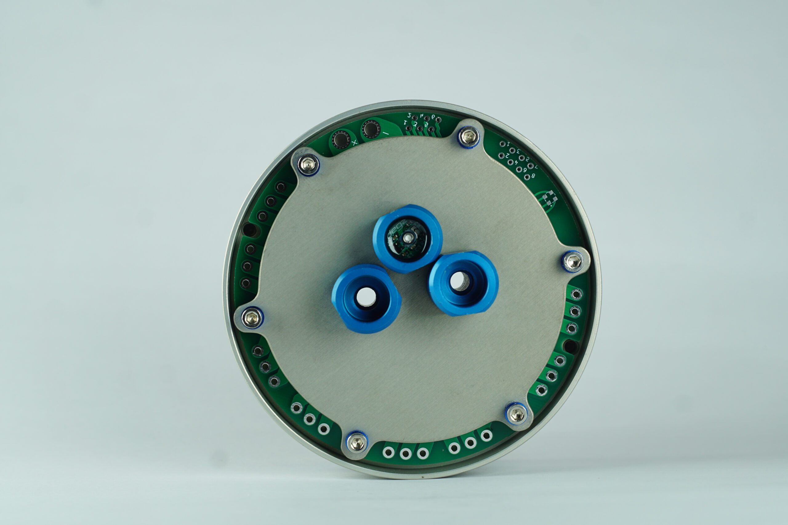
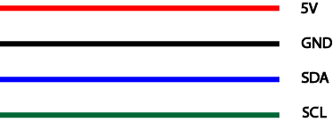

# Ürün Hakkında

Derinlik ve sıcaklık sensörü, voltaj dönüştürücü kartında entegre bir şekilde yer alır ve kolay müdahale edilebilir bir yapı sunar. ROV veya UAV’nizde güvenle kullanabileceğiniz bu sensör, sızdırmazlık konusunda üst düzey performans sağlar. **300 metre** derinliğe kadar **2mm** hassasiyetle basınç ölçümü gerçekleştirebilir ve ±1°C’ye kadar hassas sıcaklık ölçümleri sunar. Ayrıca, I2C üzerinden verilere erişim imkanı sunarak kullanımı daha da etkili hale getirir. MS5837-30BA ile geliştirilen Derinlik ve Sıcaklık Sensörü, _PixHawk ve diğer uçuş kontrol kartlarıyla uyumludur._ Derinlik hassasiyeti 1cm ve maksimum derinlik ölçümü 300 metreye kadar olan D300, ArduPilot ve ArduSub’da da desteklenir. Bu önemli sensör, ArduSub kontrollü ROV’larda güvenle kullanılabilir.

D300, ROV veya UAV’nizde sızdırmazlığı koruyarak kullanımı hazır, yüksek ve alçak basınç değerlerine hassasiyeti olarak geliştirilmiş bir sensördür.300 metre derinliğe kadar 2mm hassasiyet ile basınç ölçümü yapabilirsiniz. Bu sensör, **±1°C’ye kadar hassas bir sıcaklık sensörü içerir** ve verilere I2C üzerinden de erişilebilir.

D300, 30 bar’a (300m/1000ft derinlik) kadar ölçüm yapabilen ve I2C üzerinden haberleşebilen MS5837-30BA kullanılarak geliştirilmiştir. PixHawk ve diğerleri dahil olmak üzere çoğu uçuş kontrol kartıyla uyumlu bir JST konektörü kullanılmıştır. Depth Sensörün, herhangi bir ArduSub kontrollü ROV’larda kullanılabilmesi için ArduPilot ve ArduSub’da varsayılan olarak desteklenir.

## Teknik Özellikler

- Besleme Gerilimi: 4.5-5.5V
- i2C Gerilimi: 3.3V
- Sıcaklık Hassasiyeti: ±1°C
- Derinlik Hassasiyeti: 1cm
- Maksimum Derinlik Ölçümü: 300 metre

:::warning
Bu cihaz 3.3V i2C Gerilimi ile çalıştığı için 5V i2C gerilimi ile çalışan cihazlara bağlandığında zarar görecektir.
:::

## Sensor çıkışları

## Kutu İçeriği
D300 Derinlik ve Su Sıcaklığı Sensörü (Dupont konvektör takılı halde gönderilecektir.)