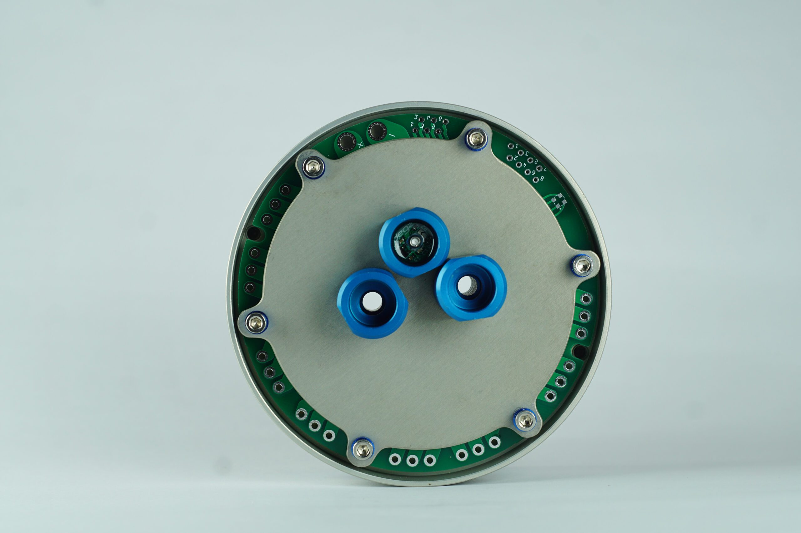

# Ürünün Teknik Özellikleri

## Kart Hakkında

Özellik                  |                                                                                                                                                                                                                                     |
|----------------------------|--------------------------------------------------------------------------------------------------------------------------------------------------------------------------------------------------------------------------------------------|
|Entegrasyon        |Sensör, voltaj dönüştürücü kartıyla entegre edilmiş, kolay müdahale edilebilir yapıdadır.                                                                                                                        |
Performans | 300 metre derinliğe kadar 2mm hassasiyetle basınç ölçümü yapabilir; ±1°C hassasiyetle sıcaklık ölçümü sunar. Derinlik Hassasiyeti 1cmdir|
|Veri Erişimi| I2C aracılığıyla verilere erişim sağlar, bu kullanımı kolaylaştırır. I2C Gerilimi 3.3V dur.|
|Uyumluluk                   |PixHawk ve diğer uçuş kontrol kartlarıyla uyumlu; ArduPilot ve ArduSub tarafından desteklenir.|
|Maksimum Derinlik | 300 metre derinliğe kadar ölçüm yapabilir.|
|Sensör Modeli| MS5837-30BA kullanılarak geliştirilmiştir.|
|Konnektör Tipi|Çoğu uçuş kontrol kartıyla uyumlu JST konektörü kullanılmıştır.|
|Sızdırmazlık| ROV veya UAV’lerde sızdırmazlık konusunda üst düzey performans sağlar.|
|Besleme Gerilimi|  4.5-5.5V |

:::warning
Bu cihaz 3.3V i2C Gerilimi ile çalıştığı için 5V i2C gerilimi ile çalışan cihazlara bağlandığında zarar görecektir.
:::

## Sensor çıkışları

