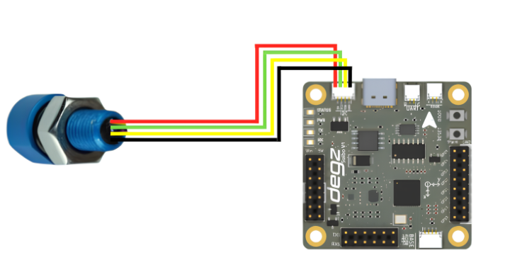

# Ürünün Kullanımı

## D300  Basınç, Sıcaklık, Derinlik ve Yükseklik Sensörü ile Veri Okuma Kodu

Bu kod, Arduino ve D300 Derinlik ve Su Sıcaklığı Sensörü (MS5837 modeli) kullanılarak su altı ortamlarında basınç, sıcaklık, derinlik ve yükseklik değerlerini ölçmek için yazılmıştır. MS5837 sensörü, suyun fiziksel özelliklerini yüksek doğrulukla ölçer ve elde edilen verileri Arduino'nun seri portu üzerinden gönderir.

Kurulum aşamasında, seri iletişim 9600 baud hızında başlatılır ve I2C bağlantısı kurulur. Sensörün başlatılması sırasında herhangi bir bağlantı hatası olup olmadığı kontrol edilir. Başarılı bir başlatma sonrasında, sensör modeli ve suyun yoğunluğu ayarlanarak ölçümlere hazır hale getirilir.

Ana döngüde, sensör sürekli olarak okunur ve elde edilen basınç, sıcaklık, derinlik ve yükseklik değerleri seri port üzerinden yazdırılır. Her okuma sonrasında bir saniyelik bir bekleme süresi eklenerek veri akışı düzenli bir şekilde sürdürülür. Bu kod, su altı araştırmaları, dalış teknolojileri, denizcilik uygulamaları veya çevresel izleme projeleri için idealdir. Verilerin sürekli ve güvenilir bir şekilde kaydedilmesi, analiz ve izleme faaliyetlerinde büyük önem taşır.




````
#include <Wire.h>
#include "MS5837.h"

MS5837 sensor;

void setup() {
  Serial.begin(9600); // Seri bağlantıyı 9600 baud hızında başlatır.
  
  Serial.println("Başlıyor"); // Başlangıç mesajını seri porttan gönderir.
  
  Wire.begin(); // I2C bağlantısını başlatır.

  // Sensör başlatılıyor. Başarısız olursa hata mesajı yazdırılıyor.
  while (!sensor.init()) {
    Serial.println("Başlatma başarısız!"); // Başlatma başarısız.
    Serial.println("SDA/SCL doğru bağlı mı?"); // SDA/SCL doğru bağlı mı kontrol et.
    Serial.println("Degz Robotik Bar30: Sarı=SDA, Yeşil=SCL"); // Doğru bilgi: Sarı=SDA, Yeşil=SCL
    Serial.println("\n\n\n"); // Ek boş satırlar.
    delay(5000); // 5 saniye bekletir.
  }
  
  sensor.setModel(MS5837::MS5837_30BA); // Sensör modelini ayarlar.
  sensor.setFluidDensity(997); // Akışkan yoğunluğunu ayarlar (tatlı su için 997 kg/m^3, deniz suyu için 1029 kg/m^3).
}

void loop() {
  // Basınç ve sıcaklık okumalarını günceller.
  sensor.read();

  // Basınç bilgisini seri porta yazdırır.
  Serial.print("Basınç: "); 
  Serial.print(sensor.pressure()); 
  Serial.println(" mbar");
  
  // Sıcaklık bilgisini seri porta yazdırır.
  Serial.print("Sıcaklık: "); 
  Serial.print(sensor.temperature()); 
  Serial.println(" derece C");
  
  // Derinlik bilgisini seri porta yazdırır.
  Serial.print("Derinlik: "); 
  Serial.print(sensor.depth()); 
  Serial.println(" m");
  
  // Yükseklik bilgisini seri porta yazdırır.
  Serial.print("Yükseklik: "); 
  Serial.print(sensor.altitude()); 
  Serial.println(" m deniz seviyesinin üzerinde");

  delay(1000); // 1 saniye bekletir.
}
````

**Bu ürünü kullanırken karşılaştığınız  sorunları  bize sormak için  [tıklayınız](https://forum.degzrobotics.com/).**  