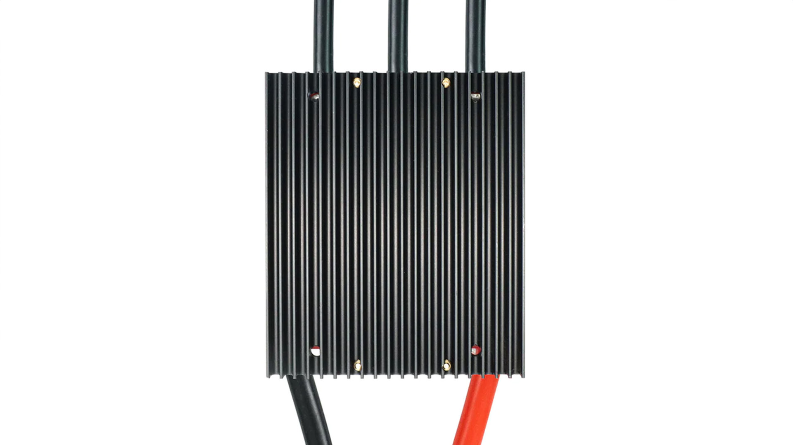
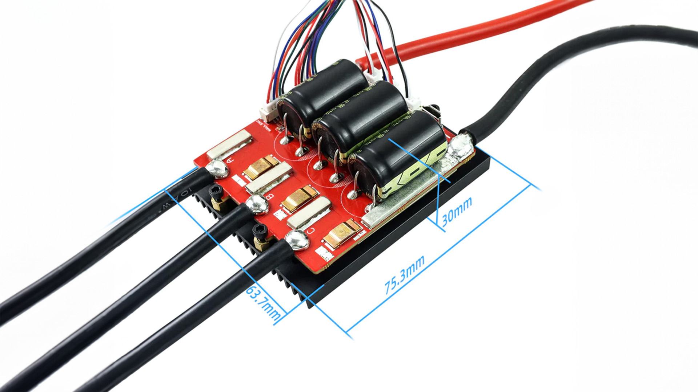

# Ürün Hakkında

Dünyanın en güçlü açık kaynaklı motor sürücüleri Degz aracılığı ile sizlerle!
Degz ile dünyanın en güçlü açık kaynaklı VESC motor sürücüyü keşfedin! VESC motor sürücü yüksek performanslı kara, hava ve deniz araçlarının kalbinde yer alıyor. 60V’a kadar yüksek gerilimle çalışabilme özelliğiyle dikkat çekerken, kapsamlı sürücü ayarlama yazılımı VESC Tool ile kolayca programlanabilirsiniz. Rejeneratif frenleme özelliği sayesinde enerji geri kazanımı mümkün. Teknik özellikler arasında 100A sürekli akım, 200A anlık akım, ve çeşitli kontrol modları bulunur. Ayrıca VESC motor sürücü, çeşitli koruma fonksiyonları ve sensör destekleriyle öne çıkan bu motor sürücüler, elektrikli araç projelerinizin gücünü artırıyor.

Dünya genelinde kendini ispatlamış, bir çok yüksek performanslı kara, hava ve deniz aracının kalbini oluşturan motor sürücüsü VESC projelerinizde yer almak için hazır. VESC 60V’a kadar yüksek gerilim ile çalıştığı için dikkatli kullanılması gerekmektedir!

VESC motor sürücü ile;

- Utras’ı yüksek performanslı olarak kullanabilirsiniz.
- Kendi scooterınızı tasarlayabilir veya scooterınızı modifiye edebilirsiniz.
- Yüksek performanslı sualtı araçları tasarlayıp üretebilirsiniz.

## Kapsamlı Sürücü Ayarlama Yazılımı VESC Tool

Motor sürücünüzü VESC arayüzü ile kolaylıkla programlayabilirsiniz.
Programlayıcıyı indirmek için [bu linki](https://vesc-project.com/vesc_tool) kullanabilirsiniz.

Rejeneratif Frenleme Özelliği

Elektrikli araçlarınızın ihtiyaç duyduğu geri beslemeyi motor sürücü üzerinden doğrudan alabilirsiniz. Bu daha uzun menzil veya daha fazla batarya ömrü demektir. (Bataryaların BMS’e sahip olması önerilir)

## Teknik Özellikler

| Özellik                    | Değer                                                                                                                                                                                                                                      |
|----------------------------|--------------------------------------------------------------------------------------------------------------------------------------------------------------------------------------------------------------------------------------------|
| Sürekli akım               | 100A                                                                                                                                                                                                                                       |
| Anlık akım                 | 200A                                                                                                                                                                                                                                       |
| Gerilim                    | 14V-60V (Hücreler: 4-13S; 4S ila 12S için güvenlidir, gerilim - spike’ları 60V’yi aşmamalıdır!)                                                                                                                                            |
| BEC                        | 5V @ 1A ERPM: 150000 Kontrol                                                                                                                                                                                                               |
| Arayüzü Bağlantı Noktaları | USB, CAN, UART                                                                                                                                                                                                                             |
| Desteklenen Sensörler      | ABI, HALL, AS5047, AS5048A                                                                                                                                                                                                                 |
| Giriş Seti Desteği         | PPM, ADC, NRF, UART, SPI, IIC Modlar: DC, BLDC, FOC - (sinüzoidal)                                                                                                                                                                         |
| Regeneratif kapasite       | Evet                                                                                                                                                                                                                                       |
| Programlanabilir           | Evet                                                                                                                                                                                                                                       |
| Motor kablosu              | 10AWG                                                                                                                                                                                                                                      |
| Güç kablosu                | 8AWG                                                                                                                                                                                                                                       |
| Boyut                      | 75.4×63.7×31.1mm (Isı emici dahil)                                                                                                                                                                                                         |
| Özellikler                 | Dört Kontrol Modu: Akım / Görev Döngüsü / Hız / Konum - kontrol modu.                                                                                                                                                                      |
| Koruma fonksiyonları       | düşük gerilim koruması, yüksek gerilim koruması, aşırı - akım koruması, yüksek sıcaklık koruması, MOSFET’lerin aşırı sıcaklık - koruması. MPU9250, MPU9150, MPU6050, LSM6DS3, BMI160 gibi ivmeölçer ölçüm - ünitesi modüllerini destekler. |

:::info
Fabrika çıkışlı firmware sürümü olan 5.2 sürümünü kullanmanız önerilir, yeni firmware güncellemesi ESC’ye zarar verebilir.
:::

## Kabloların bağlantı şeması

## Gyro ile Dengelemeye Hazır (İngilizce içerik)

VESC IMU ile dengeleme sağlayan tek tekerlekli araçlarla çalışmaya uygun halde gelir.

<iframe width="100%" height="574" src="https://www.youtube.com/embed/iGgNuo6o_Ug" title="VESC IMU Accelerometer Calibration - How To" frameborder="0" allow="accelerometer; autoplay; clipboard-write; encrypted-media; gyroscope; picture-in-picture; web-share" allowfullscreen></iframe>

## VESC board için ayarlama (İngilizce İçerik)

Vesc’nin elektrikli kaykaylar ile nasıl ayarlanması gerektiğini aşağıdan izleyebilirsiniz.

<iframe width="100%" height="574" src="https://www.youtube.com/embed/lDuV8cnPRmI" title="VESC® Tool 2020 Tutorial - How to Program Vesc for DIY Electric Skateboards" frameborder="0" allow="accelerometer; autoplay; clipboard-write; encrypted-media; gyroscope; picture-in-picture; web-share" allowfullscreen></iframe>