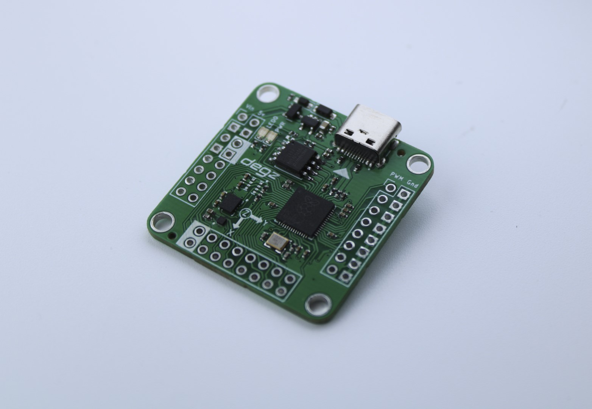
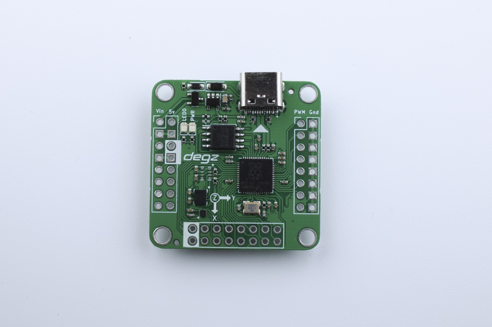
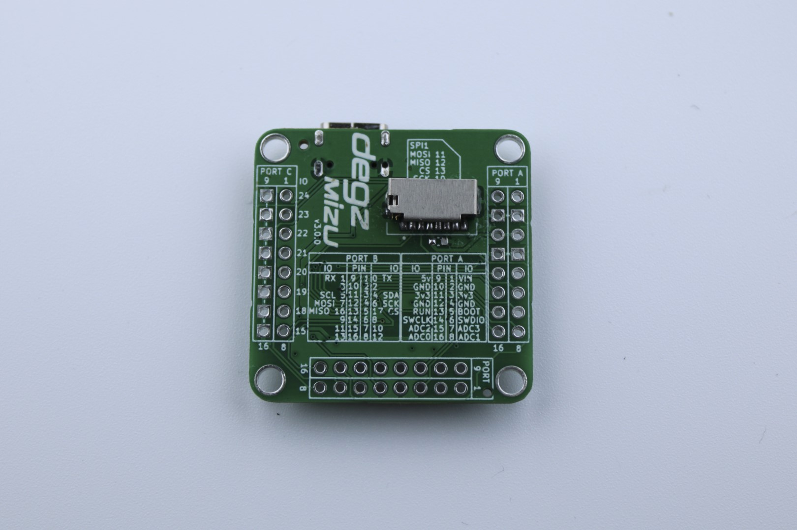

import DocCardList from '@theme/DocCardList';
    
# Ürün Hakkında

## Mizu dalışa hazır

Mizu su altı kontrol kartı, su altı projeleriniz için özel olarak tasarlanmış bir geliştirme kartıdır. Mizucom yüzey kontrolcüsü ile entegre edilmiş ve insansız su altı sistemleriniz için açık kaynaklı bir yazılım sunmaktadır.

:::warning
Bu ürün satıştan kalkmıştır. Bu yüzden güncellenen [Degz Suibo](/elektronik-kartlar/suibo-rp2040/)'ya bakabilirsiniz.  

:::

Deringezen-X ile uyumlu olan Mizu geliştirme kartı, boyutlarıyla dikkat çekerken, FPV stack geleneğini sürdürerek ek kartlarla projelerinize uyum sağlar. Esneklik açısından zengin olan Mizu, 16 motoru aynı anda kontrol edebilir ve çeşitli iletişim tiplerini destekler. 10 eksen dengeleme özelliği ve otonomi için gerekli sensörlerle donatılmış olan Mizu, insansız su altı araçlarından roket kontrol kartlarına kadar geniş bir kullanım yelpazesi sunar. Teknik özellikler arasında çift çekirdekli ARM M0 mikrodenetleyici, 8 Mb harici flash, IMU sensörü, pusula, barometre (yalnızca Mizu-b modeli), programlanabilir LED ve daha fazlası bulunmaktadır. Mizu su altı kontrol kartı, projelerinizi daha küçük, daha esnek ve daha güçlü hale getirmek için ideal bir seçenektir.

İnsansız su altı sistemleri için özelleştirilmiş açık kaynaklı bir yazılım sunulmuş olup, yüzey kontrolcüsü olan Mizucom ile kullanıma hazırdır. Diğer sistemler için bazı özelleştirmeler geliştirilerek rahatlıkla kullanılabilir. Octomini kartlarının devamı niteliğinde olan Mizu, tüm su altı projelerinde kolaylıkla kullanılabilecek bir geliştirme kartıdır.

Deringezen-1, Mizu ile çalışmaktadır.

## Boyutlar daha da küçüldü

36x36mm boyutları ile en küçük projelerde dahi işinizi kolaylaştıracak. FPV stack geleneğinin sürdürüldüğü Mizu, ek kartlar ile tüm projelere uyumluluk sağlayabilir.(Ek kartlar tasarım aşamasındadır, özel olarak tasarlanabilir)

## Farklı projeler için esnek hale getirildi

Mizu ile 16 motoru aynı anda kontrol edebilirsiniz. I2c, SPI, UART ve bir çok farklı iletişim tipini desteklemektedir. Arduino projelerinde kullanılan tüm sensörleri Mizu’ya rahatlıkla entegre edebilirsiniz.

## 10 eksen dengeleme

Mizu’nun üzerindeki jiroskop, ivmeölçer, pusula ve basınç* sensörü ile yarı otonom ve otonom araç projelerinizde rahatlıkla kullanabilirsiniz.

## Otonomi için gerekli tüm sensörler üzerinde

Mizu tüm robotik projelerinizde kullanabileceğiniz kontrol kartıdır. Robotik projeler için gerekli jiroskop, ivmeölçer, pusula ve basınç* sensörü gibi gerekli tüm sensörleri içerisinde barındırmaktadır. Bu sensörlerle birlikte Mizu’yu;

- İnsansız Su Altı Aracı Kontrol Kartı
- İnsansız Hava Aracı Kontrol Kartı
- İnsansız Su Üstü Aracı Kontrol Kartı
- Roket Kontrol Kartı olarak kullanabilirsiniz!

*Barometre sadece Mizu-b modelinde yerleşik olarak bulunmaktadır.

<DocCardList />