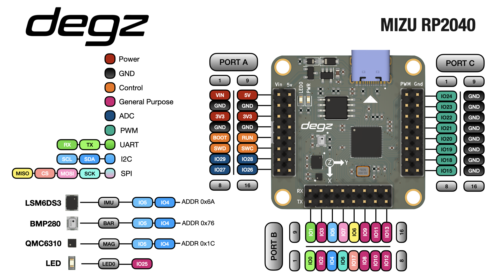

# Ürünün Teknik Özellikleri

## Pin diyagramı

## Teknik Özellikler

- Besleme Gerilimi – 3.3V – 5V
- Pin Gerilim Değeri – 3.3V
- Programlama USB üzerinden
- Çift çekirdekli ARM M0 mimarisi mikrodenetleyici
- 8 Mb harici flash(program hafızası)
- 4xADC(Analog Digital Converter)
- 2xUART
- 2xI2C
- 2xSPI
- 16xPWM
- IMU sensörü LSM6DS3 
- Pusula QMC6310
- BMP280 Barometer (Yalnız Mizu-b modeli)
- Programlanabilir LED
- Dahili Mikro SD kart yuvası

## Kutu İçeriği

- Mizu Geliştirme Kartı
- Dişi 2 Pin Jumper
- Erkek 2 Pin Jumper
- 2×24 Erkek Header
