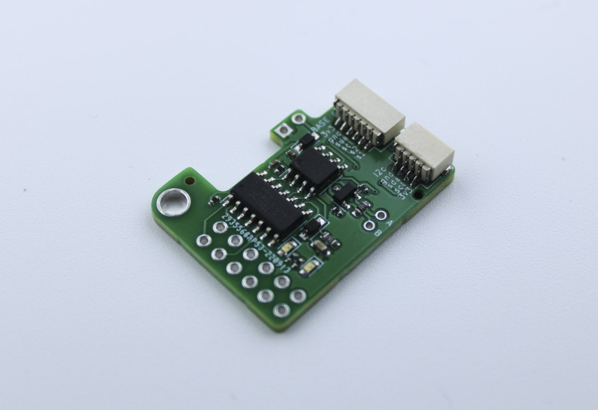
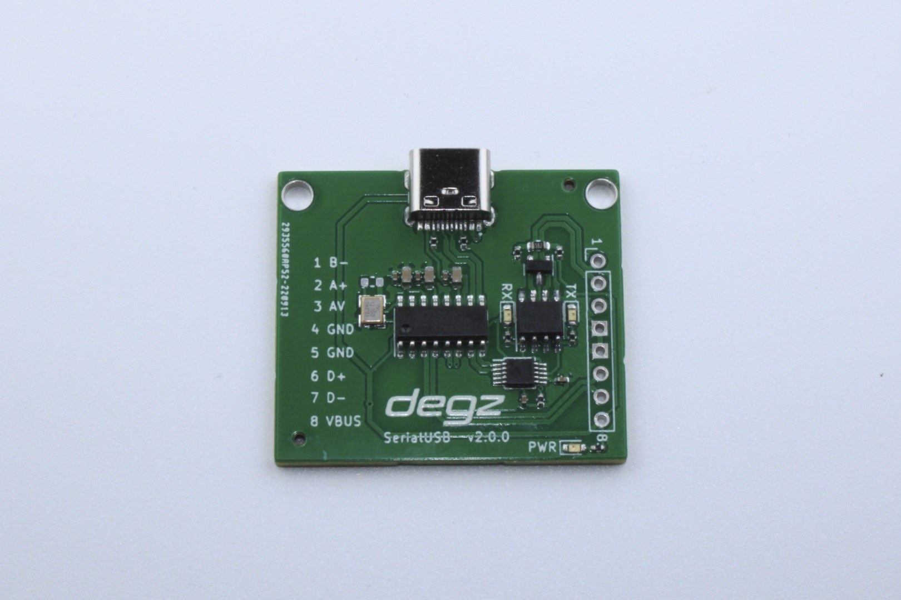

# Ürün Hakkında

## Yüksek performans, düşük fiyat

Yüksek performans, düşük fiyat prensibiyle tasarlanan Mizucom iletişim modülü ile kablolu kontrol artık daha etkili ve uygun maliyetli. RS-485 iletişim mimarisi üzerine kurulan bu iletişim kartı, özel robotik sistemlerde düşük gecikme ve yüksek performans sağlamak için özel olarak geliştirildi. Hot-plug özelliği sayesinde çalışırken takılıp çıkarılabilir ve güvenli bağlantı sunar. Mizucom iletişim modülü, tek kablo üzerinden hem yüksek çözünürlüklü görüntü hem de kontrol sinyali iletişimini USB arayüzü üzerinden bilgisayarınıza aktarır.

 Python tabanlı bilgisayar arayüzü, otonom kontroller için özel olarak kodlandı. 400 metreye kadar iletişim menzili ve analog çözücülerle uyumlu yapısıyla Mizucom iletişim modülü, su altı sistemleri ve kablolu robotik uygulamalarda güvenilir bir çözüm sunar. RS485 veri standardına sahip, su altı istasyonuyla 4’lü kablo ile iletişim, 5V besleme gerilimi ve Windows/MacOS uyumlu yazılımlarla Mizucom, teknolojiyi verimli bir şekilde kullanmak isteyenler için ideal bir tercihtir. Mizu ile kullanıma tam uygundur.

## Güvenli bağlantı

Mizucom hot-plug özelliği sayesinde çalışırken takılıp çıkarılabilir ve çalışmaya devam eder. Yazılımsal kontroller sayesinde, araç kablo kopması durumunda ayarlandığı şekilde çalışmaya devam edebilir veya durabilir.

## Tek kablo çoklu iletişim

USB arayüzü üzerinden hem yüksek çözünürlüklü görüntü hem de kontrol sinyalini aynı kablodan bilgisayara aktarabilirsiniz.

## Otonom sistemler için geliştirildi

Mizucom’un bilgisayar arayüzü phyton üzerinde kodlanmıştır ve otonom kontroller için özel olarak geliştirilmiştir. Bilgisayar arayüzünden joystick komutlarını veya otonom yönlendirmeleri direkt olarak araca aktarabilirsiniz.

## Yüksek Menzil

Mizucom 400 metreye kadar kablolu iletişim sağlayabilir. İnsansız sualtı sistemleri ve diğer kablolu robotik uygulamalarında kullanılabilir.

## Analog çözücüler ile kolay kullanım

Standart analog kamera ve yüksek çözünürlüklü ahd kamera ile satın alınan analog çözücüler direkt olarak Mizucom kartının üzerine entegre edilebilir.

## Teknik Özellikler

| Veriyolu Standardı                             | RS485             |
|------------------------------------------------|-------------------|
| Kamera İletişimi                               | Analog, Analog HD |
| Su altı istasyonu ile 4’lü kablo ile iletişim  | (A, B, AV ve GND) |
| Besleme Gerilimi                               | 5v                |
| Uyumlu Yazılımlar                              | Windows / MacOS   |

## Kutu İçeriği

- Serial İletişim Modülü
- Comm Shield
- JST SH 1.0mm 4 Pin Kablo
- JST SH 1.0mm 2 Pin Kablo
- Dişi 2 Pin Jumper
- Erkek 2 Pin Jumper

## Kullanım Diyagramı

