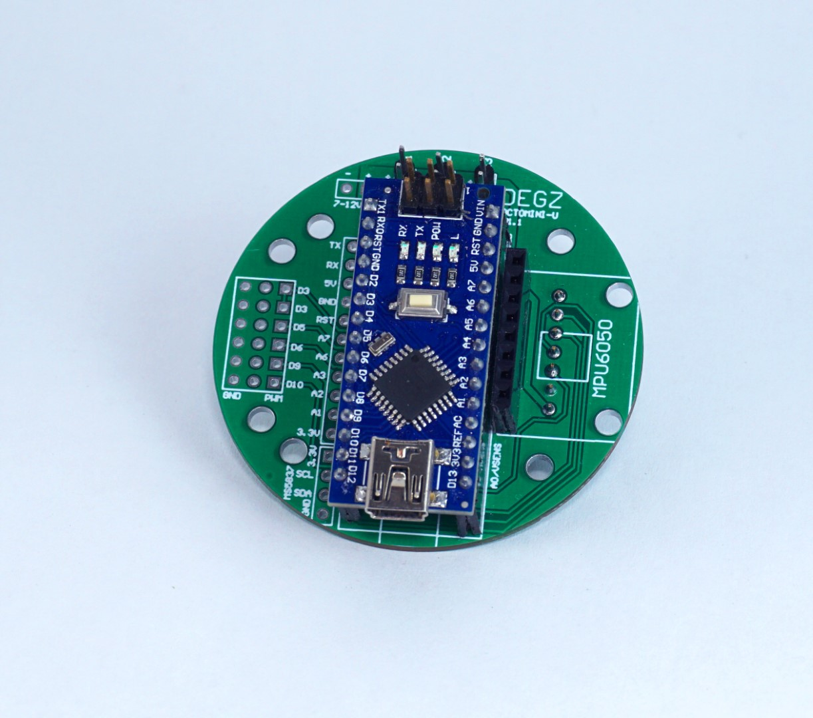
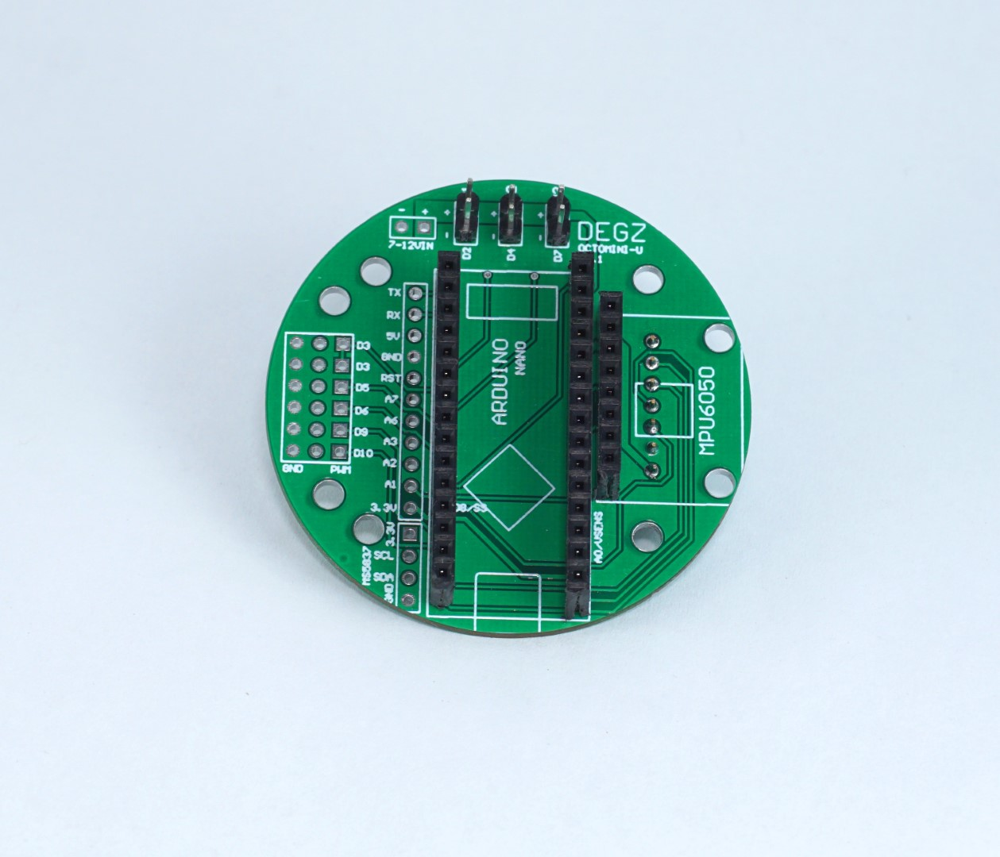

import DocCardList from '@theme/DocCardList';

# Ürün Hakkında

:::warning
Bu ürünün üretimi sonlandırılmıştır, stok bitiminde devamı üretilmeyecektir.
:::

Octomini **arduino-nano** temelli bir geliştirici kartıdır.

Artık insansız sualtı aracı üretmek çok kolay! Fpv stackden ilham alarak geliştirdiğimiz yöntem ile tüm elektronik sisteminiz avcunuzun içine sığıyor!

Dış çapı 55mm'den *daha küçük*. Üzerindeki anahtarlama elemanları ile aydınlatma, tutucu kol, örnekleme gibi 3 farklı cihazın açma kapama kontrolünü *yüzeyden* yapabilirsiniz.

<DocCardList />