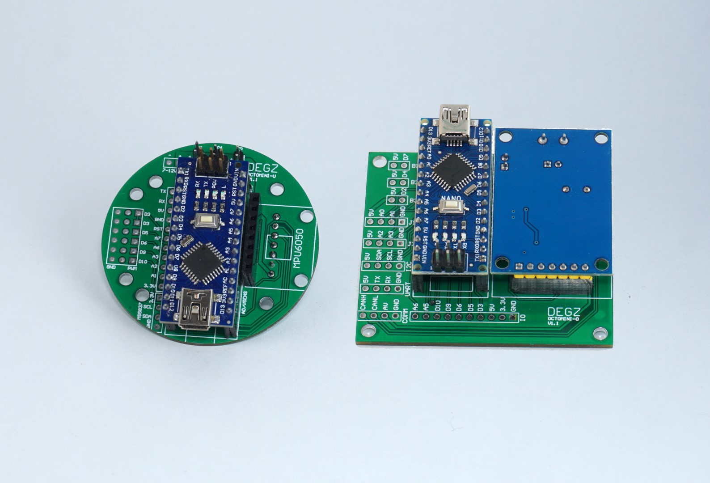
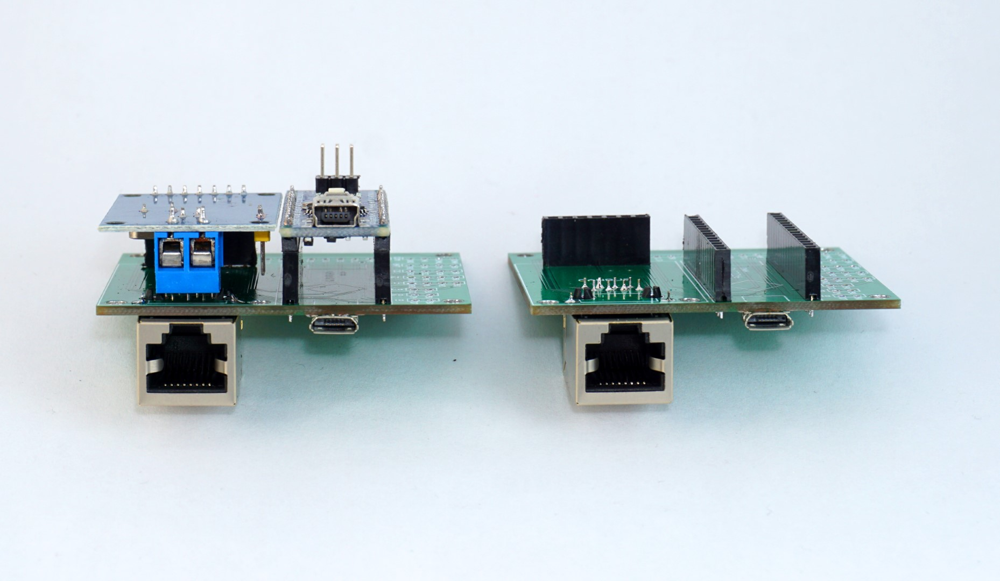
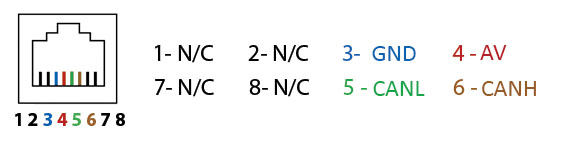

# Ürün Hakkında

:::warning
Bu ürünün üretimi sonlandırılmıştır, stok bitiminde devamı üretilmeyecektir.
:::

## Octomini ile kumanda modülü

Arduino temelli bir proje ile kumanda modülü yapabilirsiniz. Joystick tasarımını sadeleştirmek için üretilen bu modüle şunları bağlayabilirsiniz:

- 2 adet 2 Eksen joystick
- 3 adet Button
- Analog Kamera Çözücü
- Oled Ekran

:::info
Octomini tamamiyle açık kaynaklı yazılımı ve donanımdan oluşur.
Yazılımı indirmek veya katkıda bulunmak isterseniz [buraya](https://github.com/degzrobotics/octomini) tıklayabilirsiniz!
:::

Tether diagramı;

