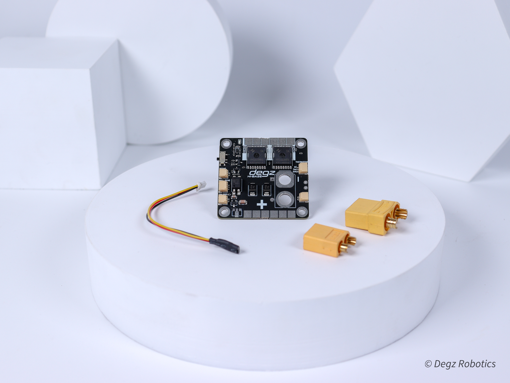

# Ürün Hakkında

 

Hi Base kartı, kullanıcıların enerji tüketimlerini anlık olarak izlemelerini sağlayan bir elektronik devre kartıdır. Anlık akım, voltaj ve güç izleme özellikleri sayesinde, kullanıcılar enerji kullanımlarını detaylı bir şekilde görüntüleyebilirsiniz. Manyetik anahtarlama teknolojisi, kartın fiziksel bir temas olmaksızın açılıp kapanmasını mümkün kılar, ve aynı zamanda bir harici anahtar üzerinden uzaktan kontrol edilebilirliği sunar. Kart, INA219 akım sensörü ile donatılmıştır, bu da hassas akım ölçümleri yapılabilmesini sağlar.  45 x 45 mm boyutundaki kompakt tasarımı ve geniş uyumluluğu, çeşitli enerji yönetimi ihtiyaçlarına yönelik olarak tasarlanmıştır, böylece  enerji yönetimini etkin bir şekilde gerçekleştirmelerine olanak tanır.