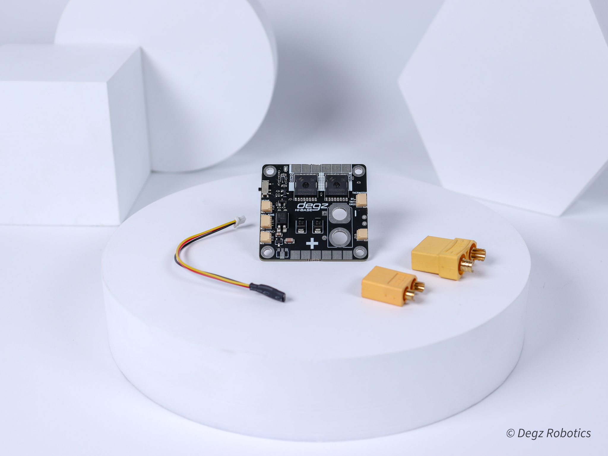
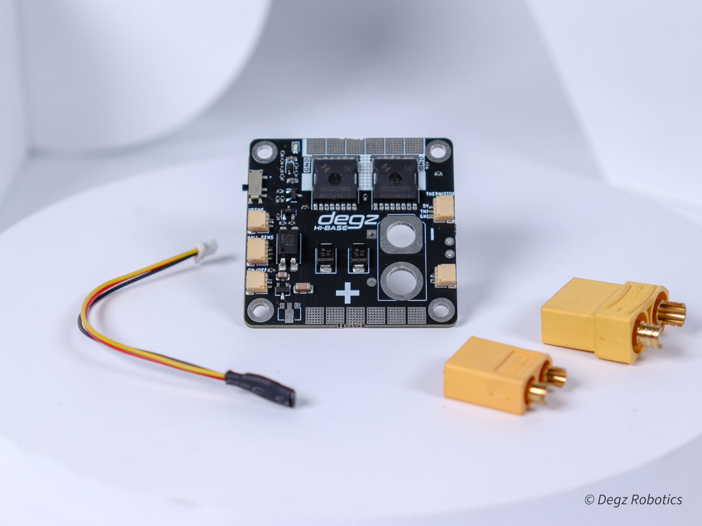
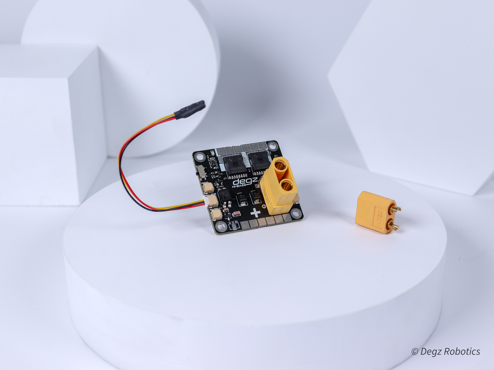
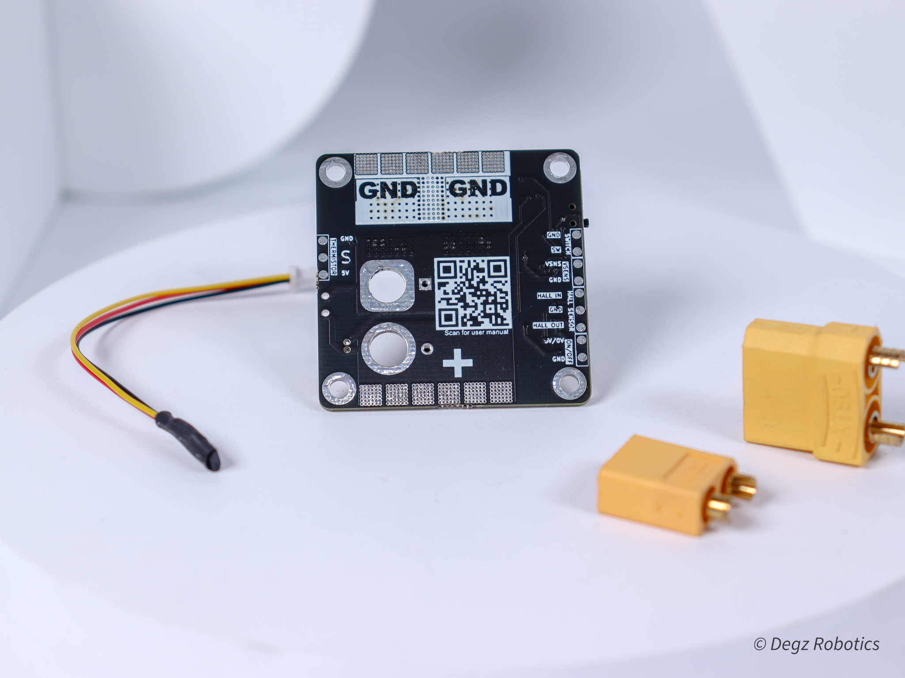

import DocCardList from '@theme/DocCardList';

# Ürün Hakkında
HiBase Güç Dağıtım Kartı üzerindeki anahtarlama elemanları sayesinde elektronik haznenin dışarısından anahtarlama yapmanızı sağlar. Statik manyetik anahtarlama ile güvenli bir şekilde sisteminizin gücünü kesebilir, açma-kapatma işlemlerini gerçekleştirebilirsiniz

## Gerçek Zamanlı Enerji İzleme

Hi Base, enerji tüketiminizi anlık olarak izlemenize olanak tanır. Anlık voltaj ve güç izleme özelliği ile enerji kullanımınızı detaylıca görebilir ve optimize edebilirsiniz. Manyetik anahtarlama teknolojisi, fiziksel temas olmadan cihazınızı açıp kapatmanıza imkan verir; olumsuz durumlarda işlemci tarafından kapatma özelliği ile kullanım kolaylığı ve güvenliği artırır. Kartın üzerindeki on-off jesti ile işlemciye bağlayarak, karttan base'e 5v verince kartı uzaktan kapatabilir, 0V yollayınca kartı kullanıma açabilirsiniz. 

## Hassas Voltaj Ölçümü

Yenilikçi base kartımız, hassas gerilim bölücü teknolojisi ile voltaj ölçme imkanı sunar ve NTC sensörü ile sıcaklık takibini kolaylaştırır. 45 x 45 mm boyutlarında kompakt bir tasarıma sahip olan kartımız, 6-48 Vdc giriş gerilimi ve 2s'den 12s'e kadar çeşitli pil türleri ile uyumludur, bu da onu geniş bir uygulama yelpazesinde ideal kılar.

## Güçlü Performans
Hi Base, 120 Amper'e kadar azami akım ve 60 Amper sürekli akım kapasitesi ile yüksek güç gerektiren projeler için tasarlanmıştır. Yüksek performans ve dayanıklılık sunar. Küçük boyutu ve geniş voltaj ile pil tipi uyumluluğu sayesinde, bu kart DIY projelerinden endüstriyel uygulamalara kadar her türlü enerji yönetimi ihtiyacına uygun bir çözüm sunar. 

## Kullanım Kolaylaştıran Jst Çıkışları
HiBase kartımız, anlık enerji izleme ve kontrol imkanı sunuyor ve bu özelliklere kolayca erişmenizi sağlayan JST çıkışlarına sahip.**Voltage sensör JST çıkışı** sayesinde, voltaj değerlerinizi gerçek zamanlı olarak izleyebilir ve enerji kullanımınızı optimize edebilirsiniz. **Hall sensörü JST çıkışı**, manyetik alanları algılayan hall sensörlerini kartınıza bağlamanıza olanak tanır; bu sayede akımın yönünü ve şiddetini hassas bir şekilde ölçebilirsiniz. **Thermistör JST çıkışı** ile sıcaklık değişimlerini anlık olarak takip edebilir, sisteminizin her zaman ideal çalışma sıcaklığında olduğundan emin olabilirsiniz. En benzersiz özelliğimiz olan **on/off JST çıkışı** ile kartınızı uzaktan yönetin; 5V uygulayarak kolayca kapatın ve 0V vererek yeniden açın. Bu kart, enerji yönetimini sadece basit, kullanışlı ve etkili kılmakla kalmaz, aynı zamanda projelerinize üstün adaptasyon ve hassasiyet kazandırır. Enerji yönetiminizi bir üst seviyeye taşıyacak bu kartla, projelerinizde yeni ufuklar açın! 

## Özelleştirlebilir Soğutma Sistemi 

Kartımızın temel versiyonu alüminyum levha içermese de, performansı öncelik veren müşterilerimiz için özelleştirilebilir bir seçenek olarak sunuyoruz: İsteğiniz üzerine kartınıza entegre edilebilecek bir alüminyum levha. Bu yenilikçi özellik, kartınızın çalışırken ısınmasını yavaşlatır ve aşırı sıcaklıkları önleyerek soğutma işlevi görür, bu sayede cihazınızın performansını artırır. Yoğun kullanım sırasında dahi, bu özel tasarım kartınızın sürekli ve güvenilir bir şekilde çalışmasını sağlar, böylece sistemleriniz her zaman serin ve stabil kalır. Alüminyum levha, özellikle yüksek performans gerektiren projelerde ve sıcaklık yönetiminin kritik olduğu enerji yönetimi uygulamalarında büyük bir avantaj sağlar. Performansınızı maksimize etmek, ısınma sorunlarını minimize etmek ve projelerinizi güçlendirmek için bu özelliği projelerinize entegre edebilirsiniz.

## Özellikler

|      Ana Özellikler           |              |
|--------------------------|-----------------------|
|Anlık akım voltaj ve güç izleme|Kullanıcının enerji tüketimini detaylı bir şekilde izlemesini sağlar.|
|Manyetik anahtarlama|Fiziksel temas gerektirmeden, manyetik bir alan aracılığıyla cihazın açılıp kapanmasını sağlar.|
|Harici anahtar|Kullanıcıların cihazı dışarıdan bir anahtar aracılığıyla kontrol etmesine olanak tanır.|
|Soğutma |
|**Elektriksel Karakteristik**|
|Azami Akım| 120 Amper(120 ampere kadar test edilmiştir.)|
|Sürekli Akım| 60 Amper|
|Giriş Gerilimi| 6-48 Vdc|
|Pil Türleri| 2s – 12s|
|**Fiziksel**|
|Boyut: 45 x 45 mm|

## Kutu İçeriği

- Hi-Base
- Hall Effect Sensör
- 14 Awg Siyah Silikon Kablo (8cm)
- 14 Awg Kırmızı Silikon Kablo (8cm)
- Erkek XT90 Konnektör
- Dişi XT90 Konnektör

## Sık Sorulan Sorular

### Anahtarlama hattına ne kadar motor sürücü bağlayabilirim?

Ana hatta 200 amperi aşmayacak şekilde istediğiniz kadar bağlantı sağlayabilirsiniz. Burada tek hesaplamanız gereken, takacağınız cihazların toplam asgari akım yüküdür. Örnek olarak, asgari 10A akımla çalışan 20 motor sürücüyü(10Ax20=200A) buraya bağlayabilirsiniz.

### Anahtarlama sistemi tam olarak nasıl çalışıyor?

Ana hattaki anahtarlama sistemi sensörün önüne getirilen bir mıknatısın çekip kutbu ile açılıp itme kutbu ile bütün güç sistemini kapatmaktadır.

### Teknofest’te düğme istendiği yazıyor, bu sistem düğme olarak kabul ediliyor mu?

Güç dağıtım kartı anahtarlama sistemi ile 2 yıldır Teknofest ekipleri tarafından kullanılmakta olup, benzer sistemlere kıyasla sızdırmazlık ve emniyet açısından en güvenli yöntemdir. Yarışmada istenen acil durdurma vazifesini çok iyi şekilde gerçekleştirdiği için, güvenle yarışmada kullanılabileceğini ve acil durdurma düğmesi olarak hakemler tarafından kabul edileceğini belirtebiliriz.

### Sürekli olarak yüksek akım kullanmam sorun yaratır mı?

Elektronik açıdan bir problem oluşturmamakla birlikte, yüksek akımın sistemde ısınmaya sebep olacağını unutmayın. Bu yüzden eğer hiç aralıksız 1 dakikanın üzerinde 80 amperin üzerinde akım çekilmesi durumunda akım seviyesine göre sistem ciddi şekilde ısınabilir. Burada mosfetlerin üzerine bir soğutucu ekleyerek soğutma sağlayabilirsiniz. Yine de ekstrem durumlar için  güç dağıtım kartını neredeyse sualtı araçlarının tamamı için yeterli 60amper akımda 10 dakika boyunca test ettiğimizi ve risk oluşturacak bir ısınma ile karşılaşmadığımızı belirtmek isteriz. Daha yüksek akımlarda, sisteminizin sıcaklığını test ederek sıcaklığını takip edecek bir önlem mekanizması kurmanızı tavsiye ederiz.
Subdrive Lo-Base kullanarak sistemin çektiği amperi okuyabilirim ?
Subdrive Lo-Base üzerinde bulunduğu akım sensörü ile 100 ampere kadar akım ölçümü yapabilmektedir.

<DocCardList />
