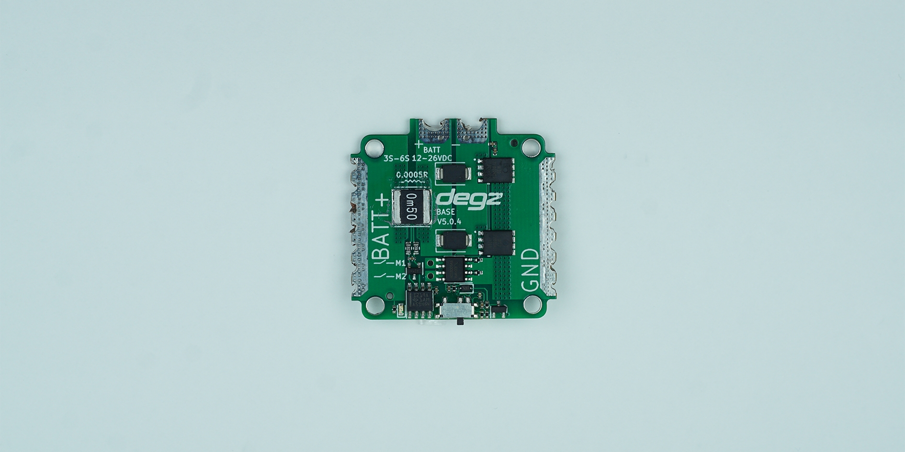

import DocCardList from '@theme/DocCardList';

# Ürün Hakkında
Hi Base Güç Dağıtım Kartı üzerindeki anahtarlama elemanları sayesinde elektronik haznenin dışarısından anahtarlama yapmanızı sağlar.
Statik manyetik anahtarlama ile güvenli bir şekilde sisteminizin gücünü kesebilir, açma-kapatma işlemlerini gerçekleştirebilirsiniz.

|      Ana Özellikler           |              |
|--------------------------|-----------------------|
|Anlık akım voltaj ve güç izleme|Kullanıcının enerji tüketimini detaylı bir şekilde izlemesini sağlar.|
|Manyetik anahtarlama|Fiziksel temas gerektirmeden, manyetik bir alan aracılığıyla cihazın açılıp kapanmasını sağlar.|
|Harici anahtar|Kullanıcıların cihazı dışarıdan bir anahtar aracılığıyla kontrol etmesine olanak tanır.|
|**Elektriksel Karakteristik**|
|Azami Akım| 120 Amper(120 ampere kadar test edilmiştir.)|
|Sürekli Akım| 60 Amper|
|Giriş Gerilimi| 6-48 Vdc|
|Pil Türleri| 2s – 12s|
|**Sensörler**|
|INA219 Akım sensörü|	Cihazın akımı hassas bir şekilde ölçmesini yardımcı olur .|
|**Fiziksel**|
|Boyut: 45 x 45 mm|

## Kutu İçeriği

- Hi-Base
- Hall Effect Sensör
- 14 Awg Siyah Silikon Kablo (8cm)
- 14 Awg Kırmızı Silikon Kablo (8cm)
- Erkek XT60 Konnektör
- Dişi XT60 Konnektör

## Sık Sorulan Sorular

### Anahtarlama hattına ne kadar motor sürücü bağlayabilirim?

Ana hatta 200 amperi aşmayacak şekilde istediğiniz kadar bağlantı sağlayabilirsiniz. Burada tek hesaplamanız gereken, takacağınız cihazların toplam asgari akım yüküdür. Örnek olarak, asgari 10A akımla çalışan 20 motor sürücüyü(10Ax20=200A) buraya bağlayabilirsiniz.

### Anahtarlama sistemi tam olarak nasıl çalışıyor?

Ana hattaki anahtarlama sistemi sensörün önüne getirilen bir mıknatısın çekip kutbu ile açılıp itme kutbu ile bütün güç sistemini kapatmaktadır.

### Teknofest’te düğme istendiği yazıyor, bu sistem düğme olarak kabul ediliyor mu?

Güç dağıtım kartı anahtarlama sistemi ile 2 yıldır Teknofest ekipleri tarafından kullanılmakta olup, benzer sistemlere kıyasla sızdırmazlık ve emniyet açısından en güvenli yöntemdir. Yarışmada istenen acil durdurma vazifesini çok iyi şekilde gerçekleştirdiği için, güvenle yarışmada kullanılabileceğini ve acil durdurma düğmesi olarak hakemler tarafından kabul edileceğini belirtebiliriz.

### Sürekli olarak yüksek akım kullanmam sorun yaratır mı?

Elektronik açıdan bir problem oluşturmamakla birlikte, yüksek akımın sistemde ısınmaya sebep olacağını unutmayın. Bu yüzden eğer hiç aralıksız 1 dakikanın üzerinde 80 amperin üzerinde akım çekilmesi durumunda akım seviyesine göre sistem ciddi şekilde ısınabilir. Burada mosfetlerin üzerine bir soğutucu ekleyerek soğutma sağlayabilirsiniz. Yine de ekstrem durumlar için  güç dağıtım kartını neredeyse sualtı araçlarının tamamı için yeterli 60amper akımda 10 dakika boyunca test ettiğimizi ve risk oluşturacak bir ısınma ile karşılaşmadığımızı belirtmek isteriz. Daha yüksek akımlarda, sisteminizin sıcaklığını test ederek sıcaklığını takip edecek bir önlem mekanizması kurmanızı tavsiye ederiz.
Subdrive Lo-Base kullanarak sistemin çektiği amperi okuyabilirim ?
Subdrive Lo-Base üzerinde bulunduğu akım sensörü ile 100 ampere kadar akım ölçümü yapabilmektedir.

<DocCardList />
