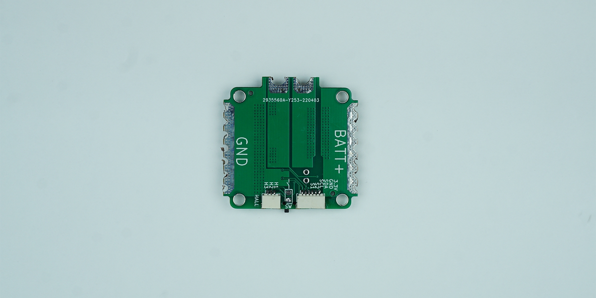

# Ürünün Teknik Özellikleri

| Özellik                  | Değer                 |
|--------------------------|-----------------------|
| Azami Akım               | 150 Amper             |
| Soğutma İle Sürekli Akım | 80 amper              |
| Sürekli Akım             | 40 Amper              |
| Dahili Regülatör         | Opsiyonel             |
| Giriş Gerilimi           | 6-26 Vdc              |
| Pil Türleri              | 2s – 6s               |
| Regülatör Voltajı        | 5 Vdc – 12Vdc         |
| Regülatör Akımı          | 3a @ 5Vdc – 1a @12Vdc |

## Kutu İçeriği

- Subdrive Lo-Base
- Hall Effect Sensör
- 14 Awg Siyah Silikon Kablo (8cm)
- 14 Awg Kırmızı Silikon Kablo (8cm)
- Erkek XT60 Konnektör
- Dişi XT60 Konnektör