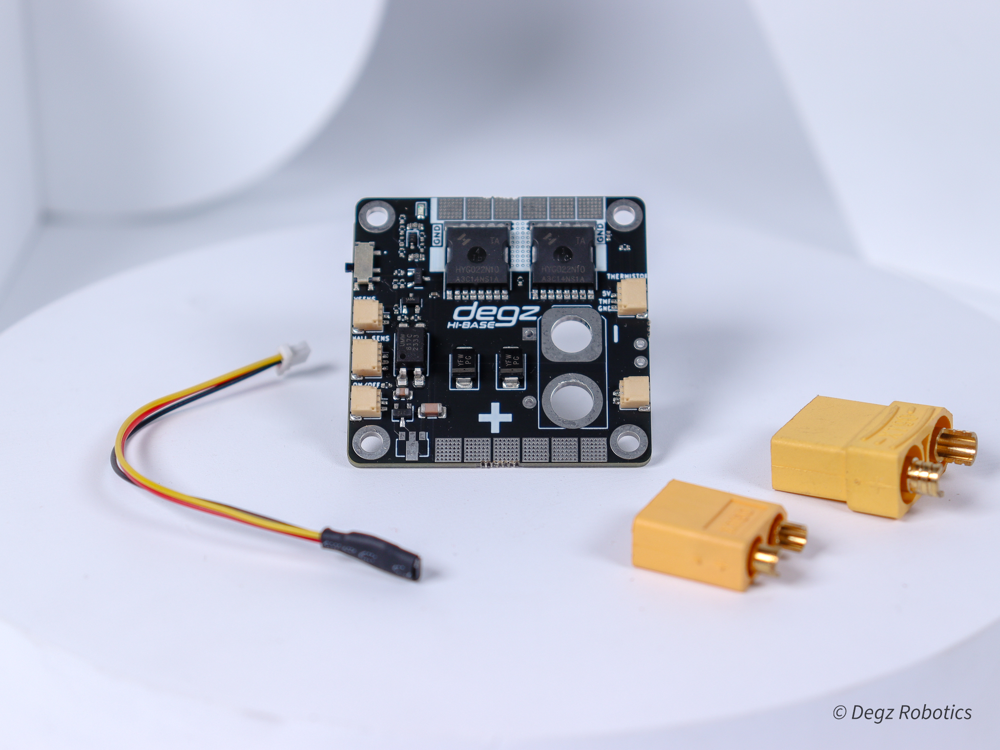

# Ürünün Teknik Özellikleri

 

|      Ana Özellikler           |              |
|--------------------------|-----------------------|
|Anlık akım voltaj ve güç izleme|Kullanıcının enerji tüketimini detaylı bir şekilde izlemesini sağlar.|
|Manyetik anahtarlama|Fiziksel temas gerektirmeden, manyetik bir alan aracılığıyla cihazın açılıp kapanmasını sağlar.|
|Harici anahtar|Kullanıcıların cihazı dışarıdan bir anahtar aracılığıyla kontrol etmesine olanak tanır.|
|**Elektriksel Karakteristik**|
|Azami Akım| 120 Amper(120 ampere kadar test edilmiştir.)|
|Sürekli Akım| 60 Amper|
|Giriş Gerilimi| 6-48 Vdc|
|Pil Türleri| 2s – 12s|
|**Sensörler**|
|INA219 Akım sensörü|	Cihazın akımı hassas bir şekilde ölçmesini yardımcı olur .|
|**Fiziksel**|
|Boyut: 45 x 45 mm|

 