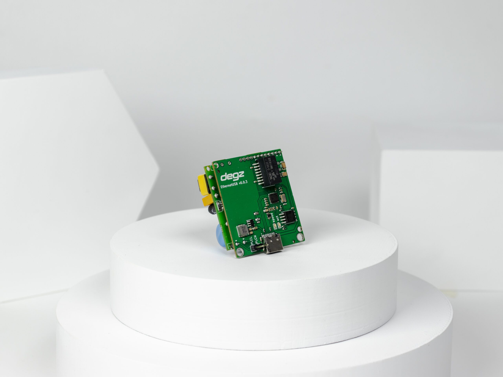
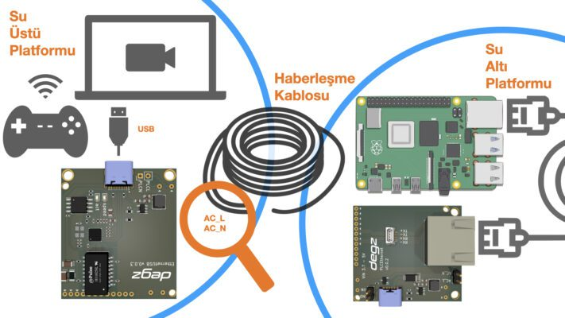

# Ürün Hakkında

Sublink Hi-com iletişim modülü, kolay kullanım ve minimum alan gereksinimleriyle dikkat çeker. USB ile bağlanabilen bu modül, AC_L ve AC_N kablolarını karşılıklı bağladığınızda hızlı iletişime geçer, standart bir ethernet bağlantısını simgeler. Küçük boyutları (43×38 mm), ürünlerinizde minimum yer kaplar ve küçük cihazlar için idealdir. Yüksek hızlı ethernet iletişimi için sadece 2 kablo kullanır ve 300 metre mesafeye kadar iletim sağlar. Saatlik 3.3W düşük güç tüketimi ile bataryalı sistemlerde uzun kullanım süresi sunar. Sublink Hi-com, su altı araçları için test edilmiş ve geliştirilmiş, su altı iletişiminde güvenilir bir çözümdür.

## Kolay kullanım

Sublink – Hi-com USB iki kabloyu (AC_L ve AC_N) karşılıklı bağlayıp güç verdiğiniz anda iletişime hazır hale gelir. Bu basit bağlantı standart bir ethernet bağlantısını simüle eder. Standart ethernet çıkışlarından uyumlu herhangi cihaza direkt bağlantı sağlayabilirsiniz.

## Küçük alanlar için uygun

43×38 mm boyutları ile ürünlerinizde minimum yer kaplar ve küçük boyutlu cihazlar için tam bir biçilmiş kaftan!

## Yüksek hız için yalnız 2 kablo

Sublink – Hi-com iletişim modülü 2 kablo üzerinden yüksek hızda ethernet iletişimi kurulması için geliştirilmiş iletişim modülüdür. Standart ethernet iletişim protokolünü, 2 kablo üzerinden 300 metre mesafeye kadar iletebilir.

## Düşük enerji tüketimi

Saatlik 3.3W düşük güç tüketimi ile bataryalı sistemlerde yüksek kullanım süresi sağlar. İletişim modülünü standart bir USB modülü üzerinden rahatlıkla besleyebilirsiniz.

## Sualtı araçlarında kullanıma hazır

Sublink – Hi-com yüksek hızlı modülü insansız sualtı araçları üzerinde test edilmiş ve geliştirilmiştir. Örnek kullanım aşağıdaki gibidir.

## Teknik Özellikler

| Özellik                            | Değer                      |
|------------------------------------|----------------------------|
| Menzil (En yüksek hız için)        | 300 metre                  |
| Bağlantı Hızı                      | 200 Mbps                   |
| Besleme Voltajı                    | 3.7V – 5V                  |
| USB Güç Besleme ve İetişim         | Mevcut                     |
| İşletim Sistemi                    | Windows / Linux / MacOS    |
| Güç Tüketimi                       | 3.3Watt/Saat               |
| Boyutlar MM (En x Boy x Yükseklik) | 43x38x27                   |
| Bağlantı Tipi                      | USB Arayüzü                |
| Çalışma Sıcaklığı                  | 0-70 C°                    |
| Ağırlık                            | 30 gram                    |
| İletişim Standardı                 | IEEE 802.3                 |
| Güvenlik                           | AES 128 Bit Şifreleme      |
| Protokol                           | TCP/IP, IGMP, CSMA/CA, QoS |
| Modülasyon Tipi                    | OFDM                       |
| Sublink Hi-com Uyumluluk           | Tam uyumlu                 |
| Sublink Lo-com ile Uyumluluk       | Uyumlu Değil               |

## Kutu İçeriği

- Sublink Hi-com USB Yüksek Hızlı İletişim Modülü
- Dişi 2 Pin Jumper (2 adet)
- Erkek 2 Pin Jumper (2 adet)
