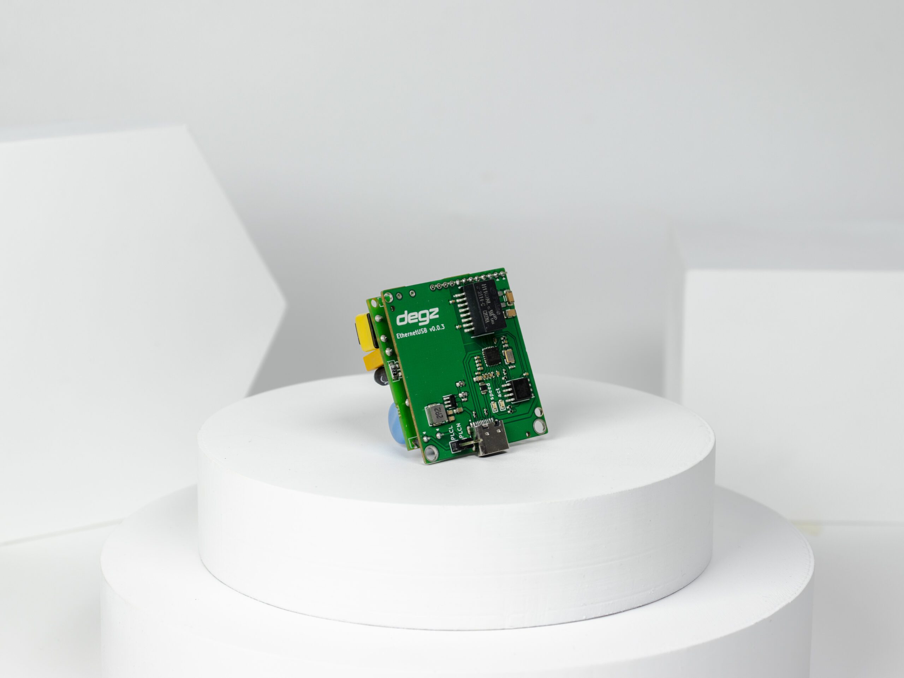

# Ürünün Teknik Özellikleri

| Özellik                            | Değer                      |
|------------------------------------|----------------------------|
| Menzil (En yüksek hız için)        | 300 metre                  |
| Bağlantı Hızı                      | 200 Mbps                   |
| Besleme Voltajı                    | 3.7V – 5V                  |
| USB Güç Besleme ve İetişim         | Mevcut                     |
| İşletim Sistemi                    | Windows / Linux / MacOS    |
| Güç Tüketimi                       | 3.3Watt/Saat               |
| Boyutlar MM (En x Boy x Yükseklik) | 43x38x27                   |
| Bağlantı Tipi                      | USB Arayüzü                |
| Çalışma Sıcaklığı                  | 0-70 C°                    |
| Ağırlık                            | 30 gram                    |
| İletişim Standardı                 | IEEE 802.3                 |
| Güvenlik                           | AES 128 Bit Şifreleme      |
| Protokol                           | TCP/IP, IGMP, CSMA/CA, QoS |
| Modülasyon Tipi                    | OFDM                       |
| Sublink Hi-com Uyumluluk           | Tam uyumlu                 |
| Sublink Lo-com ile Uyumluluk       | Uyumlu Değil               |

## Kutu İçeriği

- Sublink Hi-com USB Yüksek Hızlı İletişim Modülü
- Dişi 2 Pin Jumper (2 adet)
- Erkek 2 Pin Jumper (2 adet)
